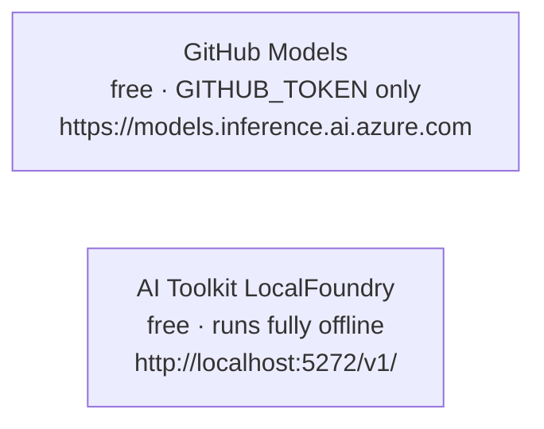

# LocalM Tutorial Examples

Code examples for LocalM tutorial courses. Each sub-folder maps to one published course.

## Courses

| Folder                  | Course                        | Status                           |
| ----------------------- | ----------------------------- | -------------------------------- |
| [`a2a/`](a2a/README.md) | Agent-to-Agent (A2A) Protocol | Active — lessons 05–14 available |

## Model Providers

All examples in this repository support at least one **free** model provider so
you can run every lesson without a paid cloud subscription.



### GitHub Models

- Get a free token at [github.com/settings/tokens](https://github.com/settings/tokens) (no scopes needed)
- Add `GITHUB_TOKEN=ghp_...` to `.env`

### AI Toolkit LocalFoundry

- Install the [VS Code AI Toolkit extension](https://marketplace.visualstudio.com/items?itemName=ms-windows-ai-studio.windows-ai-studio)
- Load any compatible model (e.g. `qwen2.5-0.5b-instruct-generic-gpu:4`) — server starts on port 5272

```python
# LocalFoundry is OpenAI-API-compatible — no key required
from openai import OpenAI

client = OpenAI(
    base_url="http://localhost:5272/v1/",
    api_key="unused",   # required field, ignored by LocalFoundry
)
```

## Environment Setup

Copy `.env.example` → `.env` and set your credentials:

```bash
cp .env.example .env
# edit .env — at minimum set GITHUB_TOKEN
```

The `.env` file is **git-ignored**. Never commit real credentials.

## License

[Mozilla Public License 2.0](LICENSE)
