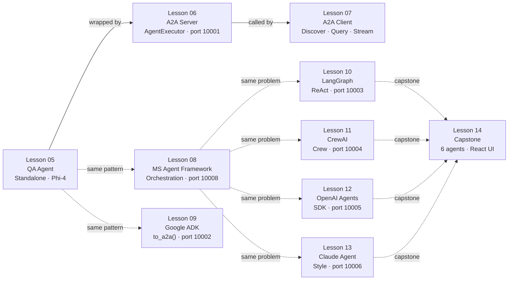
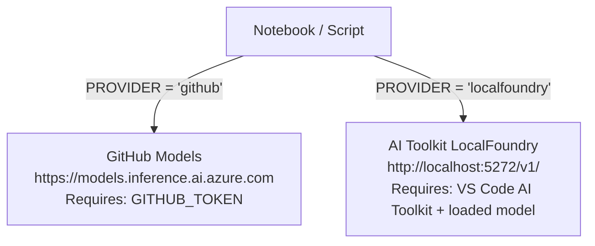

# A2A Protocol — Code Examples

Working code examples for the **Agent-to-Agent (A2A) Protocol** tutorial series.
Ten progressive lessons build from a standalone LLM agent to a multi-framework
A2A deployment, culminating in a full loan approval pipeline with six agents
and a React dashboard.

## Video-Backed Lessons

| Lesson | Topic | Video | Example |
| ------ | ----- | ----- | ------- |
| 05 | <a href="https://tuts.localm.dev/a2a/first-a2a-agent" target="_blank" rel="noopener noreferrer">Building Your First A2A Agent</a> | <a href="https://www.youtube.com/watch?v=xD606KkVkoA" target="_blank" rel="noopener noreferrer">Watch</a> | [`lessons/05-first-a2a-agent/`](lessons/05-first-a2a-agent/README.md) |
| 06 | <a href="https://tuts.localm.dev/a2a/a2a-server" target="_blank" rel="noopener noreferrer">Wrapping Agents as A2A Servers</a> | <a href="https://www.youtube.com/watch?v=mXEXEy53UTk" target="_blank" rel="noopener noreferrer">Watch</a> | [`lessons/06-a2a-server/`](lessons/06-a2a-server/README.md) |
| 07 | <a href="https://tuts.localm.dev/a2a/a2a-client" target="_blank" rel="noopener noreferrer">A2A Client Fundamentals</a> | <a href="https://www.youtube.com/watch?v=aTqo4ssrz4U" target="_blank" rel="noopener noreferrer">Watch</a> | [`lessons/07-a2a-client/`](lessons/07-a2a-client/README.md) |
| 08 | <a href="https://tuts.localm.dev/a2a/microsoft-agent-framework" target="_blank" rel="noopener noreferrer">A2A with Microsoft Agent Framework</a> | <a href="https://www.youtube.com/watch?v=oGwg0VwGyY8" target="_blank" rel="noopener noreferrer">Watch</a> | [`lessons/08-microsoft-agent-framework/`](lessons/08-microsoft-agent-framework/README.md) |
| 09 | <a href="https://tuts.localm.dev/a2a/google-adk" target="_blank" rel="noopener noreferrer">A2A with Google ADK</a> | <a href="https://www.youtube.com/watch?v=6pIgKOY16IE" target="_blank" rel="noopener noreferrer">Watch</a> | [`lessons/09-google-adk/`](lessons/09-google-adk/README.md) |
| 10 | <a href="https://tuts.localm.dev/a2a/langgraph" target="_blank" rel="noopener noreferrer">A2A with LangGraph</a> | <a href="https://www.youtube.com/watch?v=Nt9eENHhGX8" target="_blank" rel="noopener noreferrer">Watch</a> | [`lessons/10-langgraph/`](lessons/10-langgraph/README.md) |
| 11 | <a href="https://tuts.localm.dev/a2a/crewai" target="_blank" rel="noopener noreferrer">A2A with CrewAI</a> | <a href="https://www.youtube.com/watch?v=JSa8Vd9kpFM" target="_blank" rel="noopener noreferrer">Watch</a> | [`lessons/11-crewai/`](lessons/11-crewai/README.md) |
| 12 | <a href="https://tuts.localm.dev/a2a/openai-agents-sdk" target="_blank" rel="noopener noreferrer">A2A with OpenAI Agents SDK</a> | <a href="https://www.youtube.com/watch?v=I0C8xFZpJdQ" target="_blank" rel="noopener noreferrer">Watch</a> | [`lessons/12-openai-agents-sdk/`](lessons/12-openai-agents-sdk/README.md) |
| 13 | <a href="https://tuts.localm.dev/a2a/claude-agent-sdk" target="_blank" rel="noopener noreferrer">A2A with Claude Style Agents</a> | <a href="https://www.youtube.com/watch?v=e5E-iN2lFvg" target="_blank" rel="noopener noreferrer">Watch</a> | [`lessons/13-claude-agent-sdk/`](lessons/13-claude-agent-sdk/README.md) |
| 14 | <a href="https://tuts.localm.dev/a2a/multi-agent-deep-dive" target="_blank" rel="noopener noreferrer">Multi-Agent System Deep Dive - Loan Approval</a> | <a href="https://www.youtube.com/watch?v=ONhelxVH1SQ" target="_blank" rel="noopener noreferrer">Watch</a> | [`lessons/14-multi-agent-deep-dive/`](lessons/14-multi-agent-deep-dive/README.md) |

## Lesson Map


```mermaid
graph LR
    L05["Lesson 05<br/>QA Agent<br/>Standalone · Phi-4"]
    L06["Lesson 06<br/>A2A Server<br/>AgentExecutor · port 10001"]
    L07["Lesson 07<br/>A2A Client<br/>Discover · Query · Stream"]
    L08["Lesson 08<br/>MS Agent Framework<br/>Orchestration · port 10008"]
    L09["Lesson 09<br/>Google ADK<br/>to_a2a() · port 10002"]
    L10["Lesson 10<br/>LangGraph<br/>ReAct · port 10003"]
    L11["Lesson 11<br/>CrewAI<br/>Crew · port 10004"]
    L12["Lesson 12<br/>OpenAI Agents<br/>SDK · port 10005"]
    L13["Lesson 13<br/>Claude Agent<br/>Style · port 10006"]
    L14["Lesson 14<br/>Capstone<br/>6 agents · React UI"]

    L05 -->|wrapped by| L06
    L06 -->|called by| L07
    L05 -.->|same pattern| L08
    L05 -.->|same pattern| L09
    L08 -.->|same problem| L10 & L11 & L12 & L13
    L10 & L11 & L12 & L13 -.->|capstone| L14
```

| Lesson | Folder                                  | What you build                                    | Port        |
| ------ | --------------------------------------- | ------------------------------------------------- | ----------- |
| 05     | `lessons/05-first-a2a-agent/`           | Standalone `QAAgent` class with Phi-4             | —           |
| 06     | `lessons/06-a2a-server/`                | `AgentExecutor` + Agent Card + A2A server         | 10001       |
| 07     | `lessons/07-a2a-client/`                | `ClientFactory` discover + send + stream          | —           |
| 08     | `lessons/08-microsoft-agent-framework/` | `OrchestratorAgent` (MAF + Kimi-K2)               | 10008       |
| 09     | `lessons/09-google-adk/`                | `LlmAgent` + `to_a2a()` one-liner (ADK)           | 10002       |
| 10     | `lessons/10-langgraph/`                 | LangGraph ReAct agent as A2A server               | 10003       |
| 11     | `lessons/11-crewai/`                    | CrewAI role-based crew as A2A server              | 10004       |
| 12     | `lessons/12-openai-agents-sdk/`         | OpenAI Agents SDK agent as A2A server             | 10005       |
| 13     | `lessons/13-claude-agent-sdk/`          | Claude-style agent patterns as A2A server         | 10006       |
| 14     | `lessons/14-multi-agent-deep-dive/`     | Full loan approval pipeline — 6 agents + React UI | 10100–10105 |

---

## Model Provider Options

All notebooks and the lesson scripts support two providers. No Azure or Google Cloud
account is required if you use either of these free options.


```mermaid
graph TD
    NB["Notebook / Script"]
    NB -->|"PROVIDER = 'github'"| GH["GitHub Models<br/>https://models.inference.ai.azure.com<br/>Requires: GITHUB_TOKEN"]
    NB -->|"PROVIDER = 'localfoundry'"| LF["AI Toolkit LocalFoundry<br/>http://localhost:5272/v1/<br/>Requires: VS Code AI Toolkit + loaded model"]
```

### GitHub Models (default)

1. Go to <a href="https://github.com/settings/tokens" target="_blank" rel="noopener noreferrer">github.com/settings/tokens</a> → **Generate new token (classic)**
2. No scopes required — a token with no permissions works
3. Copy the token to `_examples/.env`:
   ```dotenv
   GITHUB_TOKEN=ghp_your_token_here
   ```

### AI Toolkit LocalFoundry

1. Install the <a href="https://marketplace.visualstudio.com/items?itemName=ms-windows-ai-studio.windows-ai-studio" target="_blank" rel="noopener noreferrer">VS Code AI Toolkit extension</a>
2. Open AI Toolkit → **Models** → choose a model (e.g. `qwen2.5-0.5b-instruct-generic-gpu:4`) → **Load**
3. The server starts on `http://localhost:5272/v1/` — no token needed
4. In the notebook, change `PROVIDER = "localfoundry"` in cell 2

```python
# AI Toolkit LocalFoundry — OpenAI-compatible local server
from openai import OpenAI

client = OpenAI(
    base_url="http://localhost:5272/v1/",
    api_key="unused",   # required by the client but ignored by LocalFoundry
)
```

---

## Quick Start — Full Lesson Scripts

```powershell
# Windows — from _examples/a2a/
cd _examples/a2a
.\.venv\Scripts\Activate.ps1

python scripts/lesson_05.py   # standalone agent
python scripts/lesson_06.py   # starts server + smoke-tests agent card
python scripts/lesson_07.py   # client discover + send + stream demo
python scripts/lesson_08.py   # MAF orchestrator + A2A demo
python scripts/lesson_09.py   # ADK to_a2a() + A2A demo
```

```bash
# macOS / Linux
cd _examples/a2a
source .venv/bin/activate

python scripts/lesson_05.py
python scripts/lesson_06.py
python scripts/lesson_07.py
python scripts/lesson_08.py
python scripts/lesson_09.py
```

---

## Setup

### 1. Prerequisites

- Python 3.11+
- `uv` (recommended) or `pip`

### 2. Create the virtual environment

```powershell
# Windows
cd _examples/a2a
python -m venv .venv
.\.venv\Scripts\Activate.ps1
pip install -r requirements.txt
```

```bash
# macOS / Linux
cd _examples/a2a
python -m venv .venv
source .venv/bin/activate
pip install -r requirements.txt
```

Or with `uv`:

```bash
cd _examples/a2a
uv venv
uv pip install -r requirements.txt
```

### 3. Configure environment variables

```bash
cp ../.env.example ../.env
# edit ../.env
```

| Variable                         | Required for                                                   | Where to get                                                     |
| -------------------------------- | -------------------------------------------------------------- | ---------------------------------------------------------------- |
| `GITHUB_TOKEN`                   | Lessons 05–09 notebooks + scripts, Lesson 14 (GitHub provider) | <a href="https://github.com/settings/tokens" target="_blank" rel="noopener noreferrer">github.com/settings/tokens</a> |
| `AZURE_AI_PROJECT_ENDPOINT`      | Lesson 08 full script (Kimi-K2-Thinking)                       | Azure AI Foundry portal                                          |
| `AZURE_AI_API_KEY`               | Lessons 08–13 full scripts                                     | Azure AI Foundry portal                                          |
| `AZURE_AI_MODEL_DEPLOYMENT_NAME` | Lessons 08–13 full scripts                                     | Azure AI Foundry portal                                          |
| `AZURE_OPENAI_ENDPOINT`          | Lessons 09–13 full scripts (Kimi-K2)                           | Azure AI Foundry portal                                          |

The `.env` file is **git-ignored** — never commit real credentials.

---

## Port Reference

| Port      | Agent                      | Lesson           |
| --------- | -------------------------- | ---------------- |
| 10001     | QAAgent                    | 06 · 07          |
| 10002     | LoanValidatorADK           | 09 (full script) |
| 10003     | LoanValidatorLangGraph     | 10 (full script) |
| 10004     | LoanValidatorCrewAI        | 11 (full script) |
| 10005     | LoanValidatorOpenAIAgents  | 12 (full script) |
| 10006     | LoanValidatorClaudeStyle   | 13 (full script) |
| 10008     | LoanValidatorOrchestrator  | 08 (full script) |
| 10100     | LoanApprovalOrchestrator   | 14 (capstone)    |
| 10101–105 | Capstone specialist agents | 14 (capstone)    |
| 8080      | Escalation REST API        | 14 (capstone)    |
| 3000      | React approval dashboard   | 14 (capstone)    |

---

## Repository Structure

```
a2a/
  lessons/
    README.md                           ← per-lesson overview + system diagrams
    _common/src/                        ← shared loan data + validation rules
    05-first-a2a-agent/src/             ← QAAgent class
    06-a2a-server/src/                  ← AgentExecutor + server
    07-a2a-client/src/                  ← ClientFactory + client
    08-microsoft-agent-framework/src/   ← OrchestratorAgent + server/client scripts
    09-google-adk/src/                  ← LlmAgent + to_a2a() + server/client scripts
    10-langgraph/src/                   ← LangGraph ReAct agent + server/client
    11-crewai/src/                      ← CrewAI crew + server/client
    12-openai-agents-sdk/src/           ← OpenAI Agents SDK + server/client
    13-claude-agent-sdk/src/            ← Claude-style patterns + server/client
    14-multi-agent-deep-dive/           ← Full loan pipeline: agents/ + ui/
  scripts/
    lesson_05.py … lesson_09.py        ← interactive lesson runner scripts
    README.md
  requirements.txt
  pyproject.toml
```

See [`lessons/README.md`](lessons/README.md) for detailed diagrams of the full system
architecture and the A2A round-trip sequence.
