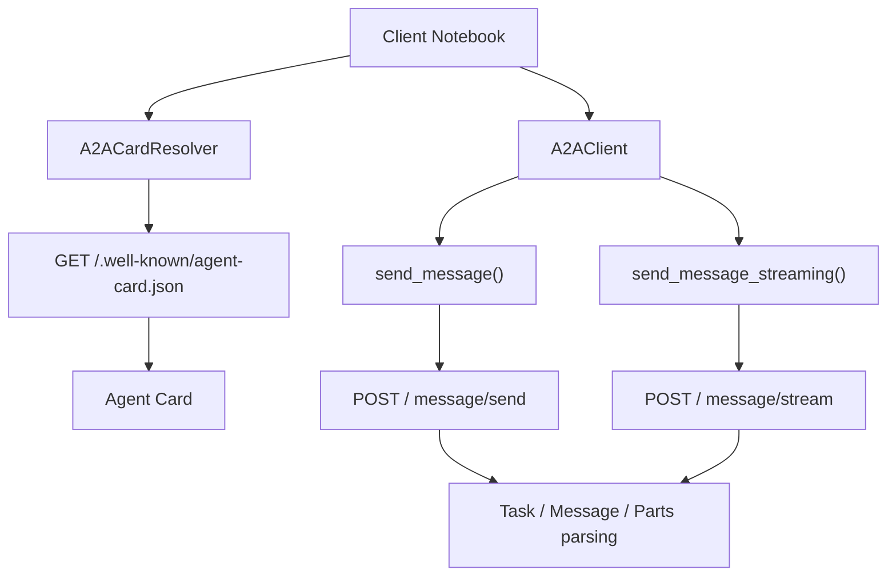

# Lesson 07 — A2A Client Fundamentals

## Quick Links

- <a href="https://www.youtube.com/watch?v=aTqo4ssrz4U" target="_blank" rel="noopener noreferrer">Watch the lesson</a>
- <a href="https://tuts.localm.dev/a2a/a2a-client" target="_blank" rel="noopener noreferrer">Companion page</a>
- Previous lesson: [Wrapping Agents as A2A Servers](../06-a2a-server/)
- Next lesson: [A2A with Microsoft Agent Framework](../08-microsoft-agent-framework/)

Build an A2A client that **discovers**, **calls**, and **streams** from the QAAgent server.

## Prerequisites

| Requirement      | Details                              |
| ---------------- | ------------------------------------ |
| Python           | 3.10+                                |
| A2A SDK          | `pip install "a2a-sdk[http-server]"` |
| Lesson 06 Server | Must be running on `localhost:10001` |

## Quick Start

1. **Start the Lesson 06 server** — open `../06-a2a-server/src/a2a_server.ipynb`
   and run all cells through the server cell (Step 6).

2. **Open `src/a2a_client.ipynb`** in VS Code or Jupyter.

3. **Run cells sequentially** — each builds on the previous.

## Files

| File                   | Purpose                        |
| ---------------------- | ------------------------------ |
| `src/a2a_client.ipynb` | Interactive client walkthrough |
| `README.md`            | This file                      |

## What You'll Learn

- **Agent Discovery** — resolve Agent Cards via `A2ACardResolver`
- **Blocking Calls** — send `message/send` requests with `SendMessageRequest`
- **Streaming Calls** — use `SendStreamingMessageRequest` for real-time responses
- **Response Parsing** — extract text from Tasks, Messages, and Parts
- **Error Handling** — detect and handle JSON-RPC errors

## Key Classes

| Class                         | Import       | Purpose                                            |
| ----------------------------- | ------------ | -------------------------------------------------- |
| `A2ACardResolver`             | `a2a.client` | Discovers agent via `/.well-known/agent-card.json` |
| `A2AClient`                   | `a2a.client` | Sends messages and receives responses              |
| `SendMessageRequest`          | `a2a.types`  | Blocking message request                           |
| `SendStreamingMessageRequest` | `a2a.types`  | Streaming message request                          |
| `MessageSendParams`           | `a2a.types`  | Message payload wrapper                            |

## Architecture

