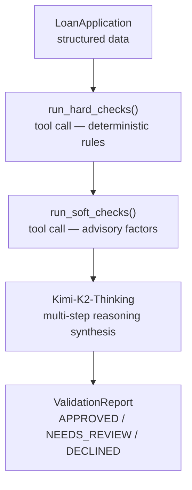

# Lesson 08 — A2A with Microsoft Agent Framework

This folder contains the working example for Lesson 08 of the A2A tutorial.

## What It Does

An `OrchestratorAgent` built with Microsoft Agent Framework uses
**Kimi-K2-Thinking** (Azure AI Foundry) to pre-screen residential mortgage
loan applications.

### Validation pipeline



### The three test applicants

| Applicant      | Profile                                                    | Expected Verdict |
| -------------- | ---------------------------------------------------------- | ---------------- |
| Alice Chen     | CS=730, DTI=0.28, LTV=0.80, 48m employed                   | APPROVED         |
| Bob Kwan       | CS=545, DTI=0.58, 4 derogatory marks                       | DECLINED         |
| Carol Martinez | CS=612, FHA, first-time buyer, resolved medical collection | NEEDS_REVIEW     |

Carol's case is the interesting one — it requires Kimi-K2-Thinking to reason through FHA
exceptions, medical collection exclusion rules, first-time buyer DTI allowance, and
employment LOE eligibility.

## Files

```
src/
  loan_data.py          LoanApplication dataclass + 3 test fixtures
  validation_rules.py   @tool-decorated hard/soft check functions + A2A policy lookup
  orchestrator.py       OrchestratorAgent (Microsoft AF + Kimi-K2-Thinking)
  server.py             A2A server wrapping the OrchestratorAgent (port 10008)
  client.py             A2A client that discovers and calls the server via A2A protocol
  server.ipynb          Simplified MAF server demo — GitHub Phi-4 or LocalFoundry, no Azure required
  client.ipynb          Simplified A2A client demo
```

## Notebooks (Simple)

The two notebooks demonstrate the **Microsoft Agent Framework pattern** with
your choice of **free** model provider — no Azure account required.

| Notebook           | Port  | What it shows                                |
| ------------------ | ----- | -------------------------------------------- |
| `src/server.ipynb` | 10081 | Build an MAF agent + A2A server step-by-step |
| `src/client.ipynb` | —     | Discover and query the MAF A2A server        |

Open both notebooks and run `server.ipynb` first (it starts the server),
then run `client.ipynb` in parallel.

### Provider options

| Provider                    | Set `PROVIDER =` | Credential                                     |
| --------------------------- | ---------------- | ---------------------------------------------- |
| **GitHub Models** (default) | `"github"`       | `GITHUB_TOKEN` in `.env`                       |
| **AI Toolkit LocalFoundry** | `"localfoundry"` | VS Code AI Toolkit + model loaded on port 5272 |

Change `PROVIDER` in cell 2 of `server.ipynb` before running.

> **Jupyter note:** All async calls in the notebooks use `await` directly rather
> than `asyncio.run()`. Jupyter already runs inside a live event loop, so
> `asyncio.run()` raises `RuntimeError: cannot be called from a running event loop`.
> Top-level `await` in cells works correctly with IPython ≥ 7.

## Running

```bash
# Interactive lesson scenario — includes live A2A server + client demo
# (from _examples/a2a/)
python scripts/lesson_08.py

# Or run server and client separately:

# Terminal 1 — start A2A server
cd lessons/08-microsoft-agent-framework/src
python server.py

# Terminal 2 — run A2A client
cd lessons/08-microsoft-agent-framework/src
python client.py                     # validate all 3 applicants
python client.py APP-2024-003        # validate a specific applicant
```

## A2A Protocol Demo

The lesson script (Step 6) demonstrates the full A2A round-trip:

1. **Server start** — OrchestratorAgent is wrapped in `A2AStarletteApplication` on port 10008
2. **Agent discovery** — Client fetches `GET /.well-known/agent-card.json` to discover capabilities
3. **Validation via A2A** — Client sends `message/send` JSON-RPC to validate Carol Martinez
4. **Multi-agent A2A** — Server's `lookup_policy_notes` tool calls QAAgent on port 10001 via A2A

This proves that **any** A2A-compliant client (LangGraph, CrewAI, Google ADK, etc.) can
call the validator without knowing it's built with Microsoft Agent Framework.

## Environment Variables

Set in `_examples/.env`:

```dotenv
AZURE_AI_PROJECT_ENDPOINT=https://<name>.services.ai.azure.com/api/projects/<proj>
AZURE_AI_API_KEY=<your-key>
AZURE_AI_MODEL_DEPLOYMENT_NAME=Kimi-K2-Thinking
```

## Dependencies

```
agent-framework>=1.0.0rc2
agent-framework-azure-ai>=1.0.0rc2
azure-ai-projects>=1.0.0b11
azure-core>=1.32.0
azure-identity>=1.19.0
pydantic>=2.0.0
```
