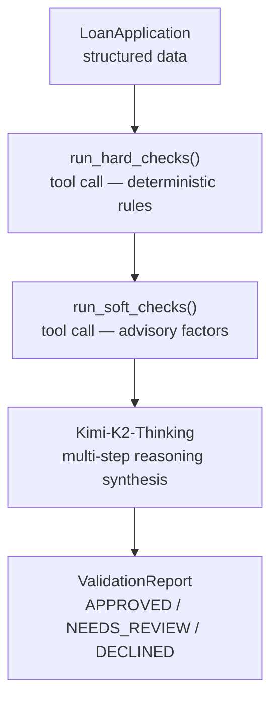

# Lesson 08 — A2A with Microsoft Agent Framework

[](https://www.youtube.com/watch?v=oGwg0VwGyY8)

## Quick Links

- <a href="https://www.youtube.com/watch?v=oGwg0VwGyY8" target="_blank" rel="noopener noreferrer">Watch the lesson</a>
- <a href="https://tuts.localm.dev/a2a/microsoft-agent-framework" target="_blank" rel="noopener noreferrer">Companion page</a>
- Previous lesson: [A2A Client Fundamentals](../07-a2a-client/)
- Next lesson: [A2A with Google ADK](../09-google-adk/)

This folder contains the working example for Lesson 08 of the A2A tutorial.

## What It Does

An `OrchestratorAgent` built with Microsoft Agent Framework uses
**Kimi-K2-Thinking** (Azure AI Foundry) to pre-screen residential mortgage
loan applications.

### Validation pipeline


```mermaid
flowchart TD
    Input["LoanApplication<br/>structured data"]
    Input --> Hard["run_hard_checks()<br/>tool call — deterministic rules"]
    Hard  --> Soft["run_soft_checks()<br/>tool call — advisory factors"]
    Soft  --> LLM["Kimi-K2-Thinking<br/>multi-step reasoning synthesis"]
    LLM   --> Out["ValidationReport<br/>APPROVED / NEEDS_REVIEW / DECLINED"]
```

### Test applicants (8 fixtures from `_common/src/`)

| Applicant      | Profile                                                    | Expected Verdict |
| -------------- | ---------------------------------------------------------- | ---------------- |
| Alice Chen     | CS=730, DTI=0.28, LTV=0.80, 48m employed                   | APPROVED         |
| Bob Kwan       | CS=545, DTI=0.58, 4 derogatory marks                       | DECLINED         |
| Carol Martinez | CS=612, FHA, first-time buyer, resolved medical collection | NEEDS_REVIEW     |
| David Okonkwo  | CS=690, self-employed, high LTV                            | NEEDS_REVIEW     |
| Elena Popov    | CS=780, low DTI, excellent history                         | APPROVED         |
| Frank Torres   | CS=620, recent BK, manual underwrite                       | DECLINED         |
| Grace Nakamura | CS=710, co-borrower, condo                                 | APPROVED         |
| Hassan El-Amin | CS=650, VA loan, combat veteran                            | NEEDS_REVIEW     |

Carol's case is the interesting one — it requires Kimi-K2-Thinking to reason through FHA
exceptions, medical collection exclusion rules, first-time buyer DTI allowance, and
employment LOE eligibility.

## Files

```
src/
  orchestrator.py       OrchestratorAgent (Microsoft AF + Kimi-K2-Thinking)
  server.py             A2A server wrapping the OrchestratorAgent (port 10008)
  server.ipynb          Interactive notebook version of the server
  client.py             A2A client that discovers and calls the server via A2A protocol
```

> **Shared data** — `loan_data.py` and `validation_rules.py` are imported from
> `lessons/_common/src/` (no duplication across lessons).

## Running

### 1. Install dependencies

```bash
cd _examples/a2a
pip install -r requirements.txt
```

### 2. Configure environment

Create `_examples/.env` with:

```dotenv
AZURE_OPENAI_ENDPOINT=https://<resource>.openai.azure.com
AZURE_AI_API_KEY=<your-key>
AZURE_AI_MODEL_DEPLOYMENT_NAME=Kimi-K2-Thinking
```

### 3. Start the A2A server

```bash
cd lessons/08-microsoft-agent-framework/src
python server.py
```

The server starts on `http://localhost:10008`.

### 4. Run the A2A client (in a second terminal)

```bash
cd lessons/08-microsoft-agent-framework/src
python client.py                     # validate all applicants
python client.py APP-2024-003        # validate a specific applicant
```

### 5. Test with curl

```bash
# Fetch Agent Card
curl http://localhost:10008/.well-known/agent-card.json | python -m json.tool

# Send a validation request
curl -X POST http://localhost:10008 \
  -H "Content-Type: application/json" \
  -d '{"jsonrpc":"2.0","id":"test-1","method":"message/send","params":{"message":{"role":"user","parts":[{"kind":"text","text":"Validate APP-2024-003"}],"messageId":"msg-001"}}}'
```

## Sample Output

Running `python client.py` produces:

```text
--- Agent Discovery ---
  Name    : LoanValidatorOrchestrator
  Version : 1.0.0
  URL     : http://localhost:10008/
  Skills  : 1
    - Validate Loan Application: Run hard/soft business-rule checks and LLM reasoning on a loan application.
--- Validating APP-2024-001 ---
============================================================
VALIDATION REPORT: APPROVED
Applicant: Alice Chen (APP-2024-001)
============================================================

REASONING:
Applicant demonstrates strong credit profile with score of 730, DTI of 28% well
below threshold, and stable 48-month employment history. 20% down payment
provides adequate equity. All hard and soft checks passed without exceptions.

COMPENSATING FACTORS:
  + Long employment history (48 months) indicates stability
  + 20% down payment provides strong equity position
  + DTI of 28% provides comfortable debt service buffer

============================================================

--- Validating APP-2024-002 ---
============================================================
VALIDATION REPORT: DECLINED
Applicant: Bob Kwan (APP-2024-002)
============================================================

REASONING:
Multiple non-remediable hard fails for conventional loan: credit score of 545 is
below 620 minimum, DTI of 80% far exceeds 43% limit, employment history of 8
months is insufficient with no LOE exception available, and 4 derogatory marks
exceed policy limit.

COMPENSATING FACTORS:
  + Eligible for Down Payment Assistance programme
  + LTV ratio of 91.2% is within conventional limits

RISK FLAGS:
  - Credit score 545 is below conventional minimum of 620
  - DTI ratio 80.0% exceeds maximum 43% threshold
  - Employment history 8 months is below 24 month requirement; no LOE available
  - Derogatory marks (4) exceed policy limit of 2
  - Unresolved medical collection and judgment present
  - Loan-to-income ratio 7.38x exceeds advisory limit of 4.5x

============================================================

--- Validating APP-2024-003 ---
============================================================
VALIDATION REPORT: NEEDS_REVIEW
Applicant: Carol Martinez (APP-2024-003)
============================================================

REASONING:
All hard disqualification rules pass with FHA-specific exceptions for employment
history and credit score. Applicant meets minimum credit and debt ratios, but
short employment tenure requires underwriter verification of the Letter of
Explanation.

COMPENSATING FACTORS:
  + DTI ratio 34.2% is comfortably below 44% FHA limit
  + Medical collection fully paid/discharged in 2022
  + First-time homebuyer status with LOE provided
  + DTA eligibility provides additional program flexibility

RISK FLAGS:
  - Employment history limited to 18 months (below 24-month standard)
  - Minimal 3.5% down payment creates maximum LTV and PMI requirement
  - Credit score 612 is marginal and below conventional thresholds

UNDERWRITER CONDITIONS:
  1. Verify and approve Letter of Explanation for employment history exception
  2. Confirm Down Payment Assistance program enrollment
  3. Document PMI requirement and premium in loan terms
  4. Obtain evidence medical collection account was paid and discharged

============================================================

--- Done ---
```


1. **Server start** — OrchestratorAgent is wrapped in `A2AStarletteApplication` on port 10008
2. **Agent discovery** — Client fetches `GET /.well-known/agent-card.json` to discover capabilities
3. **Validation via A2A** — Client sends `message/send` JSON-RPC to validate an applicant
4. **Framework transparency** — Any A2A-compliant client (LangGraph, CrewAI, Google ADK, etc.) can call the validator without knowing it's built with Microsoft Agent Framework

## Environment Variables

| Variable                         | Description                       | Example                           |
| -------------------------------- | --------------------------------- | --------------------------------- |
| `AZURE_OPENAI_ENDPOINT`          | Azure OpenAI resource endpoint    | `https://<name>.openai.azure.com` |
| `AZURE_AI_API_KEY`               | API key for the Azure AI resource | _(from Azure portal)_             |
| `AZURE_AI_MODEL_DEPLOYMENT_NAME` | Model deployment name             | `Kimi-K2-Thinking`                |

Set in `_examples/.env` (git-ignored).

## Dependencies

```
agent-framework>=1.0.0rc2
agent-framework-azure-ai>=1.0.0rc2
azure-ai-projects>=1.0.0b11
azure-core>=1.32.0
azure-identity>=1.19.0
pydantic>=2.0.0
```
