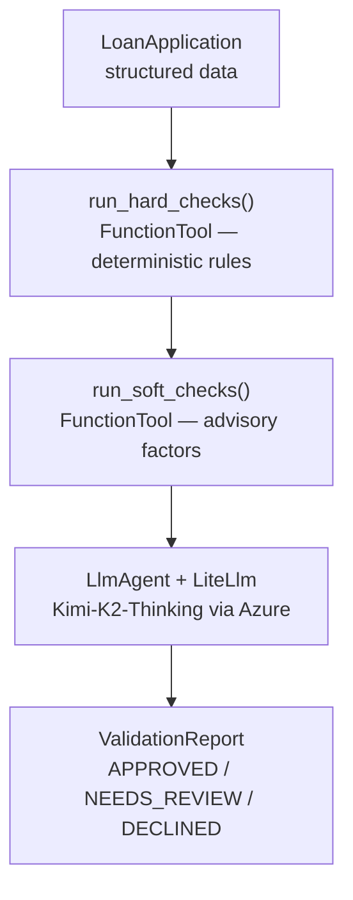

# Lesson 09 — A2A with Google Agent Development Kit (ADK)

This folder contains the working example for Lesson 09 of the A2A tutorial.

## What It Does

An `OrchestratorAgent` built with Google ADK uses **Kimi-K2-Thinking** (Azure AI Foundry)
to pre-screen residential mortgage loan applications — the same validation
problem from Lesson 08, reimplemented with a different framework.

### Validation pipeline



### The three test applicants

| Applicant      | Profile                                                    | Expected Verdict |
| -------------- | ---------------------------------------------------------- | ---------------- |
| Alice Chen     | CS=730, DTI=0.28, LTV=0.80, 48m employed                   | APPROVED         |
| Bob Kwan       | CS=545, DTI=0.58, 4 derogatory marks                       | DECLINED         |
| Carol Martinez | CS=612, FHA, first-time buyer, resolved medical collection | NEEDS_REVIEW     |

## Files

```
src/
  orchestrator.py       OrchestratorAgent (ADK LlmAgent + LiteLlm → Kimi-K2-Thinking)
  server.py             A2A server using ADK's to_a2a() one-liner (port 10002)
  client.py             A2A client that discovers and calls the server via A2A protocol
```

> **Shared data** — `loan_data.py` and `validation_rules.py` are imported from
> `lessons/_common/src/` via sys.path (no duplication).

## Running

### 1. Install dependencies

```bash
cd _examples/a2a
pip install -r requirements.txt
```

### 2. Configure environment

Create `_examples/.env` with:

```dotenv
AZURE_OPENAI_ENDPOINT=https://<resource>.openai.azure.com
AZURE_AI_API_KEY=<your-key>
AZURE_AI_MODEL_DEPLOYMENT_NAME=Kimi-K2-Thinking
```

### 3. Start the A2A server

```bash
cd lessons/09-google-adk/src
python server.py
```

The server starts on `http://localhost:10002`.

### 4. Run the A2A client (in a second terminal)

```bash
cd lessons/09-google-adk/src
python client.py
```

## Key Concepts Demonstrated

1. **ADK `to_a2a()` One-Liner** — the simplest A2A server integration of any
   framework (compare to Lesson 08's manual `A2AStarletteApplication` wiring)
2. **LiteLlm Model Adapter** — run Azure-hosted Kimi-K2 without any
   Google Cloud / Vertex AI dependency
3. **FunctionTool** — wrap plain Python functions as agent tools with
   automatic parameter discovery from type hints and docstrings
4. **Same Problem, Different Framework** — identical loan validation domain
   proves that the framework is just the orchestration layer

## Environment Variables

Set in `_examples/.env`:

```dotenv
AZURE_OPENAI_ENDPOINT=https://<resource>.openai.azure.com
AZURE_AI_API_KEY=<your-key>
AZURE_AI_MODEL_DEPLOYMENT_NAME=Kimi-K2-Thinking
```

## Dependencies

```
google-adk[a2a]>=1.3.0
litellm>=1.50.0
```

## Sample Output

Running `python client.py` produces:

```text
--- Agent Discovery (Google ADK) ---
  Name    : LoanValidatorADK
  Version : 0.0.1
  URL     : http://localhost:10002
    - model: Pre-screens residential mortgage applications using deterministic
      business rules and LLM reasoning to produce APPROVED / NEEDS_REVIEW /
      DECLINED verdicts with full justification.
    - adk_run_hard_checks: Execute hard-fail business rules against a loan application.
    - adk_run_soft_checks: Execute soft advisory checks against a loan application.
    - adk_lookup_policy_notes: Look up policy guidance for a specific underwriting question.

--- Validating APP-2024-001 ---
```json
{
  "verdict": "APPROVED",
  "reasoning_summary": "All hard and soft checks passed ...",
  "compensating_factors": [...],
  "risk_flags": [],
  "conditions": []
}
```

--- Done ---
```

> **Note:** The Google ADK `to_a2a()` integration wraps the `LlmAgent` directly.
> The agent receives the applicant ID via the A2A message and uses `adk_run_hard_checks`
> and `adk_run_soft_checks` tools to fetch validation data before synthesising a verdict.
> Actual LLM-generated reasoning content will vary between runs.
