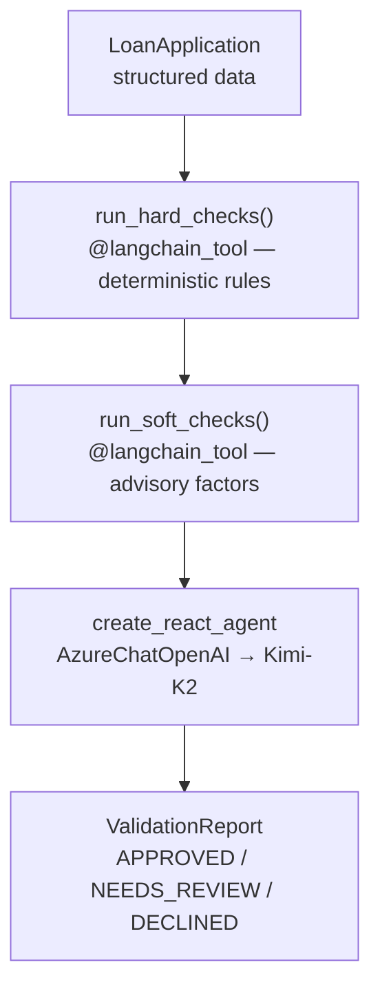

# Lesson 10 — A2A with LangGraph

This folder contains the working example for Lesson 10 of the A2A tutorial.

## What It Does

An `OrchestratorAgent` built with LangGraph's `create_react_agent` uses
**Kimi-K2** (Azure AI Foundry) to pre-screen residential mortgage loan
applications — the same validation problem from Lesson 08, reimplemented
with a different framework.

### Validation pipeline



### The three test applicants

| Applicant      | Profile                                                    | Expected Verdict |
| -------------- | ---------------------------------------------------------- | ---------------- |
| Alice Chen     | CS=730, DTI=0.28, LTV=0.80, 48m employed                   | APPROVED         |
| Bob Kwan       | CS=545, DTI=0.58, 4 derogatory marks                       | DECLINED         |
| Carol Martinez | CS=612, FHA, first-time buyer, resolved medical collection | NEEDS_REVIEW     |

## Files

```
src/
  orchestrator.py       OrchestratorAgent (LangGraph ReAct + AzureChatOpenAI → Kimi-K2)
  server.py             A2A server with manual AgentExecutor wiring (port 10003)
  client.py             A2A client that discovers and calls the server via A2A protocol
```

> **Shared data** — `loan_data.py` and `validation_rules.py` are imported from
> `lessons/08-microsoft-agent-framework/src/` via sys.path (no duplication).

## Running

```bash
# Terminal 1 — start A2A server
cd lessons/10-langgraph/src
python server.py

# Terminal 2 — run A2A client
cd lessons/10-langgraph/src
python client.py
```

## Key Concepts Demonstrated

1. **`create_react_agent`** — LangGraph's prebuilt ReAct agent with
   automatic tool-calling loop
2. **`AzureChatOpenAI`** — LangChain's Azure OpenAI integration for
   connecting to Kimi-K2 via Azure AI Foundry
3. **`@langchain_tool`** — decorator for wrapping functions as LangChain tools
4. **Manual A2A Wiring** — full `AgentExecutor` → `DefaultRequestHandler` →
   `A2AStarletteApplication` pattern (same as Lesson 08)
5. **Same Problem, Different Framework** — identical loan validation domain
   proves that the framework is just the orchestration layer

## Environment Variables

Set in `_examples/.env`:

```dotenv
AZURE_OPENAI_ENDPOINT=https://<resource>.openai.azure.com
AZURE_AI_API_KEY=<your-key>
AZURE_AI_MODEL_DEPLOYMENT_NAME=Kimi-K2
```

## Dependencies

```
langgraph>=0.4.0
langchain-openai>=0.3.0
langchain-core>=0.3.0
```
