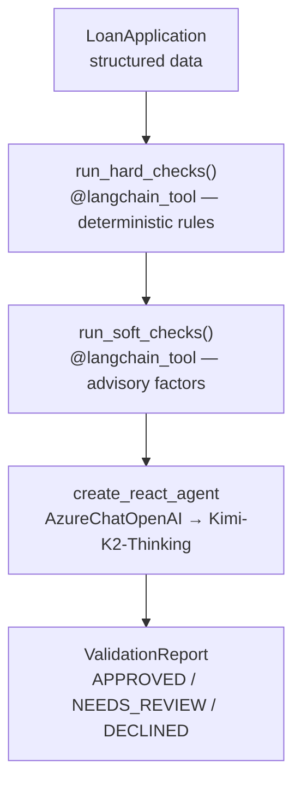

# Lesson 10 — A2A with LangGraph

[](https://www.youtube.com/watch?v=Nt9eENHhGX8)

## Quick Links

- <a href="https://www.youtube.com/watch?v=Nt9eENHhGX8" target="_blank" rel="noopener noreferrer">Watch the lesson</a>
- <a href="https://tuts.localm.dev/a2a/langgraph" target="_blank" rel="noopener noreferrer">Companion page</a>
- Previous lesson: [A2A with Google ADK](../09-google-adk/)
- Next lesson: [A2A with CrewAI](../11-crewai/)

This folder contains the working example for Lesson 10 of the A2A tutorial.

## What It Does

An `OrchestratorAgent` built with LangGraph's `create_react_agent` uses
**Kimi-K2-Thinking** (Azure AI Foundry) to pre-screen residential mortgage loan
applications — the same validation problem from Lesson 08, reimplemented
with a different framework.

### Validation pipeline


```mermaid
flowchart TD
    Input["LoanApplication<br/>structured data"]
    Input --> Hard["run_hard_checks()<br/>@langchain_tool — deterministic rules"]
    Hard  --> Soft["run_soft_checks()<br/>@langchain_tool — advisory factors"]
    Soft  --> LLM["create_react_agent<br/>AzureChatOpenAI → Kimi-K2-Thinking"]
    LLM   --> Out["ValidationReport<br/>APPROVED / NEEDS_REVIEW / DECLINED"]
```

### The three test applicants

| Applicant      | Profile                                                    | Expected Verdict |
| -------------- | ---------------------------------------------------------- | ---------------- |
| Alice Chen     | CS=730, DTI=0.28, LTV=0.80, 48m employed                   | APPROVED         |
| Bob Kwan       | CS=545, DTI=0.58, 4 derogatory marks                       | DECLINED         |
| Carol Martinez | CS=612, FHA, first-time buyer, resolved medical collection | NEEDS_REVIEW     |

## Files

```
src/
  orchestrator.py       OrchestratorAgent (LangGraph ReAct + AzureChatOpenAI → Kimi-K2-Thinking)
  server.py             A2A server with manual AgentExecutor wiring (port 10003)
  client.py             A2A client that discovers and calls the server via A2A protocol
```

> **Shared data** — `loan_data.py` and `validation_rules.py` are imported from
> `lessons/_common/src/` via sys.path (no duplication).

## Running

### 1. Install dependencies

```bash
cd _examples/a2a
pip install -r requirements.txt
```

### 2. Configure environment

Create `_examples/.env` with:

```dotenv
AZURE_OPENAI_ENDPOINT=https://<resource>.openai.azure.com
AZURE_AI_API_KEY=<your-key>
AZURE_AI_MODEL_DEPLOYMENT_NAME=Kimi-K2-Thinking
```

### 3. Start the A2A server

```bash
cd lessons/10-langgraph/src
python server.py
```

The server starts on `http://localhost:10003`.

### 4. Run the A2A client (in a second terminal)

```bash
cd lessons/10-langgraph/src
python client.py
```

## Key Concepts Demonstrated

1. **`create_react_agent`** — LangGraph's prebuilt ReAct agent with
   automatic tool-calling loop
2. **`AzureChatOpenAI`** — LangChain's Azure OpenAI integration for
   connecting to Kimi-K2 via Azure AI Foundry
3. **`@langchain_tool`** — decorator for wrapping functions as LangChain tools
4. **Manual A2A Wiring** — full `AgentExecutor` → `DefaultRequestHandler` →
   `A2AStarletteApplication` pattern (same as Lesson 08)
5. **Same Problem, Different Framework** — identical loan validation domain
   proves that the framework is just the orchestration layer

## Environment Variables

Set in `_examples/.env`:

```dotenv
AZURE_OPENAI_ENDPOINT=https://<resource>.openai.azure.com
AZURE_AI_API_KEY=<your-key>
AZURE_AI_MODEL_DEPLOYMENT_NAME=Kimi-K2-Thinking
```

## Dependencies

```
langgraph>=0.4.0
langchain-openai>=0.3.0
langchain-core>=0.3.0
```

## Sample Output

Running `python client.py` produces:

```text
--- Agent Discovery (LangGraph) ---
  Name: LoanValidatorLangGraph  Version: 1.0.0
    - Validate Loan Application

--- Validating APP-2024-001 ---
============================================================
VALIDATION REPORT: APPROVED
Applicant: Alice Chen (APP-2024-001)
============================================================

REASONING:
All hard and soft checks passed with strong margins. Applicant presents excellent
creditworthiness (730 score, zero derogatory marks), stable 48-month employment
history, and conservative financial ratios (28% DTI, 80% LTV with 20% down
payment). No risk flags or manual review conditions identified.

COMPENSATING FACTORS:
  + Long employment tenure (48 months) demonstrates stability
  + 20% down payment provides substantial equity cushion
  + Credit score of 730 qualifies for most competitive rate tiers
  + DTI of 28% indicates comfortable debt service capacity

============================================================

--- Validating APP-2024-002 ---
============================================================
VALIDATION REPORT: DECLINED
Applicant: Bob Kwan (APP-2024-002)
============================================================

(hard-fail criteria not met: CS 545 < 620, DTI 80% > 43%, 8m employment, 4 derogatory marks)

--- Validating APP-2024-003 ---
============================================================
VALIDATION REPORT: NEEDS_REVIEW
Applicant: Carol Martinez (APP-2024-003)
============================================================

(FHA exceptions applied; manual underwriter verification required)

--- Done ---
```
