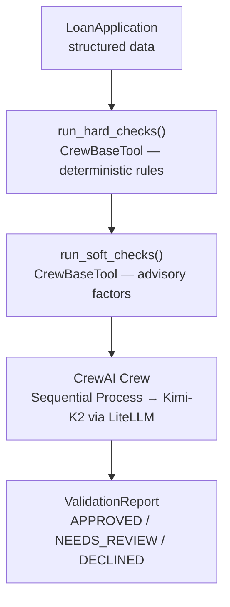

# Lesson 11 — A2A with CrewAI

This folder contains the working example for Lesson 11 of the A2A tutorial.

## What It Does

An `OrchestratorAgent` built with CrewAI uses **Kimi-K2** (Azure AI Foundry)
to pre-screen residential mortgage loan applications — the same validation
problem from Lesson 08, reimplemented with a different framework.

### Validation pipeline



### The three test applicants

| Applicant      | Profile                                                    | Expected Verdict |
| -------------- | ---------------------------------------------------------- | ---------------- |
| Alice Chen     | CS=730, DTI=0.28, LTV=0.80, 48m employed                   | APPROVED         |
| Bob Kwan       | CS=545, DTI=0.58, 4 derogatory marks                       | DECLINED         |
| Carol Martinez | CS=612, FHA, first-time buyer, resolved medical collection | NEEDS_REVIEW     |

## Files

```
src/
  orchestrator.py       OrchestratorAgent (CrewAI Crew with role-based agents → Kimi-K2)
  server.py             A2A server with manual AgentExecutor wiring (port 10004)
  client.py             A2A client that discovers and calls the server via A2A protocol
```

> **Shared data** — `loan_data.py` and `validation_rules.py` are imported from
> `lessons/08-microsoft-agent-framework/src/` via sys.path (no duplication).

## Running

```bash
# Terminal 1 — start A2A server
cd lessons/11-crewai/src
python server.py

# Terminal 2 — run A2A client
cd lessons/11-crewai/src
python client.py
```

## Key Concepts Demonstrated

1. **Role-Based Agents** — CrewAI's `Agent` class with role/goal/backstory
   pattern for separating concerns (Compliance Analyst vs. Senior Underwriter)
2. **Sequential Crew Process** — tasks flow in order from compliance
   analysis to final underwriting verdict
3. **`CrewBaseTool`** — class-based tool wrappers (contrast with decorator
   approaches in other frameworks)
4. **Azure via LiteLLM** — CrewAI uses LiteLLM under the hood; the
   `azure/{deployment}` model string routes to Azure AI Foundry
5. **Same Problem, Different Framework** — identical loan validation domain
   proves that the framework is just the orchestration layer

## Environment Variables

Set in `_examples/.env`:

```dotenv
AZURE_OPENAI_ENDPOINT=https://<resource>.openai.azure.com
AZURE_AI_API_KEY=<your-key>
AZURE_AI_MODEL_DEPLOYMENT_NAME=Kimi-K2
```

## Dependencies

```
crewai>=0.100.0
```
