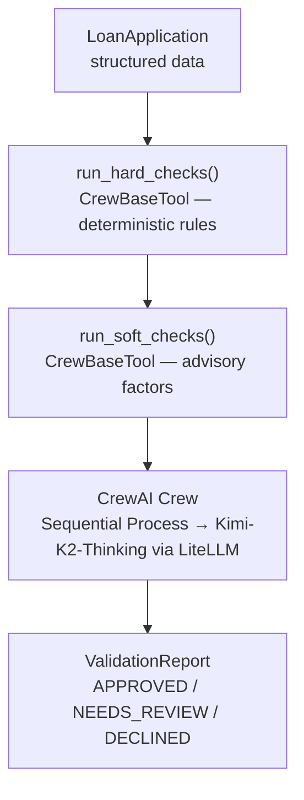

# Lesson 11 — A2A with CrewAI

[](https://www.youtube.com/watch?v=JSa8Vd9kpFM)

## Quick Links

- <a href="https://www.youtube.com/watch?v=JSa8Vd9kpFM" target="_blank" rel="noopener noreferrer">Watch the lesson</a>
- <a href="https://tuts.localm.dev/a2a/crewai" target="_blank" rel="noopener noreferrer">Companion page</a>
- Previous lesson: [A2A with LangGraph](../10-langgraph/)
- Next lesson: [A2A with OpenAI Agents SDK](../12-openai-agents-sdk/)

This folder contains the working example for Lesson 11 of the A2A tutorial.

## What It Does

An `OrchestratorAgent` built with CrewAI uses **Kimi-K2-Thinking** (Azure AI Foundry)
to pre-screen residential mortgage loan applications — the same validation
problem from Lesson 08, reimplemented with a different framework.

### Validation pipeline


```mermaid
flowchart TD
    Input["LoanApplication<br/>structured data"]
    Input --> Hard["run_hard_checks()<br/>CrewBaseTool — deterministic rules"]
    Hard  --> Soft["run_soft_checks()<br/>CrewBaseTool — advisory factors"]
    Soft  --> LLM["CrewAI Crew<br/>Sequential Process → Kimi-K2-Thinking via LiteLLM"]
    LLM   --> Out["ValidationReport<br/>APPROVED / NEEDS_REVIEW / DECLINED"]
```

### The three test applicants

| Applicant      | Profile                                                    | Expected Verdict |
| -------------- | ---------------------------------------------------------- | ---------------- |
| Alice Chen     | CS=730, DTI=0.28, LTV=0.80, 48m employed                   | APPROVED         |
| Bob Kwan       | CS=545, DTI=0.58, 4 derogatory marks                       | DECLINED         |
| Carol Martinez | CS=612, FHA, first-time buyer, resolved medical collection | NEEDS_REVIEW     |

## Files

```
src/
  orchestrator.py       OrchestratorAgent (CrewAI Crew with role-based agents → Kimi-K2)
  server.py             A2A server with manual AgentExecutor wiring (port 10004)
  client.py             A2A client that discovers and calls the server via A2A protocol
```

> **Shared data** — `loan_data.py` and `validation_rules.py` are imported from
> `lessons/_common/src/` via sys.path (no duplication).

## Running

### 1. Install dependencies

```bash
cd _examples/a2a
pip install -r requirements.txt
```

### 2. Configure environment

Create `_examples/.env` with:

```dotenv
AZURE_OPENAI_ENDPOINT=https://<resource>.openai.azure.com
AZURE_AI_API_KEY=<your-key>
AZURE_AI_MODEL_DEPLOYMENT_NAME=Kimi-K2-Thinking
```

### 3. Start the A2A server

```bash
cd lessons/11-crewai/src
python server.py
```

The server starts on `http://localhost:10004`.

### 4. Run the A2A client (in a second terminal)

```bash
cd lessons/11-crewai/src
python client.py
```

## Key Concepts Demonstrated

1. **Role-Based Agents** — CrewAI's `Agent` class with role/goal/backstory
   pattern for separating concerns (Compliance Analyst vs. Senior Underwriter)
2. **Sequential Crew Process** — tasks flow in order from compliance
   analysis to final underwriting verdict
3. **`CrewBaseTool`** — class-based tool wrappers (contrast with decorator
   approaches in other frameworks)
4. **Azure via LiteLLM** — CrewAI uses LiteLLM under the hood; the
   `azure/{deployment}` model string routes to Azure AI Foundry
5. **Same Problem, Different Framework** — identical loan validation domain
   proves that the framework is just the orchestration layer

## Environment Variables

Set in `_examples/.env`:

```dotenv
AZURE_OPENAI_ENDPOINT=https://<resource>.openai.azure.com
AZURE_AI_API_KEY=<your-key>
AZURE_AI_MODEL_DEPLOYMENT_NAME=Kimi-K2-Thinking
```

## Dependencies

```
crewai>=0.100.0
```

## Sample Output

Running `python client.py` produces (requires active Azure AI Foundry endpoint):

```text
Connected to A2A agent at http://localhost:10004
   Agent: LoanValidatorCrewAI
   Skills: ['Loan Application Pre-Screening']

--- Validating Alice Chen (APP-2024-001) ---
============================================================
VALIDATION REPORT: APPROVED
Applicant: Alice Chen (APP-2024-001)
============================================================

REASONING:
All hard and soft checks passed. Strong credit score (730), 48-month employment
history, 20% down payment, and low DTI (28%) confirm eligibility. No risk
flags or compensating factor exceptions required.

COMPENSATING FACTORS:
  + Long employment history demonstrates stability
  + 20% down payment provides strong equity position
  + DTI well below threshold

============================================================

--- Validating Bob Kwan (APP-2024-002) ---
============================================================
VALIDATION REPORT: DECLINED
Applicant: Bob Kwan (APP-2024-002)
============================================================

(fails CS, DTI, employment, and derogatory mark hard checks)

--- Validating Carol Martinez (APP-2024-003) ---
============================================================
VALIDATION REPORT: NEEDS_REVIEW
Applicant: Carol Martinez (APP-2024-003)
============================================================

(FHA exceptions; underwriter must verify LOE and DPA enrollment)

============================================================
```

> **Note:** Requires the Kimi-K2-Thinking deployment on Azure AI Foundry to be available
> with sufficient quota. The CrewAI agent runs two sequential crew tasks (compliance analyst
>
> - senior underwriter) per applicant.
