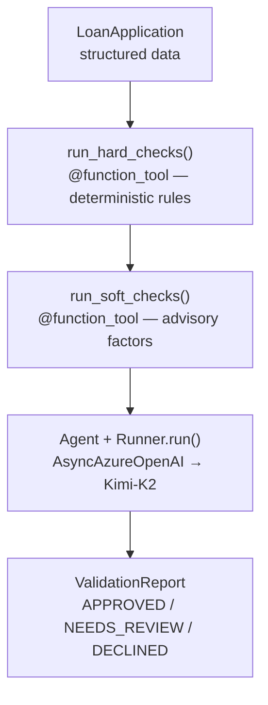

# Lesson 12 — A2A with OpenAI Agents SDK

This folder contains the working example for Lesson 12 of the A2A tutorial.

## What It Does

An `OrchestratorAgent` built with the OpenAI Agents SDK uses **Kimi-K2**
(Azure AI Foundry) to pre-screen residential mortgage loan applications —
the same validation problem from Lesson 08, reimplemented with a different
framework.

### Validation pipeline



### The three test applicants

| Applicant      | Profile                                                    | Expected Verdict |
| -------------- | ---------------------------------------------------------- | ---------------- |
| Alice Chen     | CS=730, DTI=0.28, LTV=0.80, 48m employed                   | APPROVED         |
| Bob Kwan       | CS=545, DTI=0.58, 4 derogatory marks                       | DECLINED         |
| Carol Martinez | CS=612, FHA, first-time buyer, resolved medical collection | NEEDS_REVIEW     |

## Files

```
src/
  orchestrator.py       OrchestratorAgent (OpenAI Agent + @function_tool → Kimi-K2)
  server.py             A2A server with manual AgentExecutor wiring (port 10005)
  client.py             A2A client that discovers and calls the server via A2A protocol
```

> **Shared data** — `loan_data.py` and `validation_rules.py` are imported from
> `lessons/08-microsoft-agent-framework/src/` via sys.path (no duplication).

## Running

```bash
# Terminal 1 — start A2A server
cd lessons/12-openai-agents-sdk/src
python server.py

# Terminal 2 — run A2A client
cd lessons/12-openai-agents-sdk/src
python client.py
```

## Key Concepts Demonstrated

1. **`Agent` + `Runner.run()`** — the OpenAI Agents SDK's core primitives
   for defining and running tool-calling agents
2. **`@function_tool`** — decorator for exposing Python functions as agent
   tools (similar to ADK's `FunctionTool`)
3. **`set_default_openai_client`** — configure the SDK to use
   `AsyncAzureOpenAI` for Azure AI Foundry instead of direct OpenAI
4. **`ModelSettings`** — fine-grained control over inference parameters
   (temperature, etc.)
5. **Same Problem, Different Framework** — identical loan validation domain
   proves that the framework is just the orchestration layer

## Environment Variables

Set in `_examples/.env`:

```dotenv
AZURE_OPENAI_ENDPOINT=https://<resource>.openai.azure.com
AZURE_AI_API_KEY=<your-key>
AZURE_AI_MODEL_DEPLOYMENT_NAME=Kimi-K2
```

## Dependencies

```
openai-agents>=0.1.0
openai>=1.30.0
```
