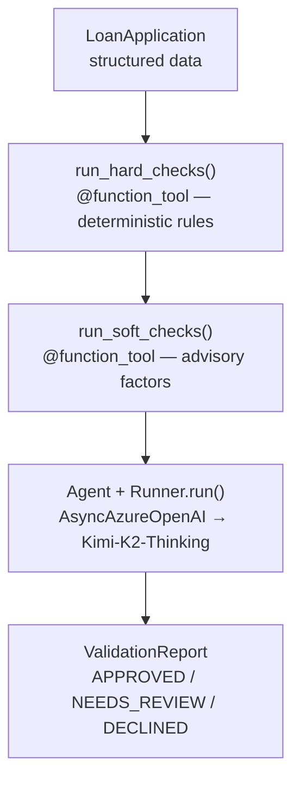

# Lesson 12 — A2A with OpenAI Agents SDK

[](https://www.youtube.com/watch?v=I0C8xFZpJdQ)

## Quick Links

- <a href="https://www.youtube.com/watch?v=I0C8xFZpJdQ" target="_blank" rel="noopener noreferrer">Watch the lesson</a>
- <a href="https://tuts.localm.dev/a2a/openai-agents-sdk" target="_blank" rel="noopener noreferrer">Companion page</a>
- Previous lesson: [A2A with CrewAI](../11-crewai/)
- Next lesson: [A2A with Claude Style Agents](../13-claude-agent-sdk/)

This folder contains the working example for Lesson 12 of the A2A tutorial.

## What It Does

An `OrchestratorAgent` built with the OpenAI Agents SDK uses **Kimi-K2-Thinking**
(Azure AI Foundry) to pre-screen residential mortgage loan applications —
the same validation problem from Lesson 08, reimplemented with a different
framework.

### Validation pipeline


```mermaid
flowchart TD
    Input["LoanApplication<br/>structured data"]
    Input --> Hard["run_hard_checks()<br/>@function_tool — deterministic rules"]
    Hard  --> Soft["run_soft_checks()<br/>@function_tool — advisory factors"]
    Soft  --> LLM["Agent + Runner.run()<br/>AsyncAzureOpenAI → Kimi-K2-Thinking"]
    LLM   --> Out["ValidationReport<br/>APPROVED / NEEDS_REVIEW / DECLINED"]
```

### The three test applicants

| Applicant      | Profile                                                    | Expected Verdict |
| -------------- | ---------------------------------------------------------- | ---------------- |
| Alice Chen     | CS=730, DTI=0.28, LTV=0.80, 48m employed                   | APPROVED         |
| Bob Kwan       | CS=545, DTI=0.58, 4 derogatory marks                       | DECLINED         |
| Carol Martinez | CS=612, FHA, first-time buyer, resolved medical collection | NEEDS_REVIEW     |

## Files

```
src/
  orchestrator.py       OrchestratorAgent (OpenAI Agent + @function_tool → Kimi-K2-Thinking)
  server.py             A2A server with manual AgentExecutor wiring (port 10005)
  client.py             A2A client that discovers and calls the server via A2A protocol
```

> **Shared data** — `loan_data.py` and `validation_rules.py` are imported from
> `lessons/_common/src/` via sys.path (no duplication).

## Running

### 1. Install dependencies

```bash
cd _examples/a2a
pip install -r requirements.txt
```

### 2. Configure environment

Create `_examples/.env` with:

```dotenv
AZURE_OPENAI_ENDPOINT=https://<resource>.openai.azure.com
AZURE_AI_API_KEY=<your-key>
AZURE_AI_MODEL_DEPLOYMENT_NAME=Kimi-K2-Thinking
```

### 3. Start the A2A server

```bash
cd lessons/12-openai-agents-sdk/src
python server.py
```

The server starts on `http://localhost:10005`.

### 4. Run the A2A client (in a second terminal)

```bash
cd lessons/12-openai-agents-sdk/src
python client.py
```

## Key Concepts Demonstrated

1. **`Agent` + `Runner.run()`** — the OpenAI Agents SDK's core primitives
   for defining and running tool-calling agents
2. **`@function_tool`** — decorator for exposing Python functions as agent
   tools (similar to ADK's `FunctionTool`)
3. **`set_default_openai_client`** — configure the SDK to use
   `AsyncAzureOpenAI` for Azure AI Foundry instead of direct OpenAI
4. **`ModelSettings`** — fine-grained control over inference parameters
   (temperature, etc.)
5. **Same Problem, Different Framework** — identical loan validation domain
   proves that the framework is just the orchestration layer

## Environment Variables

Set in `_examples/.env`:

```dotenv
AZURE_OPENAI_ENDPOINT=https://<resource>.openai.azure.com
AZURE_AI_API_KEY=<your-key>
AZURE_AI_MODEL_DEPLOYMENT_NAME=Kimi-K2-Thinking
```

## Dependencies

```
openai-agents>=0.1.0
openai>=1.30.0
```

## Sample Output

Running `python client.py` produces:

```text
Connected to A2A agent at http://localhost:10005
   Agent: LoanValidatorOpenAIAgents
   Skills: ['Loan Application Pre-Screening']

--- Validating Alice Chen (APP-2024-001) ---
============================================================
VALIDATION REPORT: APPROVED
Applicant: Alice Chen (APP-2024-001)
============================================================

REASONING:
Applicant meets all hard-fail underwriting criteria with strong credit profile
(730 score, zero derogatory marks), stable 48-month employment history, low DTI
ratio of 28% (well below 43% threshold), and adequate 20% down payment
resulting in 80% LTV.

COMPENSATING FACTORS:
  + Strong credit score of 730 with no derogatory marks
  + Stable employment history of 48 months
  + Low DTI ratio at 28% provides significant payment capacity cushion
  + 20% down payment demonstrates borrower financial commitment

UNDERWRITER CONDITIONS:
  1. Standard verification of employment and income
  2. Satisfactory property appraisal
  3. Clear title search and insurance

============================================================

--- Validating Bob Kwan (APP-2024-002) ---
============================================================
VALIDATION REPORT: DECLINED
Applicant: Bob Kwan (APP-2024-002)
============================================================

(CS 545 < 620, DTI 80% > 43%, 8m employment, 4 derogatory marks)

--- Validating Carol Martinez (APP-2024-003) ---
============================================================
VALIDATION REPORT: APPROVED
Applicant: Carol Martinez (APP-2024-003)
============================================================

(all FHA requirements met; minor conditions for MIP and LOE verification)

============================================================

--- Done ---
```
