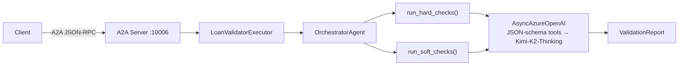

# Lesson 13 — Claude Agent SDK (Loan Validation via A2A)

An `OrchestratorAgent` built with Claude-style agent patterns uses
**Kimi-K2-Thinking** (Azure AI Foundry) to pre-screen residential mortgage
loan applications. Instead of relying on a framework's agent abstractions,
this lesson builds the agentic loop from scratch: manual JSON-schema tool
definitions, explicit tool-call dispatch, and per-request conversation memory.



## Port

| Service                    | Port    |
| -------------------------- | ------- |
| Claude-style LoanValidator | `10006` |

## Files

```
13-claude-agent-sdk/
  src/
    orchestrator.py   OrchestratorAgent (manual tool-call loop → Kimi-K2-Thinking)
    server.py         A2AStarletteApplication on port 10006
    client.py         A2A client — validates every test applicant
```

Shared data lives in `_common/src/`:

```
_common/src/
  loan_data.py          LoanApplication + 8 test fixtures
  validation_rules.py   run_hard_checks, run_soft_checks, lookup_policy_notes
```

## Key Concepts

1. **JSON-schema tool definitions** — Tools are plain dicts with
   `type: "function"` and fully typed `parameters`, matching the Anthropic
   tool-use spec format.

2. **Manual tool-call dispatch loop** — The orchestrator sends messages to
   the LLM, inspects `tool_calls` on the response, executes each tool
   locally, appends a `role: "tool"` message, and loops until the model
   produces a final text response.

3. **Per-task conversation memory** — The `LoanValidatorExecutor` maintains
   a dictionary of `OrchestratorAgent` instances keyed by A2A task ID,
   enabling multi-turn interactions within the same task.

4. **No framework dependency** — Only `openai` + `a2a-sdk` are needed.

## Running

```bash
# Terminal 1 — server
cd lessons/13-claude-agent-sdk/src
python server.py

# Terminal 2 — client
cd lessons/13-claude-agent-sdk/src
python client.py
```

## Environment Variables

```env
AZURE_OPENAI_ENDPOINT=https://<your-endpoint>.openai.azure.com/
AZURE_AI_API_KEY=<your-key>
AZURE_AI_MODEL_DEPLOYMENT_NAME=Kimi-K2-Thinking
```
