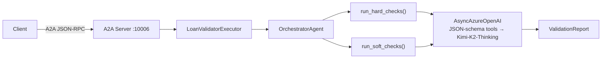

# Lesson 13 — Claude Agent SDK (Loan Validation via A2A)

[](https://www.youtube.com/watch?v=e5E-iN2lFvg)

## Quick Links

- <a href="https://www.youtube.com/watch?v=e5E-iN2lFvg" target="_blank" rel="noopener noreferrer">Watch the lesson</a>
- <a href="https://tuts.localm.dev/a2a/claude-agent-sdk" target="_blank" rel="noopener noreferrer">Companion page</a>
- Previous lesson: [A2A with OpenAI Agents SDK](../12-openai-agents-sdk/)
- Next lesson: [Multi-Agent System Deep Dive](../14-multi-agent-deep-dive/)

An `OrchestratorAgent` built with Claude-style agent patterns uses
**Kimi-K2-Thinking** (Azure AI Foundry) to pre-screen residential mortgage
loan applications. Instead of relying on a framework's agent abstractions,
this lesson builds the agentic loop from scratch: manual JSON-schema tool
definitions, explicit tool-call dispatch, and per-request conversation memory.


```mermaid
graph LR
    Client -->|A2A JSON-RPC| Server[A2A Server :10006]
    Server --> Executor[LoanValidatorExecutor]
    Executor --> Agent[OrchestratorAgent]
    Agent --> Hard["run_hard_checks()"]
    Agent --> Soft["run_soft_checks()"]
    Hard  --> LLM["AsyncAzureOpenAI<br/>JSON-schema tools → Kimi-K2-Thinking"]
    Soft  --> LLM
    LLM   --> Report[ValidationReport]
```

## Port

| Service                    | Port    |
| -------------------------- | ------- |
| Claude-style LoanValidator | `10006` |

## Files

```
13-claude-agent-sdk/
  src/
    orchestrator.py   OrchestratorAgent (manual tool-call loop → Kimi-K2-Thinking)
    server.py         A2AStarletteApplication on port 10006
    client.py         A2A client — validates every test applicant
```

Shared data lives in `_common/src/`:

```
_common/src/
  loan_data.py          LoanApplication + 8 test fixtures
  validation_rules.py   run_hard_checks, run_soft_checks, lookup_policy_notes
```

## Key Concepts

1. **JSON-schema tool definitions** — Tools are plain dicts with
   `type: "function"` and fully typed `parameters`, matching the Anthropic
   tool-use spec format.

2. **Manual tool-call dispatch loop** — The orchestrator sends messages to
   the LLM, inspects `tool_calls` on the response, executes each tool
   locally, appends a `role: "tool"` message, and loops until the model
   produces a final text response.

3. **Per-task conversation memory** — The `LoanValidatorExecutor` maintains
   a dictionary of `OrchestratorAgent` instances keyed by A2A task ID,
   enabling multi-turn interactions within the same task.

4. **No framework dependency** — Only `openai` + `a2a-sdk` are needed.

## Running

```bash
# Terminal 1 — server
cd lessons/13-claude-agent-sdk/src
python server.py

# Terminal 2 — client
cd lessons/13-claude-agent-sdk/src
python client.py
```

## Environment Variables

```env
AZURE_OPENAI_ENDPOINT=https://<your-endpoint>.openai.azure.com/
AZURE_AI_API_KEY=<your-key>
AZURE_AI_MODEL_DEPLOYMENT_NAME=Kimi-K2-Thinking
```

## Dependencies

```
openai>=1.30.0
a2a-sdk>=0.3.0
```

## Sample Output

Running `python client.py` produces:

```text
Connected to A2A agent at http://localhost:10006
   Agent: LoanValidatorClaudeStyle
   Skills: ['Loan Application Pre-Screening']

--- Validating Alice Chen (APP-2024-001) ---
============================================================
VALIDATION REPORT: APPROVED
Applicant: Alice Chen (APP-2024-001)
============================================================

REASONING:
All hard business rules passed with significant margin: credit score 730
(min 620), DTI 28.0% (max 43.0%), LTV 80.0% (max 95.0%), employment 48
months (min 24), and zero derogatory marks. All soft advisory checks also
passed, indicating strong credit profile, adequate income, stable employment,
and sufficient down payment.

COMPENSATING FACTORS:
  + Long employment history (48 months) demonstrates stability
  + 20% down payment provides strong equity buffer
  + Credit score 730 qualifies for competitive pricing
  + Zero derogatory marks indicate clean credit history

============================================================

--- Validating Bob Kwan (APP-2024-002) ---
============================================================
VALIDATION REPORT: DECLINED
Applicant: Bob Kwan (APP-2024-002)
============================================================

(four hard-check failures: CS 545 < 620, DTI 80% > 43%, 8m employment, 4 derogatory marks)

--- Validating Carol Martinez (APP-2024-003) ---
============================================================
VALIDATION REPORT: NEEDS_REVIEW
Applicant: Carol Martinez (APP-2024-003)
============================================================

(LOE exception applied; manual underwriting required)

UNDERWRITER CONDITIONS:
  1. Underwriter must verify LOE credibility
  2. Confirm Down Payment Assistance program enrollment
  3. Validate medical collection is paid and discharged
  4. Verify income stability and employment continuity
  5. Ensure FHA Mortgage Insurance Premium (MIP) is established

============================================================

--- Done ---
```
