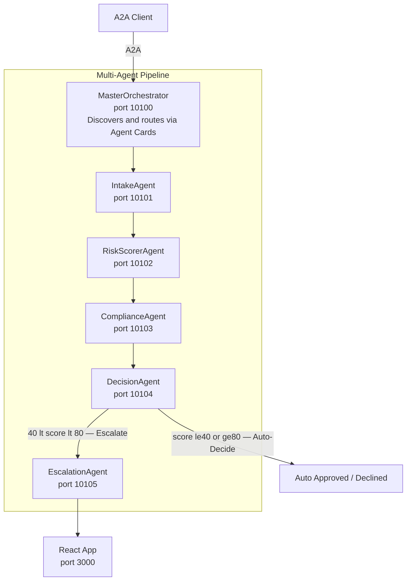
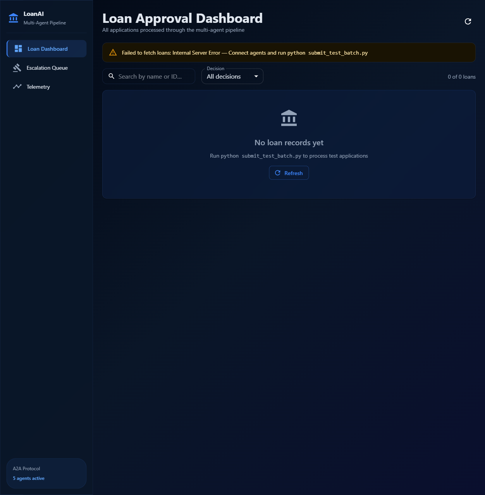
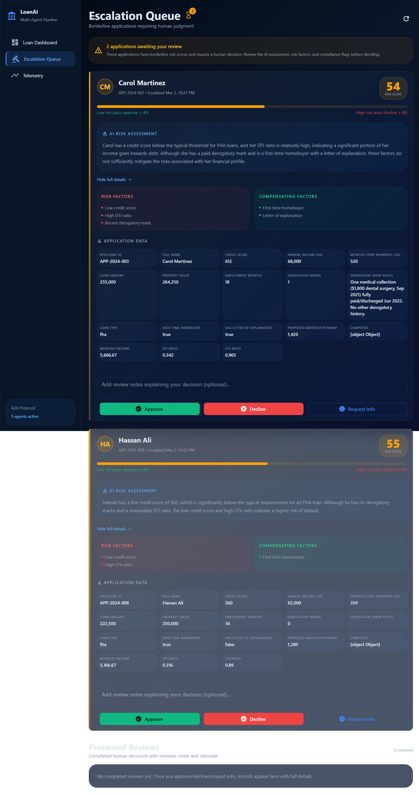
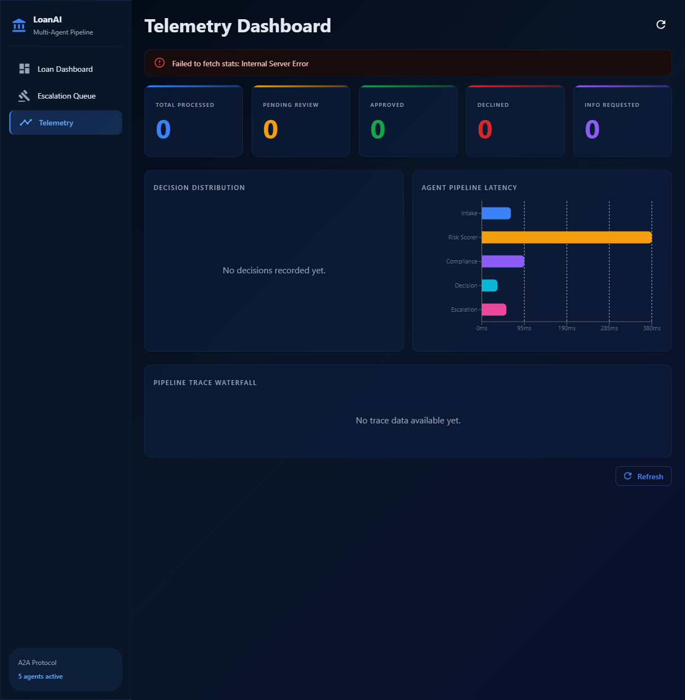

# Lesson 14 — Multi-Agent Loan Approval System (Capstone)

A production-grade multi-agent loan approval pipeline built with the A2A protocol,
featuring AI-driven decisioning (80%), human-in-the-loop escalation (20%),
a React approval dashboard, and OpenTelemetry observability.

## Architecture



## Project Structure

```
14-multi-agent-deep-dive/
├── agents/
│   ├── .env.example          ← Environment template (references shared .env)
│   └── src/
│       ├── model_provider.py ← Unified LLM provider abstraction
│       ├── telemetry.py      ← OpenTelemetry setup
│       ├── intake_agent.py   ← IntakeAgent logic
│       ├── intake_server.py  ← A2A server (port 10101)
│       ├── risk_scorer.py    ← RiskScorerAgent logic
│       ├── risk_scorer_server.py ← A2A server (port 10102)
│       ├── compliance_agent.py   ← ComplianceAgent logic
│       ├── compliance_server.py  ← A2A server (port 10103)
│       ├── decision_agent.py     ← DecisionAgent logic
│       ├── decision_server.py    ← A2A server (port 10104)
│       ├── escalation_agent.py   ← EscalationAgent + REST API
│       ├── escalation_server.py  ← A2A server (port 10105)
│       ├── orchestrator.py       ← MasterOrchestrator logic
│       ├── orchestrator_server.py← A2A server (port 10100)
│       ├── start_all.py          ← Launch all agents
│       └── submit_test_batch.py  ← Submit 8 test applications
├── ui/
│   ├── package.json
│   ├── tsconfig.json
│   ├── vite.config.ts
│   └── src/
│       ├── main.tsx
│       ├── App.tsx
│       ├── api.ts
│       ├── types.ts
│       └── components/
│           ├── ApprovalQueue.tsx
│           ├── ApplicationCard.tsx
│           ├── TelemetryDashboard.tsx
│           ├── TraceWaterfall.tsx
│           ├── DecisionChart.tsx
│           └── AgentLatencyChart.tsx
└── README.md                 ← This file
```

---

## Prerequisites

| Requirement   | Notes                                                |
| ------------- | ---------------------------------------------------- |
| Python 3.11+  | Shared venv at `_examples/a2a/.venv`                 |
| Node.js 18+   | For the React approval dashboard                     |
| Shared `.env` | `_examples/.env` — already has `GITHUB_TOKEN`, creds |
| Shared venv   | `_examples/a2a/.venv` — already has all deps         |

---

## Environment & Dependencies

This lesson uses the **shared** virtual environment and `.env` file — you do **not**
need lesson-specific copies.

### Shared `.env` (credentials + provider)

Located at `_examples/.env`. The `find_dotenv()` call in every server walks up the
directory tree and finds it automatically.

```dotenv
# Already set in _examples/.env:
GITHUB_TOKEN=ghp_…
AZURE_OPENAI_ENDPOINT=https://tuts.openai.azure.com
AZURE_AI_API_KEY=Cwu7kK…
AZURE_AI_MODEL_DEPLOYMENT_NAME=Kimi-K2-Thinking
PROVIDER=github          # ← switches the LLM provider
```

### Shared venv & requirements

```powershell
# From repo root:
cd _examples\a2a
.venv\Scripts\activate       # activates the shared venv
pip install -r requirements.txt   # lesson 14 deps are already listed
```

> **Note:** The shared `requirements.txt` includes OpenTelemetry, FastAPI, and
> all other lesson 14 dependencies. No separate `requirements.txt` exists here.

---

## Model Provider Configuration

The `PROVIDER` variable in `.env` selects which LLM backs the RiskScorerAgent's
AI assessment. All other agents are rule-based (no LLM).

| `PROVIDER` value                    | Model                 | Endpoint                                    |
| ----------------------------------- | --------------------- | ------------------------------------------- |
| `github` (default)                  | Phi-4 (GitHub Models) | `https://models.github.ai/inference`        |
| `microsoftfoundry` / `azure`        | Kimi-K2-Thinking      | Azure OpenAI (from `AZURE_OPENAI_ENDPOINT`) |
| `localfoundry` / `local` / `ollama` | Qwen 2.5 (AI Toolkit) | `http://localhost:5272/v1/` (configurable)  |

### Switching providers

```dotenv
# In _examples/.env — change this one line:
PROVIDER=github              # ← default: free-tier Phi-4
# PROVIDER=microsoftfoundry  # ← Azure AI Foundry
# PROVIDER=localfoundry      # ← VS Code AI Toolkit / Ollama
```

**Override model names** with environment variables:

```dotenv
GITHUB_MODEL=openai/gpt-4o-mini                    # default (fast)
# GITHUB_MODEL=Phi-4                               # slower, more verbose
LOCALFOUNDRY_MODEL=qwen2.5-0.5b-instruct-generic-gpu:4  # default
AZURE_AI_MODEL_DEPLOYMENT_NAME=Kimi-K2-Thinking          # default
```

---

## Quick Start

### Step 1 — Activate the shared venv

```powershell
cd Y:\.sources\localm-tuts\a2a\_examples\a2a
.venv\Scripts\activate
```

### Step 2 — Start all 6 A2A agent servers

```powershell
cd Y:\.sources\localm-tuts\a2a\_examples\a2a\lessons\14-multi-agent-deep-dive\agents\src
python start_all.py
```

This launches all servers as subprocesses and waits for each Agent Card endpoint
to respond. You should see:

```
============================================================
Multi-Agent Loan Approval Pipeline — Startup
============================================================

Starting IntakeAgent (intake_server.py) on port 10101…
Starting RiskScorerAgent (risk_scorer_server.py) on port 10102…
Starting ComplianceAgent (compliance_server.py) on port 10103…
Starting DecisionAgent (decision_server.py) on port 10104…
Starting EscalationAgent (escalation_server.py) on port 10105…
Starting Orchestrator (orchestrator_server.py) on port 10100…

Waiting for agents to become ready…

  ✅ IntakeAgent ready on port 10101
  ✅ RiskScorerAgent ready on port 10102
  ✅ ComplianceAgent ready on port 10103
  ✅ DecisionAgent ready on port 10104
  ✅ EscalationAgent ready on port 10105
  ✅ Orchestrator ready on port 10100

6/6 agents ready.

🚀 All agents running! Pipeline is ready.
```

### Step 3 — Start the React UI (separate terminal)

```powershell
cd Y:\.sources\localm-tuts\a2a\_examples\a2a\lessons\14-multi-agent-deep-dive\ui
npm install
npm run dev
# Opens at http://localhost:3000
```

### Step 4 — Submit test applications

```powershell
cd Y:\.sources\localm-tuts\a2a\_examples\a2a\lessons\14-multi-agent-deep-dive\agents\src
python submit_test_batch.py
```

Submits 8 applications with varying risk profiles (low, medium, high, edge-cases).

### Step 5 — Observe the pipeline

- **Terminal logs**: Each agent prints detailed step-by-step logs with timing
- **React dashboard**: Open http://localhost:3000 to see escalated applications
- **Telemetry**: Traces appear on the React telemetry dashboard + console output

---

## UI Screenshots (Playwright)

Captured on 2026-03-02 from `http://localhost:3000` using Playwright after
running a full end-to-end validation: all 6 agents active, 8 test applications
submitted via `submit_test_batch.py`.

### Dashboard



### Escalation Queue



### Telemetry



> Screenshots reflect live pipeline results: 4 auto-approved, 2 auto-declined,
> 2 escalated to human review (Carol Martinez score 54, Hassan Ali score 55).

---

## Validation Logs

End-to-end example run logs for Lessons 08-14:

| Lesson | Log file                        | Result                              |
| ------ | ------------------------------- | ----------------------------------- |
| 08     | `_runlogs/08-client-verify.log` | MAF agent + client verified         |
| 09     | `_runlogs/09-client-verify.log` | Google ADK agent + client verified  |
| 10     | `_runlogs/10-client-verify.log` | LangGraph agent + client verified   |
| 11     | `_runlogs/11-client-verify.log` | CrewAI agent + client verified      |
| 12     | `_runlogs/12-client-verify.log` | OpenAI Agents SDK + client verified |
| 13     | `_runlogs/13-client-verify.log` | Claude Agent SDK + client verified  |
| 14     | `_runlogs/14-client-verify.log` | Multi-agent pipeline: 8/8 processed |

Full batch result (2026-03-02): 4 APPROVED · 2 DECLINED · 2 PENDING_REVIEW

Raw logs are in `../_runlogs/*.log`.

---

## Servers & Port Map

| Port  | Service               | Process                  | Health Check Endpoint                           |
| ----- | --------------------- | ------------------------ | ----------------------------------------------- |
| 10100 | MasterOrchestrator    | `orchestrator_server.py` | `http://localhost:10100/.well-known/agent.json` |
| 10101 | IntakeAgent           | `intake_server.py`       | `http://localhost:10101/.well-known/agent.json` |
| 10102 | RiskScorerAgent       | `risk_scorer_server.py`  | `http://localhost:10102/.well-known/agent.json` |
| 10103 | ComplianceAgent       | `compliance_server.py`   | `http://localhost:10103/.well-known/agent.json` |
| 10104 | DecisionAgent         | `decision_server.py`     | `http://localhost:10104/.well-known/agent.json` |
| 10105 | EscalationAgent (A2A) | `escalation_server.py`   | `http://localhost:10105/.well-known/agent.json` |
| 8080  | Escalation REST API   | (same process as 10105)  | `http://localhost:8080/api/escalations/pending` |
| 3000  | React UI              | `npm run dev` (Vite)     | `http://localhost:3000`                         |

### Running servers individually

If `start_all.py` fails or you need to debug a single agent:

```powershell
# Terminal 1 — IntakeAgent
python intake_server.py

# Terminal 2 — RiskScorerAgent
python risk_scorer_server.py

# Terminal 3 — ComplianceAgent
python compliance_server.py

# Terminal 4 — DecisionAgent
python decision_server.py

# Terminal 5 — EscalationAgent + REST API
python escalation_server.py

# Terminal 6 — Orchestrator (start last — discovers others)
python orchestrator_server.py
```

> **Startup order matters:** The Orchestrator discovers peers by fetching Agent
> Cards on startup. Start the 5 specialist agents first, then the Orchestrator.

---

## Testing & Verification

### Health check all agents

```powershell
# Quick check — each should return the Agent Card JSON
Invoke-WebRequest http://localhost:10101/.well-known/agent.json | Select-Object StatusCode
Invoke-WebRequest http://localhost:10102/.well-known/agent.json | Select-Object StatusCode
Invoke-WebRequest http://localhost:10103/.well-known/agent.json | Select-Object StatusCode
Invoke-WebRequest http://localhost:10104/.well-known/agent.json | Select-Object StatusCode
Invoke-WebRequest http://localhost:10105/.well-known/agent.json | Select-Object StatusCode
Invoke-WebRequest http://localhost:10100/.well-known/agent.json | Select-Object StatusCode
```

### Submit a single application manually

```powershell
$body = @{
    jsonrpc = "2.0"
    id = "test-1"
    method = "message/send"
    params = @{
        message = @{
            role = "user"
            parts = @(@{
                kind = "text"
                text = '{"applicant_name":"Test User","annual_income":85000,"loan_amount":200000,"property_value":250000,"credit_score":720,"employment_years":5,"debt_to_income_ratio":0.28}'
            })
            messageId = "msg-test-1"
        }
    }
} | ConvertTo-Json -Depth 10

Invoke-RestMethod -Uri http://localhost:10100/ -Method POST -Body $body -ContentType "application/json"
```

### Check escalation queue

```powershell
Invoke-RestMethod http://localhost:8080/api/escalations/pending
```

### Expected log output

When a test application is submitted, each agent logs its processing with
timestamps and timing. Example:

```
14:32:01 orchestrator       INFO    ======================================================================
14:32:01 orchestrator       INFO    [APP-abc123] PIPELINE START
14:32:01 orchestrator       INFO    ======================================================================
14:32:01 orchestrator       INFO    [APP-abc123] Step 1/5: IntakeAgent ─ validating…
14:32:01 intake_agent       INFO    === IntakeAgent — Validation Pipeline ===
14:32:01 intake_agent       INFO    Applicant: Test User | Income: $85,000 | Loan: $200,000
14:32:01 intake_agent       INFO    ✓ Validation PASSED — DTI=0.28, LTV=0.80
14:32:01 orchestrator       INFO    [APP-abc123] Step 1/5: IntakeAgent done (45ms)
14:32:01 orchestrator       INFO    [APP-abc123] Step 2/5: RiskScorerAgent ─ scoring…
14:32:01 risk_scorer        INFO    === RiskScorer — Score Pipeline ===
14:32:01 risk_scorer        INFO    Provider: GitHub Models (Phi-4)
14:32:02 risk_scorer        INFO    Rule-based score: 35 | LLM adjustment: -3
14:32:02 risk_scorer        INFO    Final composite score: 32 (LOW risk)
14:32:02 orchestrator       INFO    [APP-abc123] Step 2/5: RiskScorerAgent done (980ms)
…
14:32:03 orchestrator       INFO    [APP-abc123] PIPELINE COMPLETE — APPROVED in 2150ms
14:32:03 orchestrator       INFO    ======================================================================
```

---

## Decision Thresholds

| Risk Score | Action        | Approximate % |
| ---------- | ------------- | ------------- |
| ≤ 40       | Auto-Approved | ~50%          |
| 40–80      | Human Review  | ~20%          |
| ≥ 80       | Auto-Declined | ~30%          |

Thresholds are configurable via `AUTO_APPROVE_THRESHOLD` and `AUTO_DECLINE_THRESHOLD`
environment variables (or in the agent's `.env.example`).

---

## Logging & Telemetry

### Python logging

Every agent uses the `logging` module with named loggers:

| Logger name        | Module              |
| ------------------ | ------------------- |
| `orchestrator`     | orchestrator.py     |
| `intake_agent`     | intake_agent.py     |
| `risk_scorer`      | risk_scorer.py      |
| `compliance_agent` | compliance_agent.py |
| `decision_agent`   | decision_agent.py   |
| `escalation_agent` | escalation_agent.py |

Format: `HH:MM:SS <logger-name>    <LEVEL>  <message>`

### OpenTelemetry

- Traces are auto-exported to console (always on) and OTLP (if configured)
- W3C `traceparent` headers propagate across all A2A calls
- Set `OTEL_EXPORTER_OTLP_ENDPOINT` to send to Jaeger / Grafana Tempo

### React telemetry dashboard

The React UI at http://localhost:3000 includes:

- **Trace Waterfall** — visualizes each pipeline step timing
- **Decision Chart** — pie chart of approved / declined / escalated
- **Agent Latency Chart** — bar chart of per-agent response times

---

## Troubleshooting

| Problem                        | Solution                                                             |
| ------------------------------ | -------------------------------------------------------------------- |
| `ModuleNotFoundError`          | Activate shared venv: `_examples\a2a\.venv\Scripts\activate`         |
| Agent fails to start           | Check if the port is already in use: `netstat -ano \| findstr 10101` |
| Orchestrator can't find agents | Start specialist agents before the orchestrator                      |
| No LLM response                | Check `PROVIDER` value and corresponding API key in `_examples/.env` |
| Empty risk scores              | Verify `GITHUB_TOKEN` is valid (for `github` provider)               |
| React UI won't connect         | Ensure escalation server is running (port 8080 REST API)             |
