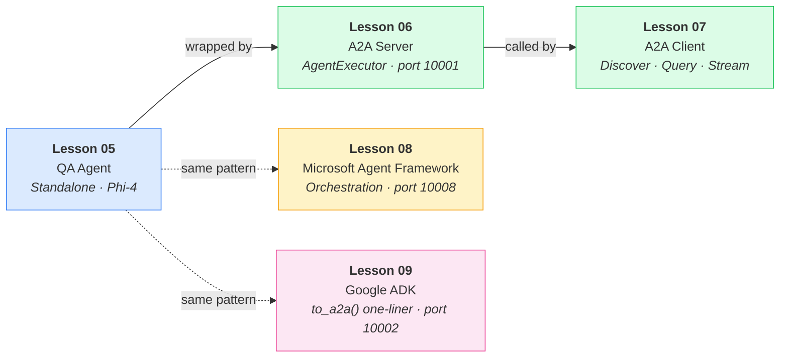
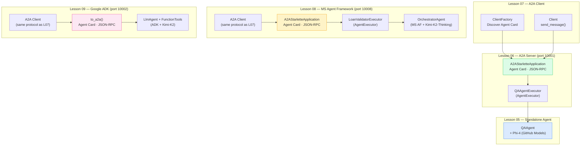
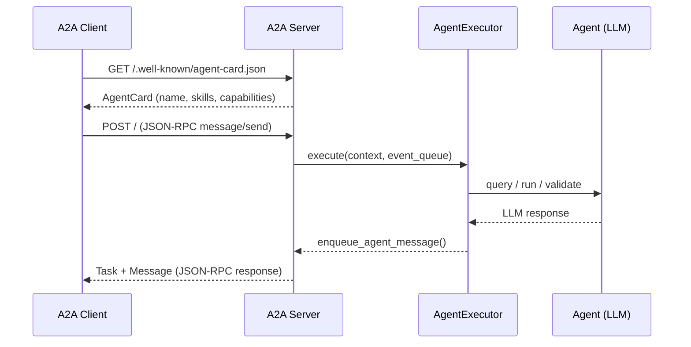
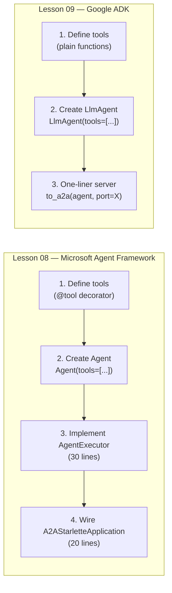

# Lessons — A2A Protocol Examples

Progressive lessons building from a standalone LLM agent to a
multi-framework A2A deployment. Each lesson compiles and runs
independently. Lessons 08–13 all solve the **same loan validation
problem** using different agent frameworks — shared data and rules
live in `_common/src/`. Lesson 14 is a capstone that builds a full
multi-agent loan approval pipeline with a React dashboard.

---

## Lesson Progression



---

## Full System Architecture



---

## Lessons at a Glance

| Lesson | Folder                          | What It Builds                                    | Port            | Model                  |
| ------ | ------------------------------- | ------------------------------------------------- | --------------- | ---------------------- |
| **05** | `05-first-a2a-agent/`           | Standalone QA agent — insurance policy Q&A        | —               | GitHub Phi-4           |
| **06** | `06-a2a-server/`                | A2A server wrapping the QA agent                  | **10001**       | GitHub Phi-4           |
| **07** | `07-a2a-client/`                | A2A client — discover, query, stream              | —               | _(client only)_        |
| **08** | `08-microsoft-agent-framework/` | Loan validator via MS Agent Framework             | **10008**       | Azure Kimi-K2-Thinking |
| **09** | `09-google-adk/`                | Loan validator via Google ADK `to_a2a()`          | **10002**       | Azure Kimi-K2-Thinking |
| **10** | `10-langgraph/`                 | Loan validator via LangGraph ReAct agent          | **10003**       | Azure Kimi-K2-Thinking |
| **11** | `11-crewai/`                    | Loan validator via CrewAI role-based crew         | **10004**       | Azure Kimi-K2-Thinking |
| **12** | `12-openai-agents-sdk/`         | Loan validator via OpenAI Agents SDK              | **10005**       | Azure Kimi-K2-Thinking |
| **13** | `13-claude-agent-sdk/`          | Loan validator via Claude-style agent patterns    | **10006**       | Azure Kimi-K2-Thinking |
| **14** | `14-multi-agent-deep-dive/`     | Full loan approval pipeline — 6 agents + React UI | **10100–10105** | GitHub gpt-4o-mini     |

---

## A2A Protocol Round-Trip



The **same client pattern** (Lesson 07) calls all three servers (Lessons 06, 08, 09).
The framework used to build the server is invisible to the client — that is A2A interoperability.

---

## Port Reference

| Port    | Lesson | Agent                     | Notes                                         |
| ------- | ------ | ------------------------- | --------------------------------------------- |
| `10001` | 06     | QAAgent                   | Insurance policy Q&A, GitHub Phi-4            |
| `10002` | 09     | LoanValidatorADK          | Google ADK, Azure Kimi-K2-Thinking            |
| `10003` | 10     | LoanValidatorLangGraph    | LangGraph ReAct, Azure Kimi-K2-Thinking       |
| `10004` | 11     | LoanValidatorCrewAI       | CrewAI crew, Azure Kimi-K2-Thinking           |
| `10005` | 12     | LoanValidatorOpenAIAgents | OpenAI Agents SDK, Azure Kimi-K2-Thinking     |
| `10006` | 13     | LoanValidatorClaudeStyle  | Claude-style patterns, Azure Kimi-K2-Thinking |
| `10008` | 08     | LoanValidatorOrchestrator | MS Agent Framework, Azure Kimi-K2-Thinking    |
| `10100` | 14     | LoanApprovalOrchestrator  | Capstone orchestrator, GitHub gpt-4o-mini     |
| `10101` | 14     | IntakeAgent               | Capstone — loan intake parsing                |
| `10102` | 14     | RiskScorerAgent           | Capstone — risk scoring                       |
| `10103` | 14     | ComplianceAgent           | Capstone — compliance checks                  |
| `10104` | 14     | DecisionAgent             | Capstone — approval/decline routing           |
| `10105` | 14     | EscalationAgent           | Capstone — human escalation + REST (8080)     |
| `3000`  | 14     | React UI                  | Capstone — approval dashboard                 |

---

## Model Providers

| Lessons                    | Provider                              | Model                                           | Auth                                     |
| -------------------------- | ------------------------------------- | ----------------------------------------------- | ---------------------------------------- |
| 05, 06, 07 + all notebooks | **GitHub Models** or **LocalFoundry** | `Phi-4` / `qwen2.5-0.5b-instruct-generic-gpu:4` | `GITHUB_TOKEN` **or** VS Code AI Toolkit |
| 08–13 _(full scripts)_     | **Azure AI Foundry**                  | `Kimi-K2-Thinking`                              | `AZURE_AI_API_KEY`                       |
| 14 _(capstone)_            | **GitHub Models**                     | `gpt-4o-mini`                                   | `GITHUB_TOKEN`                           |

---

## Quick Start

### Prerequisites

```bash
# From the a2a/ directory
uv venv .venv && uv pip install -r requirements.txt
# or: pip install -r requirements.txt
```

### Environment

```bash
cp .env.example .env   # then fill in values
```

Minimum for Lessons 05–07 and notebooks:

```dotenv
GITHUB_TOKEN=ghp_your_token_here
```

Additional for Lessons 08–13 scripts:

```dotenv
AZURE_OPENAI_ENDPOINT=https://<name>.openai.azure.com
AZURE_AI_API_KEY=<your-key>
AZURE_AI_MODEL_DEPLOYMENT_NAME=Kimi-K2-Thinking
```

### Interactive lesson scripts

```bash
# From a2a/scripts/
python lesson_05.py   # QA agent walkthrough
python lesson_06.py   # A2A server walkthrough
python lesson_07.py   # A2A client walkthrough
python lesson_08.py   # MAF orchestrator + live A2A demo
python lesson_09.py   # ADK one-liner + live A2A demo
```

### Notebooks (GitHub Models or LocalFoundry — no Azure needed)

Open in VS Code or Jupyter. Change `PROVIDER` in the setup cell to switch between
**GitHub Models** (`"github"`, default) and **AI Toolkit LocalFoundry** (`"localfoundry"`).

| Notebook                                | What it shows                             |
| --------------------------------------- | ----------------------------------------- |
| `05-first-a2a-agent/src/qa_agent.ipynb` | Build and test a standalone agent         |
| `06-a2a-server/src/a2a_server.ipynb`    | Wrap an agent as an A2A server            |
| `07-a2a-client/src/a2a_client.ipynb`    | Discover, query, and stream from a server |

---

## Framework Comparison (Lessons 08 vs 09)



| Aspect         | MS Agent Framework (L08)                           | Google ADK (L09)            |
| -------------- | -------------------------------------------------- | --------------------------- |
| Agent type     | `Agent(tools, client)`                             | `LlmAgent(tools, model)`    |
| LLM adapter    | `AzureOpenAIChatClient`                            | `LiteLlm` (any provider)    |
| A2A wiring     | Manual `AgentExecutor` + `A2AStarletteApplication` | `to_a2a(agent)`             |
| Lines to serve | ~50                                                | ~5                          |
| Control        | High — full executor control                       | Low — framework handles all |
| Best for       | Complex orchestration                              | Rapid prototyping           |

---

## File Map

```
lessons/
  README.md                                         ← This file
  _common/
    src/
      loan_data.py                                  ← LoanApplication + 8 test fixtures
      validation_rules.py                           ← Hard/soft check tools + policy lookup
  05-first-a2a-agent/
    README.md
    src/
      qa_agent.ipynb                                ← Self-contained agent notebook
      data/insurance_policy.txt
  06-a2a-server/
    README.md
    src/
      a2a_server.ipynb                              ← Self-contained server notebook (port 10001)
      data/insurance_policy.txt
  07-a2a-client/
    README.md
    src/
      a2a_client.ipynb                              ← Discover + query + stream
  08-microsoft-agent-framework/
    README.md
    src/
      server.py                                     ← A2A server (port 10008)
      client.py                                     ← A2A client
      orchestrator.py                               ← OrchestratorAgent (MS AF)
  09-google-adk/
    README.md
    src/
      server.py                                     ← A2A server (port 10002)
      client.py                                     ← A2A client
      orchestrator.py                               ← OrchestratorAgent (ADK LlmAgent)
  10-langgraph/
    README.md
    src/
      server.py                                     ← A2A server (port 10003)
      client.py                                     ← A2A client
      orchestrator.py                               ← OrchestratorAgent (LangGraph ReAct)
  11-crewai/
    README.md
    src/
      server.py                                     ← A2A server (port 10004)
      client.py                                     ← A2A client
      orchestrator.py                               ← OrchestratorAgent (CrewAI crew)
  12-openai-agents-sdk/
    README.md
    src/
      server.py                                     ← A2A server (port 10005)
      client.py                                     ← A2A client
      orchestrator.py                               ← OrchestratorAgent (OpenAI Agents)
  13-claude-agent-sdk/
    README.md
    src/
      server.py                                     ← A2A server (port 10006)
      client.py                                     ← A2A client
      orchestrator.py                               ← OrchestratorAgent (Claude-style)
  14-multi-agent-deep-dive/
    README.md
    WALKTHROUGH.md
    agents/
      src/
        model_provider.py                           ← Unified LLM provider abstraction
        telemetry.py                                ← OpenTelemetry setup
        intake_agent.py + intake_server.py          ← IntakeAgent (port 10101)
        risk_scorer.py + risk_scorer_server.py      ← RiskScorerAgent (port 10102)
        compliance_agent.py + compliance_server.py  ← ComplianceAgent (port 10103)
        decision_agent.py + decision_server.py      ← DecisionAgent (port 10104)
        escalation_agent.py + escalation_server.py  ← EscalationAgent (port 10105 + REST 8080)
        orchestrator.py + orchestrator_server.py    ← MasterOrchestrator (port 10100)
        start_all.py                                ← Launch all agents
        submit_test_batch.py                        ← Submit 8 test applications
    ui/
      src/                                          ← React approval dashboard (port 3000)
```

---

## License

[Mozilla Public License 2.0](../../LICENSE)
