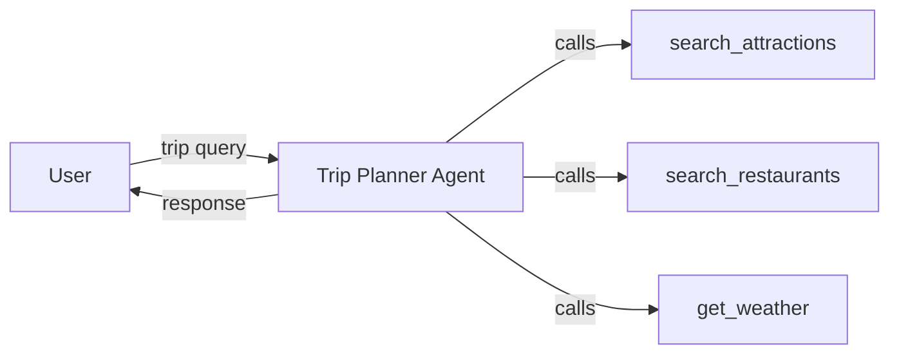

# Single Agent Pattern

One LLM agent with tools that dynamically decides execution order.

## Architecture



## Setup

```bash
cd _examples/agents/mono/agent-design-patterns-1
python -m venv .venv
# Windows
.venv\Scripts\activate
# macOS/Linux
source .venv/bin/activate
pip install -r requirements.txt
ollama pull qwen3.5:0.8b
```

## Running

```bash
# Terminal 1 — start agent server
cd _examples/agents/mono/agent-design-patterns-1/01-single-agent
python util.py --start

# Terminal 2 — run client
python client.py

# Stop server from Terminal 1 with Ctrl+C,
# or from any terminal with:
python util.py --stop
```

## Port Assignment

| Port  | Service                |
| ----- | ---------------------- |
| 11100 | Trip Planner A2A Agent |
