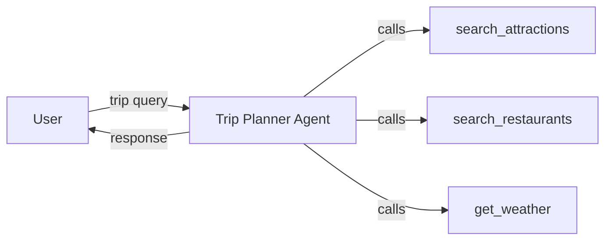

# Single Agent Pattern

[](https://www.youtube.com/watch?v=j98Csy8DbPo)

> **Watch the video:** [Single AI Agent Pattern: Why Simple Wins](https://www.youtube.com/watch?v=j98Csy8DbPo)
> **Website:** [LocalM Tuts](https://tuts.localm.dev/)

One LLM agent with tools that dynamically decides execution order.

## Architecture



## Setup

```bash
cd _examples/agents/mono/agent-design-patterns-1
python -m venv .venv
# Windows
.venv\Scripts\activate
# macOS/Linux
source .venv/bin/activate
pip install -r requirements.txt
ollama pull qwen3.5:0.8b
```

## Running

```bash
# Terminal 1 — start agent server
cd _examples/agents/mono/agent-design-patterns-1/01-single-agent
python util.py --start

# Terminal 2 — run client
python client.py

# Stop server from Terminal 1 with Ctrl+C,
# or from any terminal with:
python util.py --stop
```

## Port Assignment

| Port  | Service                |
| ----- | ---------------------- |
| 11100 | Trip Planner A2A Agent |

## Series Navigation

| # | Pattern | Video | Example |
|---|---------|-------|---------|
| **01** | **Single Agent** (this) | [Watch](https://www.youtube.com/watch?v=j98Csy8DbPo) | — |
| 02 | Sequential Agents | [Watch](https://www.youtube.com/watch?v=XaiCXeeyNzQ) | [Code](../02-sequential-agents/) |
| 03 | Parallel Agents | [Watch](https://www.youtube.com/watch?v=trrAd7zXVqI) | [Code](../03-parallel-agents/) |
| 04 | Coordinator | [Watch](https://www.youtube.com/watch?v=N05AycfgBPc) | [Code](../../agent-design-patterns-2/04-coordinator/) |
| 05 | Agent-as-Tool | [Watch](https://www.youtube.com/watch?v=fG-0_nCm3K8) | [Code](../../agent-design-patterns-2/05-agent-as-tool/) |
| 06 | Loop & Critique | [Watch](https://www.youtube.com/watch?v=SSJ_c77bJSY) | [Code](../../agent-design-patterns-2/06-loop-and-critique/) |
