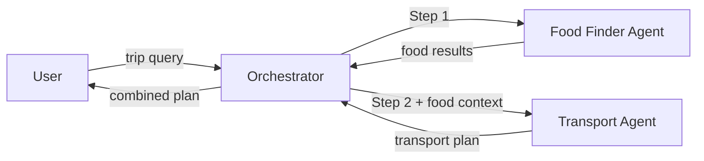

# Sequential Agents Pattern

[](https://www.youtube.com/watch?v=XaiCXeeyNzQ)

## Quick Links

- <a href="https://www.youtube.com/watch?v=XaiCXeeyNzQ" target="_blank" rel="noopener noreferrer">Watch the video</a>
- [Part 1 overview](../README.md)
- <a href="https://tuts.localm.dev/" target="_blank" rel="noopener noreferrer">Series website</a>

Fixed pipeline of A2A agents executing in deterministic order.

## Architecture



## Setup

```bash
cd _examples/agents/mono/agent-design-patterns-1
python -m venv .venv
# Windows
.venv\Scripts\activate
# macOS/Linux
source .venv/bin/activate
pip install -r requirements.txt
ollama pull qwen3.5:0.8b
```

## Running

```bash
# Terminal 1 -- start all servers
cd _examples/agents/mono/agent-design-patterns-1/02-sequential-agents
python util.py --start

# Terminal 2 -- run client
python client.py

# Stop all servers from Terminal 1 with Ctrl+C,
# or from any terminal with:
python util.py --stop
```

## Port Assignments

| Port  | Service                 |
| ----- | ----------------------- |
| 11201 | Food Finder Agent       |
| 11202 | Transport Agent         |
| 11203 | Sequential Orchestrator |

## Series Links

- Previous pattern: [Single Agent](../01-single-agent/)
- Current pattern: Sequential Agents
- Next pattern: [Parallel Agents](../03-parallel-agents/)
- Full series: [Part 1 overview](../README.md) and [Part 2 overview](../../agent-design-patterns-2/README.md)
