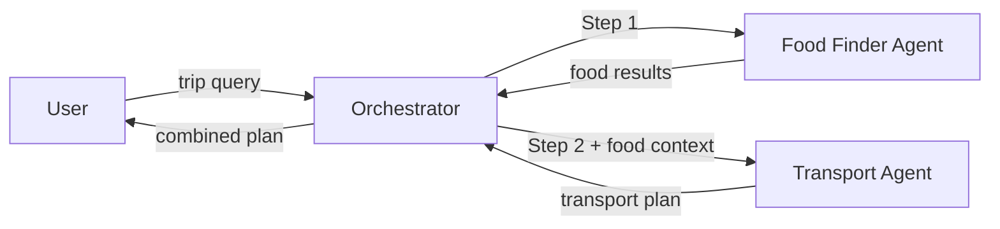

# Sequential Agents Pattern

Fixed pipeline of A2A agents executing in deterministic order.

## Architecture



## Key Concept

Each agent's output feeds into the next agent's input. The orchestrator
enforces the execution order -- the Food Finder always runs first, and
its results are passed to the Transport Agent as context.

## Setup

```bash
cd _examples/agents/mono/agent-design-patterns-1
python -m venv .venv
# Windows
.venv\Scripts\activate
# macOS/Linux
source .venv/bin/activate
pip install -r requirements.txt
ollama pull qwen3.5:0.8b
```

## Running

```bash
# Terminal 1 -- start all servers
cd _examples/agents/mono/agent-design-patterns-1/02-sequential-agents
python util.py --start

# Terminal 2 -- run client
python client.py

# Stop all servers
python util.py --stop
```

## Port Assignments

| Port  | Service                 |
| ----- | ----------------------- |
| 11201 | Food Finder Agent       |
| 11202 | Transport Agent         |
| 11203 | Sequential Orchestrator |

## Structured Payload Contract

The specialists exchange JSON payloads internally. The client still receives a
plain-text plan, but the orchestrator composes that plan from structured data.

### Food Finder payload

```json
{
    "agent": "FoodFinder",
    "city": "tokyo",
    "kind": "food_options",
    "items": [
        {
            "name": "Sukiyabashi Jiro",
            "cuisine": "Sushi",
            "area": "Ginza"
        }
    ],
    "note": "Choose one stop based on cuisine and neighborhood."
}
```

### Transport payload

```json
{
    "agent": "TransportAgent",
    "city": "tokyo",
    "kind": "transport_options",
    "items": ["JR Yamanote Line", "Tokyo Metro", "Taxi"],
    "tip": "Get a Suica card at any station. Yamanote Line circles the city."
}
```

### Example rendered response

```text
TRIP PLAN (Sequential Pipeline)
========================================
Request: I'm visiting Tokyo for 2 days. Find great food spots and plan transport.

City: Tokyo

STEP 1 - Food Recommendations:
- Sukiyabashi Jiro (Sushi, Ginza)
- Ichiran Ramen (Ramen, Shibuya)
- Tsukiji Outer Market (Street food, Tsukiji)
Note: Choose one stop based on cuisine and neighborhood.

STEP 2 - Transport Plan:
- JR Yamanote Line
- Tokyo Metro
- Taxi
Tip: Get a Suica card at any station. Yamanote Line circles the city.
```
