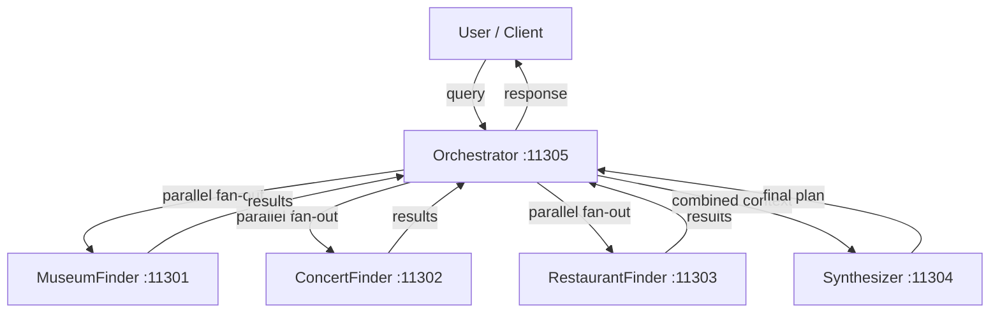

# Pattern 3 -- Parallel Agents

Demonstrates the **parallel agent** pattern: multiple specialist agents run
concurrently, and their results are synthesized into a unified response.

## Architecture



## Port Assignments

| Agent            | Port  | Role                         |
| ---------------- | ----- | ---------------------------- |
| MuseumFinder     | 11301 | Find museums and galleries   |
| ConcertFinder    | 11302 | Find concerts and live music |
| RestaurantFinder | 11303 | Find restaurants and food    |
| Synthesizer      | 11304 | Merge results into day plan  |
| Orchestrator     | 11305 | Fan-out, collect, synthesize |

## Setup

```bash
cd _examples/agents/mono/agent-design-patterns-1
python -m venv .venv
# Windows
.venv\Scripts\activate
# macOS/Linux
source .venv/bin/activate
pip install -r requirements.txt
ollama pull qwen3.5:0.8b
```

## Running

```bash
cd _examples/agents/mono/agent-design-patterns-1/03-parallel-agents
python util.py --start     # keep this terminal open
python client.py           # run from another terminal
# press Ctrl+C in the util.py terminal, or run: python util.py --stop
```

## Data Flow

1. Client sends a city planning query to the **Orchestrator** (11305).
2. Orchestrator fans out three concurrent A2A calls to the finders.
3. Each finder returns a structured JSON payload for its domain.
4. Orchestrator combines those JSON payloads and forwards them to the **Synthesizer** (11304).
5. Synthesizer renders a richer merged day plan from structured data and returns it to the client.

## Structured Payload Contract

Each specialist returns JSON. The orchestrator bundles those payloads into one
combined document, and the synthesizer renders the final day plan from that
structured input.

### Museum Finder payload

```json
{
  "agent": "MuseumFinder",
  "city": "san francisco",
  "kind": "museum_options",
  "items": [
    {
      "name": "SFMOMA",
      "type": "Modern art",
      "area": "SoMa"
    }
  ],
  "note": "Start the day with a culture stop near the listed area."
}
```

### Concert Finder payload

```json
{
  "agent": "ConcertFinder",
  "city": "san francisco",
  "kind": "concert_options",
  "items": [
    {
      "name": "Jazz at The Fillmore",
      "genre": "Jazz",
      "venue": "The Fillmore"
    }
  ],
  "note": "Use the live event as the evening anchor."
}
```

### Restaurant Finder payload

```json
{
  "agent": "RestaurantFinder",
  "city": "san francisco",
  "kind": "restaurant_options",
  "items": [
    {
      "name": "Tartine Bakery",
      "cuisine": "French bakery",
      "area": "Mission"
    }
  ],
  "note": "Use the food stop as the afternoon break between activities."
}
```

### Combined orchestrator payload

```json
{
  "original_query": "Plan a full day in San Francisco with museums, concerts, and great food.",
  "results": {
    "MuseumFinder": {
      "agent": "MuseumFinder",
      "city": "san francisco",
      "kind": "museum_options",
      "items": [],
      "note": "Start the day with a culture stop near the listed area."
    },
    "ConcertFinder": {
      "agent": "ConcertFinder",
      "city": "san francisco",
      "kind": "concert_options",
      "items": [],
      "note": "Use the live event as the evening anchor."
    },
    "RestaurantFinder": {
      "agent": "RestaurantFinder",
      "city": "san francisco",
      "kind": "restaurant_options",
      "items": [],
      "note": "Use the food stop as the afternoon break between activities."
    }
  }
}
```

### Example rendered response

```text
Day plan:
Request: Plan a full day in San Francisco with museums, concerts, and great food.

Morning - Museums:
- Primary: SFMOMA (Modern art, SoMa)
- Alternates: de Young Museum (Fine arts, Golden Gate Park); Exploratorium (Science, Embarcadero)
- Note: Start the day with a culture stop near the listed area.

Afternoon - Food:
- Primary: Tartine Bakery (French bakery, Mission)
- Alternates: Swan Oyster Depot (Seafood, Nob Hill); Nopa (California, Western Addition)
- Note: Use the food stop as the afternoon break between activities.

Evening - Live event:
- Primary: Jazz at The Fillmore (Jazz, The Fillmore)
- Alternates: SF Symphony Gala (Classical, Davies Hall); Indie Night at Bottom of the Hill (Indie Rock, Bottom of the Hill)
- Note: Use the live event as the evening anchor.
```

## Best Practice Notes

- Specialists return machine-readable JSON rather than freeform prose.
- The synthesizer is the only layer that renders end-user narrative text.
- The final response is grounded strictly in returned fields, which keeps the
  demo deterministic and easy to debug.
