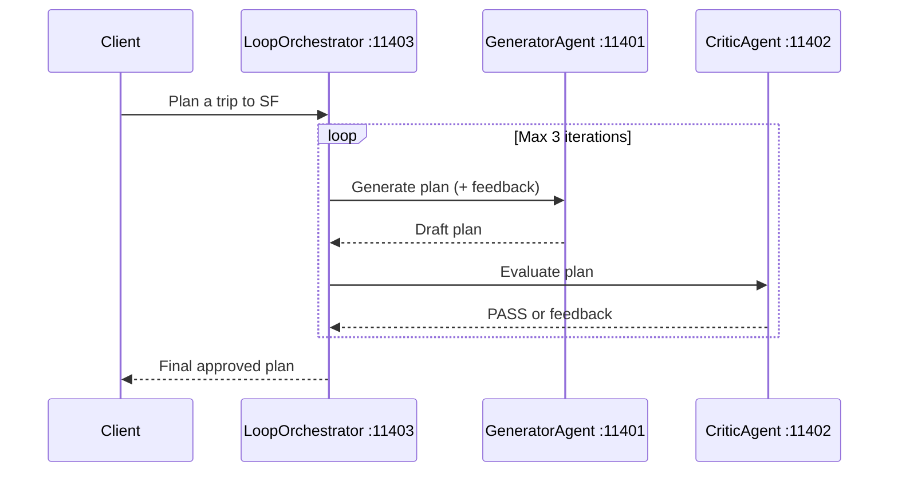

# 03 — Loop & Critique

Iterative refinement pattern: a Generator agent produces a trip plan and a
Critic agent evaluates it. The Loop Orchestrator repeats until the Critic
says PASS or the max iteration count (3) is reached.

## Architecture



## Ports

| Port  | Agent            |
| ----- | ---------------- |
| 11401 | GeneratorAgent   |
| 11402 | CriticAgent      |
| 11403 | LoopOrchestrator |

## Setup

```bash
cd _examples/agents/mono/agent-design-patterns-2
python -m venv .venv
# Windows
.venv\Scripts\activate
# macOS/Linux
source .venv/bin/activate
pip install -r requirements.txt
ollama pull qwen3.5:0.8b
```

## Running

```bash
cd _examples/agents/mono/agent-design-patterns-2/03-loop-and-critique
python util.py --start
python client.py          # in another terminal
python util.py --stop
```

## Key Concepts

- **Quality gate**: Critic checks 4 criteria (hotel, attractions, dining, transport)
- **Iterative refinement**: Feedback is injected into the next Generator prompt
- **Safety bound**: Max 3 iterations prevents infinite loops
- **Separation of concerns**: Generator and Critic are independent A2A agents
