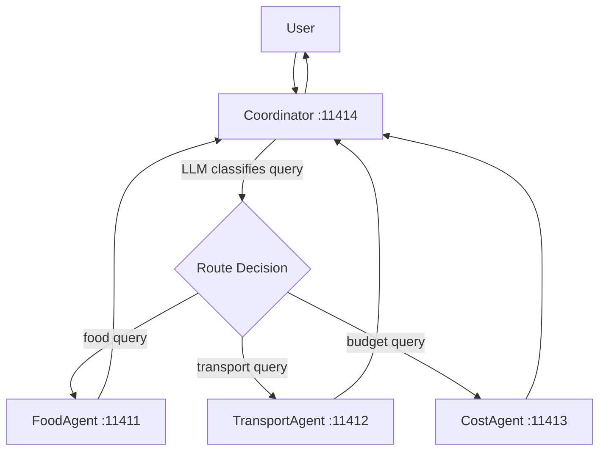

# 04 — Coordinator Routing

[](https://www.youtube.com/watch?v=N05AycfgBPc)

## Quick Links

- <a href="https://www.youtube.com/watch?v=N05AycfgBPc" target="_blank" rel="noopener noreferrer">Watch the video</a>
- [Part 2 overview](../README.md)
- <a href="https://tuts.localm.dev/" target="_blank" rel="noopener noreferrer">Series website</a>

Dynamic routing pattern: a Coordinator uses an LLM to classify the user
query and route it to the best-fit specialist agent. No fixed pipeline —
the LLM decides routing at runtime, with keyword fallback only when the
model returns no usable agent choice.

## Architecture



## Ports

| Port  | Agent          |
| ----- | -------------- |
| 11411 | FoodAgent      |
| 11412 | TransportAgent |
| 11413 | CostAgent      |
| 11414 | Coordinator    |

## Setup

```bash
cd _examples/agents/mono/agent-design-patterns-2
python -m venv .venv
# Windows
.venv\Scripts\activate
# macOS/Linux
source .venv/bin/activate
pip install -r requirements.txt
ollama pull qwen3.5:0.8b
```

## Running

```bash
cd _examples/agents/mono/agent-design-patterns-2/04-coordinator
python util.py --start
python client.py          # in another terminal
# press Ctrl+C in the util.py terminal, or run: python util.py --stop
```

## Key Concepts

- **LLM-driven routing**: The Coordinator uses an LLM to read agent descriptions
  and decide which specialist handles the query
- **Dynamic dispatch**: The LLM path runs first. A small keyword table is used
  only as a recovery path when the model returns no valid agent name
- **Fallback**: If neither the LLM nor the keyword fallback yields a match,
  the Coordinator defaults to FoodAgent
- **Single-hop**: Each query is routed to exactly one specialist
- **Structured specialist contract**: Each specialist returns a JSON payload so
  the Coordinator can render a grounded response consistently

## Structured Payload Contract

Each specialist returns JSON. The Coordinator still decides where the query goes,
but it formats the final response from structured fields instead of raw prose.

### Food specialist payload

```json
{
  "agent": "FoodAgent",
  "city": "san francisco",
  "kind": "food_options",
  "items": [
    {
      "name": "Tartine Bakery",
      "details": "artisan bakery, Mission District"
    }
  ],
  "note": "Specialist returned curated food options."
}
```

### Transport specialist payload

```json
{
  "agent": "TransportAgent",
  "city": "tokyo",
  "kind": "transport_options",
  "items": [
    {
      "name": "JR Yamanote Line",
      "details": "circular loop connecting major stations"
    }
  ],
  "note": "Specialist returned curated transport options."
}
```

### Cost specialist payload

```json
{
  "agent": "CostAgent",
  "city": "paris",
  "kind": "cost_estimate",
  "items": [
    {
      "label": "Hotel Per Night",
      "value": "EUR 120-280"
    }
  ],
  "note": "Specialist returned typical budget ranges."
}
```

### Example rendered responses

```text
COORDINATOR ROUTING RESULT
========================================
Original query: What are the best restaurants in San Francisco?
Query classified as: FoodAgent

Food options for San Francisco:
- Primary: Tartine Bakery (artisan bakery, Mission District)
- Alternates: Swan Oyster Depot (classic seafood counter, Nob Hill); Nopa (California cuisine, Western Addition)
Note: Specialist returned curated food options.
```

```text
COORDINATOR ROUTING RESULT
========================================
Original query: How much would a 3-day trip to Paris cost?
Query classified as: CostAgent

Budget snapshot for Paris:
- Hotel Per Night: EUR 120-280
- Meal Average: EUR 15-45
- Transit Day Pass: EUR 16.10 (Navigo jour)
- Attractions: EUR 0-17 per venue
Note: Specialist returned typical budget ranges.
```

## Best Practice Notes

- Routing and rendering are separated: the Coordinator chooses the specialist,
  then formats the result from structured fields.
- Each specialist returns a narrow schema tailored to its domain.
- The coordinator response stays grounded because it never invents fields beyond
  what the chosen specialist returned.

## Series Links

- Previous pattern: [Parallel Agents](../../agent-design-patterns-1/03-parallel-agents/)
- Current pattern: Coordinator
- Next pattern: [Agent-as-Tool](../05-agent-as-tool/)
- Full series: [Part 1 overview](../../agent-design-patterns-1/README.md) and [Part 2 overview](../README.md)
