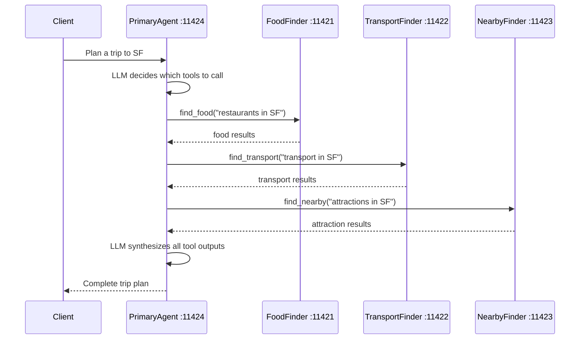

# 05 — Agent-as-Tool

Controlled composition pattern: the Primary Agent treats sub-agents as
stateless tool calls. Instead of delegating full control, the LLM invokes
sub-agents like functions and synthesizes the results itself.

## Architecture



## Ports

| Port  | Agent               |
| ----- | ------------------- |
| 11421 | FoodFinderTool      |
| 11422 | TransportFinderTool |
| 11423 | NearbyFinderTool    |
| 11424 | PrimaryAgent        |

## Setup

```bash
cd _examples/agents/mono/agent-design-patterns-2
python -m venv .venv
# Windows
.venv\Scripts\activate
# macOS/Linux
source .venv/bin/activate
pip install -r requirements.txt
ollama pull qwen3.5:0.8b
```

## Running

```bash
cd _examples/agents/mono/agent-design-patterns-2/05-agent-as-tool
python util.py --start
python client.py          # in another terminal
# press Ctrl+C in the util.py terminal, or run: python util.py --stop
```

## Key Concepts

- **Agents as functions**: Sub-agents are invoked via OpenAI tool calling,
  just like regular functions
- **Primary retains control**: The LLM decides what to call, but the final plan
  is rendered from structured JSON tool results so the response stays grounded
- **Stateless calls**: Each sub-agent call is independent with no shared state
- **A2A under the hood**: Tool calls map to A2A `message/send` requests

## Structured Payload Contract

Each tool-style sub-agent returns JSON. The Primary Agent parses these payloads
and renders the final trip plan from structured fields.

### Food tool payload

```json
{
  "agent": "FoodFinderTool",
  "city": "san francisco",
  "kind": "food_options",
  "items": [
    {
      "name": "Tartine Bakery",
      "details": "artisan bakery, Mission District"
    }
  ],
  "note": "Tool returned curated food options."
}
```

### Transport tool payload

```json
{
  "agent": "TransportFinderTool",
  "city": "san francisco",
  "kind": "transport_options",
  "items": [
    {
      "name": "BART",
      "details": "rapid transit connecting airport to downtown"
    }
  ],
  "note": "Tool returned curated transport options."
}
```

### Nearby tool payload

```json
{
  "agent": "NearbyFinderTool",
  "city": "san francisco",
  "kind": "attraction_options",
  "items": [
    {
      "name": "Golden Gate Bridge",
      "details": "iconic suspension bridge"
    }
  ],
  "note": "Tool returned curated attractions."
}
```

### Example rendered response

```text
Trip plan for: Plan a day trip to San Francisco. I need food, transport, and things to see.

Morning sights:
- Primary stop: Golden Gate Bridge (iconic suspension bridge)
- Backups: Alcatraz Island (historic penitentiary); Fisherman's Wharf (waterfront dining and shops)

Food stop:
- Primary stop: Tartine Bakery (artisan bakery, Mission District)
- Backups: Swan Oyster Depot (classic seafood, Nob Hill); Nopa (California cuisine, Western Addition)

Getting around:
- Primary option: BART (rapid transit connecting airport to downtown)
- Alternates: Muni (buses and streetcars covering the city); Cable Cars (iconic transit on steep hills)

Note: this plan is composed only from structured sub-agent payloads.
```
