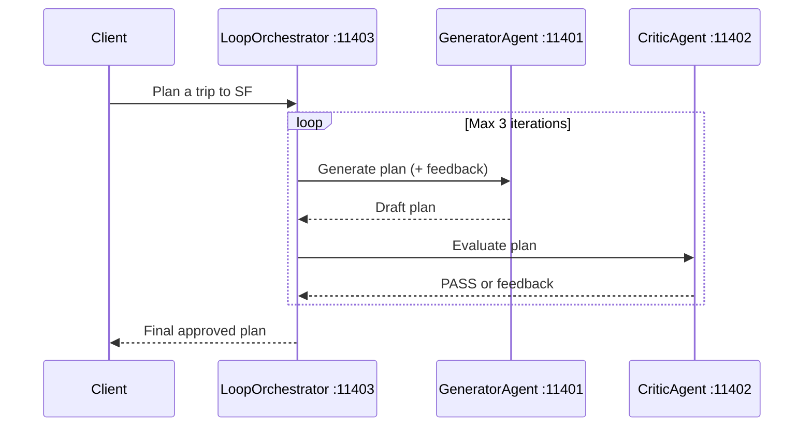

# 06 — Loop & Critique

[](https://www.youtube.com/watch?v=SSJ_c77bJSY)

## Quick Links

- <a href="https://www.youtube.com/watch?v=SSJ_c77bJSY" target="_blank" rel="noopener noreferrer">Watch the video</a>
- [Part 2 overview](../README.md)
- <a href="https://tuts.localm.dev/" target="_blank" rel="noopener noreferrer">Series website</a>

Iterative refinement pattern: a Generator agent produces a trip plan and a
Critic agent evaluates it. The Loop Orchestrator repeats until the Critic
says PASS or the max iteration count (3) is reached.

## Architecture



## Ports

| Port  | Agent            |
| ----- | ---------------- |
| 11401 | GeneratorAgent   |
| 11402 | CriticAgent      |
| 11403 | LoopOrchestrator |

## Setup

```bash
cd _examples/agents/mono/agent-design-patterns-2
python -m venv .venv
# Windows
.venv\Scripts\activate
# macOS/Linux
source .venv/bin/activate
pip install -r requirements.txt
ollama pull qwen3.5:0.8b
```

## Running

```bash
cd _examples/agents/mono/agent-design-patterns-2/06-loop-and-critique
python util.py --start
python client.py          # in another terminal
# press Ctrl+C in the util.py terminal, or run: python util.py --stop
```

## Key Concepts

- **Quality gate**: Critic checks 4 criteria (hotel, attractions, dining, transport)
- **Iterative refinement**: Feedback is injected into the next Generator prompt
- **Safety bound**: Max 3 iterations prevents infinite loops
- **Separation of concerns**: Generator and Critic are independent A2A agents

## Series Links

- Previous pattern: [Agent-as-Tool](../05-agent-as-tool/)
- Current pattern: Loop & Critique
- Full series: [Part 1 overview](../../agent-design-patterns-1/README.md) and [Part 2 overview](../README.md)
