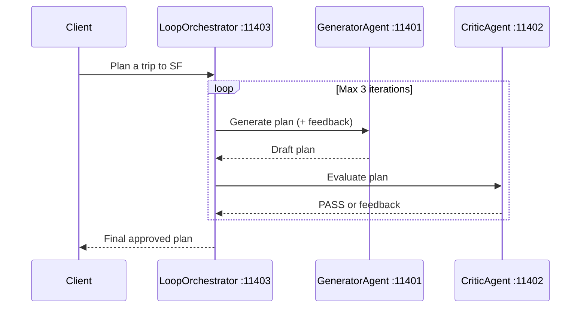

# 06 — Loop & Critique

[](https://www.youtube.com/watch?v=SSJ_c77bJSY)

> **Watch the video:** [Stop Shipping AI Hallucinations: The Loop & Critique Pattern](https://www.youtube.com/watch?v=SSJ_c77bJSY)
> **Website:** [LocalM Tuts](https://tuts.localm.dev/)

Iterative refinement pattern: a Generator agent produces a trip plan and a
Critic agent evaluates it. The Loop Orchestrator repeats until the Critic
says PASS or the max iteration count (3) is reached.

## Architecture



## Ports

| Port  | Agent            |
| ----- | ---------------- |
| 11401 | GeneratorAgent   |
| 11402 | CriticAgent      |
| 11403 | LoopOrchestrator |

## Setup

```bash
cd _examples/agents/mono/agent-design-patterns-2
python -m venv .venv
# Windows
.venv\Scripts\activate
# macOS/Linux
source .venv/bin/activate
pip install -r requirements.txt
ollama pull qwen3.5:0.8b
```

## Running

```bash
cd _examples/agents/mono/agent-design-patterns-2/06-loop-and-critique
python util.py --start
python client.py          # in another terminal
# press Ctrl+C in the util.py terminal, or run: python util.py --stop
```

## Key Concepts

- **Quality gate**: Critic checks 4 criteria (hotel, attractions, dining, transport)
- **Iterative refinement**: Feedback is injected into the next Generator prompt
- **Safety bound**: Max 3 iterations prevents infinite loops
- **Separation of concerns**: Generator and Critic are independent A2A agents

## Series Navigation

| # | Pattern | Video | Example |
|---|---------|-------|---------|
| 01 | Single Agent | [Watch](https://www.youtube.com/watch?v=j98Csy8DbPo) | [Code](../../agent-design-patterns-1/01-single-agent/) |
| 02 | Sequential Agents | [Watch](https://www.youtube.com/watch?v=XaiCXeeyNzQ) | [Code](../../agent-design-patterns-1/02-sequential-agents/) |
| 03 | Parallel Agents | [Watch](https://www.youtube.com/watch?v=trrAd7zXVqI) | [Code](../../agent-design-patterns-1/03-parallel-agents/) |
| 04 | Coordinator | [Watch](https://www.youtube.com/watch?v=N05AycfgBPc) | [Code](../04-coordinator/) |
| 05 | Agent-as-Tool | [Watch](https://www.youtube.com/watch?v=fG-0_nCm3K8) | [Code](../05-agent-as-tool/) |
| **06** | **Loop & Critique** (this) | [Watch](https://www.youtube.com/watch?v=SSJ_c77bJSY) | — |
