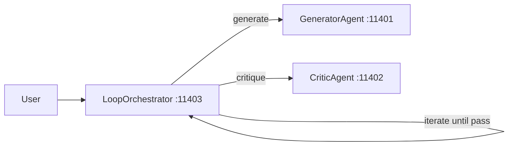
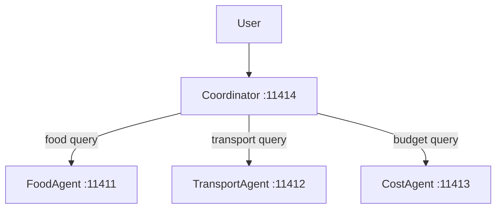
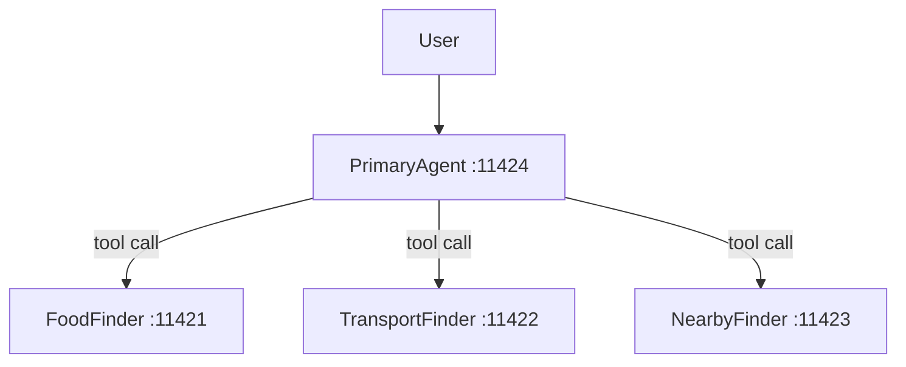

# Agent Design Patterns Part 2 — Advanced Patterns

Runnable examples for the **AI Agent Design Patterns (Part 2)** mono video
from <a href="https://tuts.localm.dev/" target="_blank" rel="noopener noreferrer">LocalM Tuts</a>.

> **Start with Part 1 ←** [Agent Design Patterns Part 1 — Foundational Patterns](../agent-design-patterns-1/)

## Video Lineup

4. <a href="https://www.youtube.com/watch?v=N05AycfgBPc" target="_blank" rel="noopener noreferrer">Stop Hardcoding Your Agents: Master the Coordinator Pattern</a>
5. <a href="https://www.youtube.com/watch?v=fG-0_nCm3K8" target="_blank" rel="noopener noreferrer">Stop Delegating, Start Controlling: The Agent-as-Tool Pattern</a>
6. <a href="https://www.youtube.com/watch?v=SSJ_c77bJSY" target="_blank" rel="noopener noreferrer">Stop Shipping AI Hallucinations: The Loop & Critique Pattern</a>

## Videos

| Video | Title | Examples |
| --- | --- | --- |
| [](https://www.youtube.com/watch?v=N05AycfgBPc) | <a href="https://www.youtube.com/watch?v=N05AycfgBPc" target="_blank" rel="noopener noreferrer">Stop Hardcoding Your Agents: Master the Coordinator Pattern</a> | [04-coordinator](04-coordinator/) |
| [](https://www.youtube.com/watch?v=fG-0_nCm3K8) | <a href="https://www.youtube.com/watch?v=fG-0_nCm3K8" target="_blank" rel="noopener noreferrer">Stop Delegating, Start Controlling: The Agent-as-Tool Pattern</a> | [05-agent-as-tool](05-agent-as-tool/) |
| [](https://www.youtube.com/watch?v=SSJ_c77bJSY) | <a href="https://www.youtube.com/watch?v=SSJ_c77bJSY" target="_blank" rel="noopener noreferrer">Stop Shipping AI Hallucinations: The Loop & Critique Pattern</a> | [06-loop-and-critique](06-loop-and-critique/) |

## Pattern Folders

| #   | Pattern             | Folder                  | Ports       | Video                                                                                                     |
| --- | ------------------- | ----------------------- | ----------- | --------------------------------------------------------------------------------------------------------- |
| 04  | Coordinator Routing | `04-coordinator/`       | 11411-11414 | <a href="https://www.youtube.com/watch?v=N05AycfgBPc" target="_blank" rel="noopener noreferrer">Watch</a> |
| 05  | Agent-as-Tool       | `05-agent-as-tool/`     | 11421-11424 | <a href="https://www.youtube.com/watch?v=fG-0_nCm3K8" target="_blank" rel="noopener noreferrer">Watch</a> |
| 06  | Loop & Critique     | `06-loop-and-critique/` | 11401-11403 | <a href="https://www.youtube.com/watch?v=SSJ_c77bJSY" target="_blank" rel="noopener noreferrer">Watch</a> |

## Prerequisites

- **Ollama** running at `http://127.0.0.1:11434`
- Model: `ollama pull qwen3.5:0.8b`

## Setup

```bash
cd _examples/agents/mono/agent-design-patterns-2
python -m venv .venv
# Windows
.venv\Scripts\activate
# macOS/Linux
source .venv/bin/activate
pip install -r requirements.txt
ollama pull qwen3.5:0.8b

# No environment variables are required.
# These examples default to http://127.0.0.1:11434/v1 and qwen3.5:0.8b.
# Only set overrides if you want different values.
# set OLLAMA_BASE_URL=http://127.0.0.1:11434/v1
# set OLLAMA_MODEL=qwen3.5:0.8b
```

## Architecture

### 06 — Loop & Critique



The orchestrator loops: Generator produces a trip plan, Critic evaluates it
against quality criteria. If the critique says PASS, the loop exits. Otherwise
the feedback is sent back to the Generator for refinement. Max 3 iterations.

### 04 — Coordinator Routing



The Coordinator uses an LLM to classify the user query and dynamically
routes it to the best-fit specialist agent. No fixed pipeline — the LLM
decides which agent handles each request.

### 05 — Agent-as-Tool



The Primary Agent treats sub-agents as stateless tool calls. Instead of
delegating full control, the primary LLM invokes sub-agents like functions
and synthesizes the combined results itself.

## Running

Each pattern folder has its own `util.py` and `client.py`:

```bash
cd _examples/agents/mono/agent-design-patterns-2/06-loop-and-critique
python util.py --start   # keep this terminal open
python client.py         # run from another terminal
# press Ctrl+C in the util.py terminal, or run: python util.py --stop
```
