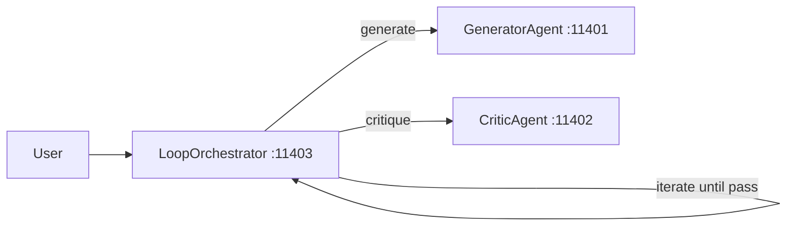
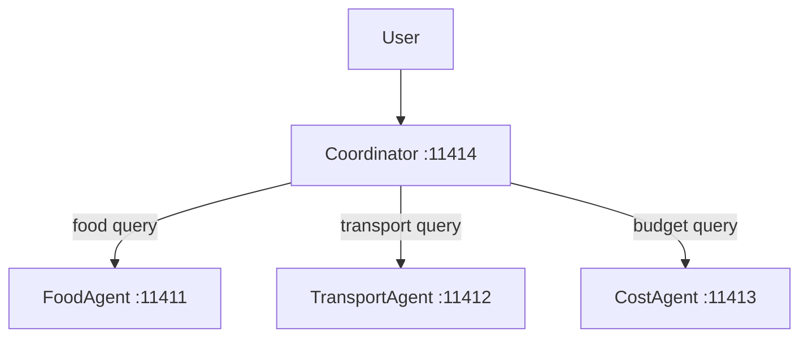
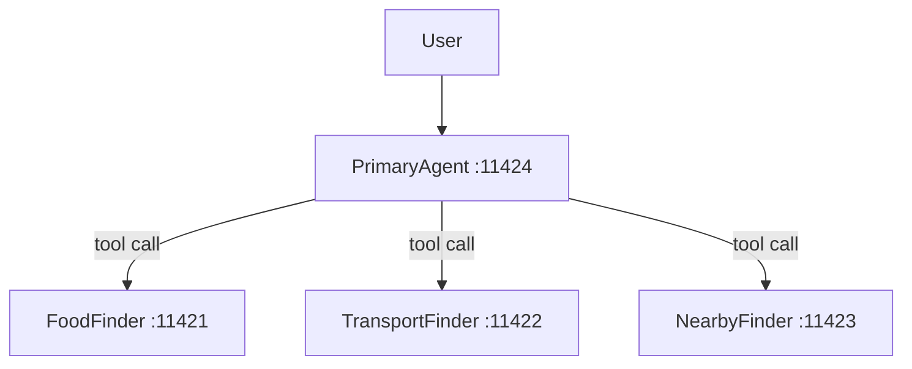

# Agent Design Patterns Part 2 — Advanced Patterns

Runnable examples for the **AI Agent Design Patterns (Part 2)** mono video.

## Patterns

| #   | Pattern             | Folder                  | Ports       |
| --- | ------------------- | ----------------------- | ----------- |
| 03  | Loop & Critique     | `03-loop-and-critique/` | 11401-11403 |
| 04  | Coordinator Routing | `04-coordinator/`       | 11411-11414 |
| 05  | Agent-as-Tool       | `05-agent-as-tool/`     | 11421-11424 |

## Prerequisites

- **Ollama** running at `http://127.0.0.1:11434`
- Model: `ollama pull qwen3.5:0.8b`

## Setup

```bash
cd _examples/agents/mono/agent-design-patterns-2
python -m venv .venv
# Windows
.venv\Scripts\activate
# macOS/Linux
source .venv/bin/activate
pip install -r requirements.txt
ollama pull qwen3.5:0.8b
```

## Architecture

### 03 — Loop & Critique



The orchestrator loops: Generator produces a trip plan, Critic evaluates it
against quality criteria. If the critique says PASS, the loop exits. Otherwise
the feedback is sent back to the Generator for refinement. Max 3 iterations.

### 04 — Coordinator Routing



The Coordinator uses an LLM to classify the user query and dynamically
routes it to the best-fit specialist agent. No fixed pipeline — the LLM
decides which agent handles each request.

### 05 — Agent-as-Tool



The Primary Agent treats sub-agents as stateless tool calls. Instead of
delegating full control, the primary LLM invokes sub-agents like functions
and synthesizes the combined results itself.

## Running

Each pattern folder has its own `util.py` and `client.py`:

```bash
cd _examples/agents/mono/agent-design-patterns-2/03-loop-and-critique
python util.py --start
python client.py
python util.py --stop
```
