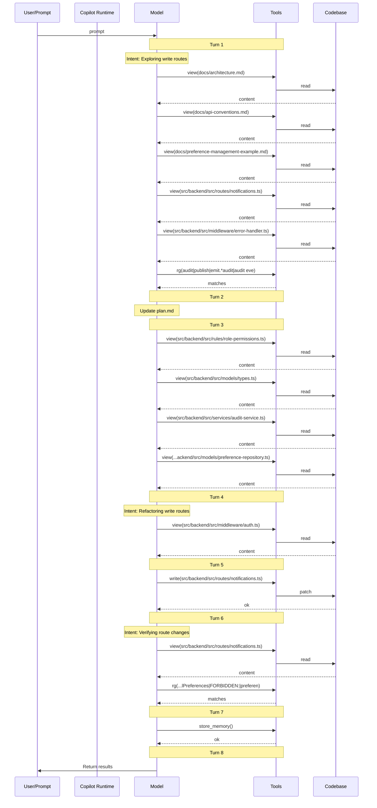

## 7 · Context Validation

> When and how was non-system (private) context accessed during the session?

### Implicit Context (auto-injected)

No instruction files detected in the session log.

### Context Access Timeline

| Turn | Action | Target |
| ---: | --- | --- |
| 1 | search | `rg(audit\|publish\|emit.*audit\|audit event\|queue)` |
| 1 | read | `docs/architecture.md` |
| 1 | read | `docs/api-conventions.md` |
| 1 | read | `docs/preference-management-example.md` |
| 1 | read | `src/backend/src/routes/notifications.ts` |
| 1 | read | `src/backend/src/middleware/error-handler.ts` |
| 3 | read | `src/backend/src/rules/role-permissions.ts` |
| 3 | read | `src/backend/src/models/types.ts` |
| 3 | read | `src/backend/src/services/audit-service.ts` |
| 3 | read | `src/backend/src/models/preference-repository.ts` |
| 4 | read | `src/backend/src/middleware/auth.ts` |
| 5 | **write** | `src/backend/src/routes/notifications.ts` |
| 6 | search | `rg(assertCanWriteNotificationPreferences\|setPreferenceWithAudit\|setChannelPreferences\|FORBIDDEN:\|preference.updated)` |
| 6 | read | `src/backend/src/routes/notifications.ts` |
| 7 | store_memory | — |

### Files Written

- `src/backend/src/routes/notifications.ts`

### Context Flow Diagram

### Validation Summary

- **Implicit context:** 0 instruction file(s) injected at session start
- **Files read:** 10 unique files across 8 turns
- **Files written:** 1 codebase file(s)
- **First codebase read:** turn 1
- **First codebase write:** turn 5
- **Discovery-before-write gap:** 4 turn(s)
