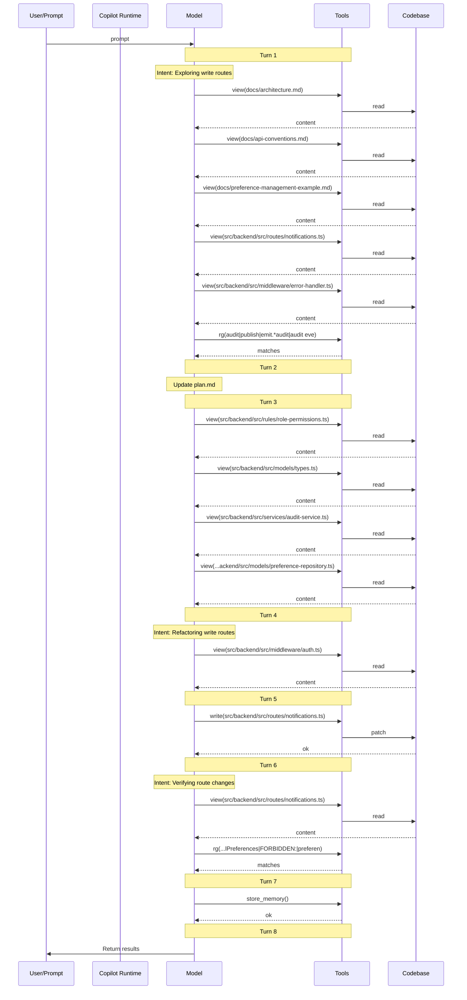

# Context Flow — 02-curate-project-context

```mermaid
sequenceDiagram
    participant U as User/Prompt
    participant S as Copilot Runtime
    participant M as Model
    participant T as Tools
    participant C as Codebase

    U->>M: prompt


    Note over M,T: Turn 1
    Note over M: Intent: Exploring write routes
    M->>T: view(docs/architecture.md)
    T->>C: read
    C-->>M: content
    M->>T: view(docs/api-conventions.md)
    T->>C: read
    C-->>M: content
    M->>T: view(docs/preference-management-example.md)
    T->>C: read
    C-->>M: content
    M->>T: view(src/backend/src/routes/notifications.ts)
    T->>C: read
    C-->>M: content
    M->>T: view(src/backend/src/middleware/error-handler.ts)
    T->>C: read
    C-->>M: content
    M->>T: rg(audit|publish|emit.*audit|audit eve)
    T-->>M: matches

    Note over M,T: Turn 2
    Note over M: Update plan.md

    Note over M,T: Turn 3
    M->>T: view(src/backend/src/rules/role-permissions.ts)
    T->>C: read
    C-->>M: content
    M->>T: view(src/backend/src/models/types.ts)
    T->>C: read
    C-->>M: content
    M->>T: view(src/backend/src/services/audit-service.ts)
    T->>C: read
    C-->>M: content
    M->>T: view(...ackend/src/models/preference-repository.ts)
    T->>C: read
    C-->>M: content

    Note over M,T: Turn 4
    Note over M: Intent: Refactoring write routes
    M->>T: view(src/backend/src/middleware/auth.ts)
    T->>C: read
    C-->>M: content

    Note over M,T: Turn 5
    M->>T: write(src/backend/src/routes/notifications.ts)
    T->>C: patch
    C-->>M: ok

    Note over M,T: Turn 6
    Note over M: Intent: Verifying route changes
    M->>T: view(src/backend/src/routes/notifications.ts)
    T->>C: read
    C-->>M: content
    M->>T: rg(...lPreferences|FORBIDDEN:|preferen)
    T-->>M: matches

    Note over M,T: Turn 7
    M->>T: store_memory()
    T-->>M: ok

    Note over M,T: Turn 8

    M->>U: Return results
```
