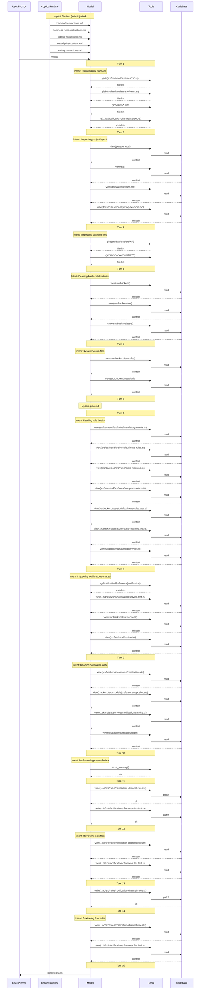

# Context Flow — 03-instruction-architecture

```mermaid
sequenceDiagram
    participant U as User/Prompt
    participant S as Copilot Runtime
    participant M as Model
    participant T as Tools
    participant C as Codebase

    Note over S,M: Implicit Context (auto-injected)
    S->>M: backend.instructions.md
    S->>M: business-rules.instructions.md
    S->>M: copilot-instructions.md
    S->>M: security.instructions.md
    S->>M: testing.instructions.md

    U->>M: prompt


    Note over M,T: Turn 1
    Note over M: Intent: Exploring rule surfaces
    M->>T: glob(src/backend/src/rules/**/*.ts)
    T-->>M: file list
    M->>T: glob(src/backend/tests/**/*.test.ts)
    T-->>M: file list
    M->>T: glob(docs/*.md)
    T-->>M: file list
    M->>T: rg(...nts|notification-channel|LEGAL-2)
    T-->>M: matches

    Note over M,T: Turn 2
    Note over M: Intent: Inspecting project layout
    M->>T: view((lesson root))
    T->>C: read
    C-->>M: content
    M->>T: view(src)
    T->>C: read
    C-->>M: content
    M->>T: view(docs/architecture.md)
    T->>C: read
    C-->>M: content
    M->>T: view(docs/instruction-layering-example.md)
    T->>C: read
    C-->>M: content

    Note over M,T: Turn 3
    Note over M: Intent: Inspecting backend files
    M->>T: glob(src/backend/src/**/*)
    T-->>M: file list
    M->>T: glob(src/backend/tests/**/*)
    T-->>M: file list

    Note over M,T: Turn 4
    Note over M: Intent: Reading backend directories
    M->>T: view(src/backend)
    T->>C: read
    C-->>M: content
    M->>T: view(src/backend/src)
    T->>C: read
    C-->>M: content
    M->>T: view(src/backend/tests)
    T->>C: read
    C-->>M: content

    Note over M,T: Turn 5
    Note over M: Intent: Reviewing rule files
    M->>T: view(src/backend/src/rules)
    T->>C: read
    C-->>M: content
    M->>T: view(src/backend/tests/unit)
    T->>C: read
    C-->>M: content

    Note over M,T: Turn 6
    Note over M: Update plan.md

    Note over M,T: Turn 7
    Note over M: Intent: Reading rule details
    M->>T: view(src/backend/src/rules/mandatory-events.ts)
    T->>C: read
    C-->>M: content
    M->>T: view(src/backend/src/rules/business-rules.ts)
    T->>C: read
    C-->>M: content
    M->>T: view(src/backend/src/rules/state-machine.ts)
    T->>C: read
    C-->>M: content
    M->>T: view(src/backend/src/rules/role-permissions.ts)
    T->>C: read
    C-->>M: content
    M->>T: view(src/backend/tests/unit/business-rules.test.ts)
    T->>C: read
    C-->>M: content
    M->>T: view(src/backend/tests/unit/state-machine.test.ts)
    T->>C: read
    C-->>M: content
    M->>T: view(src/backend/src/models/types.ts)
    T->>C: read
    C-->>M: content

    Note over M,T: Turn 8
    Note over M: Intent: Inspecting notification surfaces
    M->>T: rg(NotificationPreference|notification)
    T-->>M: matches
    M->>T: view(...nd/tests/unit/notification-service.test.ts)
    T->>C: read
    C-->>M: content
    M->>T: view(src/backend/src/services)
    T->>C: read
    C-->>M: content
    M->>T: view(src/backend/src/routes)
    T->>C: read
    C-->>M: content

    Note over M,T: Turn 9
    Note over M: Intent: Reading notification code
    M->>T: view(src/backend/src/routes/notifications.ts)
    T->>C: read
    C-->>M: content
    M->>T: view(...ackend/src/models/preference-repository.ts)
    T->>C: read
    C-->>M: content
    M->>T: view(...ckend/src/services/notification-service.ts)
    T->>C: read
    C-->>M: content
    M->>T: view(src/backend/src/db/seed.ts)
    T->>C: read
    C-->>M: content

    Note over M,T: Turn 10
    Note over M: Intent: Implementing channel rules
    M->>T: store_memory()
    T-->>M: ok

    Note over M,T: Turn 11
    M->>T: write(...nd/src/rules/notification-channel-rules.ts)
    T->>C: patch
    C-->>M: ok
    M->>T: write(...ts/unit/notification-channel-rules.test.ts)
    T->>C: patch
    C-->>M: ok

    Note over M,T: Turn 12
    Note over M: Intent: Reviewing new files
    M->>T: view(...nd/src/rules/notification-channel-rules.ts)
    T->>C: read
    C-->>M: content
    M->>T: view(...ts/unit/notification-channel-rules.test.ts)
    T->>C: read
    C-->>M: content

    Note over M,T: Turn 13
    M->>T: write(...nd/src/rules/notification-channel-rules.ts)
    T->>C: patch
    C-->>M: ok

    Note over M,T: Turn 14
    Note over M: Intent: Reviewing final edits
    M->>T: view(...nd/src/rules/notification-channel-rules.ts)
    T->>C: read
    C-->>M: content
    M->>T: view(...ts/unit/notification-channel-rules.test.ts)
    T->>C: read
    C-->>M: content

    Note over M,T: Turn 15

    M->>U: Return results
```
