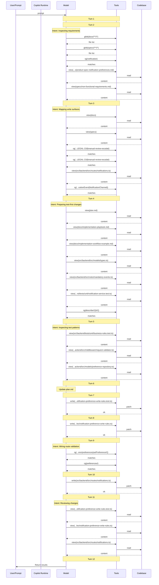

# Context Flow — 05-implementation-workflows

```mermaid
sequenceDiagram
    participant U as User/Prompt
    participant S as Copilot Runtime
    participant M as Model
    participant T as Tools
    participant C as Codebase

    U->>M: prompt


    Note over M,T: Turn 1

    Note over M,T: Turn 2
    Note over M: Intent: Inspecting requirements
    M->>T: glob(docs//**//*)
    T-->>M: file list
    M->>T: glob(specs//**//*)
    T-->>M: file list
    M->>T: rg(notification)
    T-->>M: matches
    M->>T: view(...s/product-spec-notification-preferences.md)
    T->>C: read
    C-->>M: content
    M->>T: view(specs/non-functional-requirements.md)
    T->>C: read
    C-->>M: content

    Note over M,T: Turn 3
    Note over M: Intent: Mapping write surfaces
    M->>T: view(docs)
    T->>C: read
    C-->>M: content
    M->>T: view(specs)
    T->>C: read
    C-->>M: content
    M->>T: rg(...LEGAL-218|manual-review-escalati)
    T-->>M: matches
    M->>T: rg(...LEGAL-218|manual-review-escalati)
    T-->>M: matches
    M->>T: view(src/backend/src/routes/notifications.ts)
    T->>C: read
    C-->>M: content
    M->>T: rg(...cationEvent|NotificationChannel|)
    T-->>M: matches

    Note over M,T: Turn 4
    Note over M: Intent: Preparing test-first changes
    M->>T: view(plan.md)
    T->>C: read
    C-->>M: content
    M->>T: view(docs/implementation-playbook.md)
    T->>C: read
    C-->>M: content
    M->>T: view(docs/implementation-workflow-example.md)
    T->>C: read
    C-->>M: content
    M->>T: view(src/backend/src/models/types.ts)
    T->>C: read
    C-->>M: content
    M->>T: view(src/backend/src/rules/mandatory-events.ts)
    T->>C: read
    C-->>M: content
    M->>T: view(...nd/tests/unit/notification-service.test.ts)
    T->>C: read
    C-->>M: content
    M->>T: rg(describe//(|it//()
    T-->>M: matches

    Note over M,T: Turn 5
    Note over M: Intent: Inspecting test patterns
    M->>T: view(src/backend/tests/unit/business-rules.test.ts)
    T->>C: read
    C-->>M: content
    M->>T: view(...ackend/src/middleware/request-validator.ts)
    T->>C: read
    C-->>M: content
    M->>T: view(...ackend/src/models/preference-repository.ts)
    T->>C: read
    C-->>M: content

    Note over M,T: Turn 6
    Note over M: Update plan.md

    Note over M,T: Turn 7
    M->>T: write(...otification-preference-write-rules.test.ts)
    T->>C: patch
    C-->>M: ok

    Note over M,T: Turn 8
    M->>T: write(...les/notification-preference-write-rules.ts)
    T->>C: patch
    C-->>M: ok

    Note over M,T: Turn 9
    Note over M: Intent: Wiring route validation
    M->>T: rg(...ons/preferences|setPreference//()
    T-->>M: matches
    M->>T: rg(preferences/)
    T-->>M: matches

    Note over M,T: Turn 10
    M->>T: write(src/backend/src/routes/notifications.ts)
    T->>C: patch
    C-->>M: ok

    Note over M,T: Turn 11
    Note over M: Intent: Reviewing changes
    M->>T: view(...otification-preference-write-rules.test.ts)
    T->>C: read
    C-->>M: content
    M->>T: view(...les/notification-preference-write-rules.ts)
    T->>C: read
    C-->>M: content
    M->>T: view(src/backend/src/routes/notifications.ts)
    T->>C: read
    C-->>M: content

    Note over M,T: Turn 12

    M->>U: Return results
```
