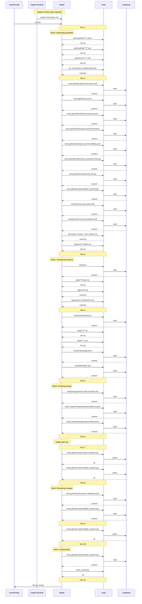

# Context Flow — 06-tools-and-guardrails

```mermaid
sequenceDiagram
    participant U as User/Prompt
    participant S as Copilot Runtime
    participant M as Model
    participant T as Tools
    participant C as Codebase

    Note over S,M: Implicit Context (auto-injected)
    S->>M: copilot-instructions.md

    U->>M: prompt


    Note over M,T: Turn 1
    Note over M: Intent: Inspecting guardrails
    M->>T: glob(.github//**//*.json)
    T-->>M: file list
    M->>T: glob(.github//**//*.py)
    T-->>M: file list
    M->>T: glob(docs//**//*.md)
    T-->>M: file list
    M->>T: rg(...|trust|import-validation|barrel|)
    T-->>M: matches

    Note over M,T: Turn 2
    M->>T: view(.github/copilot-instructions.md)
    T->>C: read
    C-->>M: content
    M->>T: view(.github/mcp.json)
    T->>C: read
    C-->>M: content
    M->>T: view(.github/hooks/file-protection.json)
    T->>C: read
    C-->>M: content
    M->>T: view(.github/hooks/post-save-format.json)
    T->>C: read
    C-->>M: content
    M->>T: view(.github/hooks/pre-commit-validate.json)
    T->>C: read
    C-->>M: content
    M->>T: view(.github/scripts/check_protected_files.py)
    T->>C: read
    C-->>M: content
    M->>T: view(.github/scripts/format_file.py)
    T->>C: read
    C-->>M: content
    M->>T: view(.github/scripts/validate_commit.py)
    T->>C: read
    C-->>M: content
    M->>T: view(docs/security-policy.md)
    T->>C: read
    C-->>M: content
    M->>T: view(docs/tool-trust-boundaries.md)
    T->>C: read
    C-->>M: content
    M->>T: rg(^export |^import .*from |index//.ts)
    T-->>M: matches
    M->>T: glob(src//**//index.ts)
    T-->>M: file list

    Note over M,T: Turn 3
    Note over M: Intent: Tracing barrel layout
    M->>T: view(src)
    T->>C: read
    C-->>M: content
    M->>T: glob(**//index.ts)
    T-->>M: file list
    M->>T: rg(from//s+[/)
    T-->>M: matches
    M->>T: rg(export//s+//*|export//s+//{)
    T-->>M: matches

    Note over M,T: Turn 4
    M->>T: view(src/backend/src)
    T->>C: read
    C-->>M: content
    M->>T: glob(**//*.ts)
    T-->>M: file list
    M->>T: glob(**//*.tsx)
    T-->>M: file list
    M->>T: view(src/package.json)
    T->>C: read
    C-->>M: content
    M->>T: view(README.md)
    T->>C: read
    C-->>M: content

    Note over M,T: Turn 5
    Note over M: Intent: Finalizing design
    M->>T: view(docs/guardrail-audit-example.md)
    T->>C: read
    C-->>M: content
    M->>T: view(.output/change/expected-patterns.json)
    T->>C: read
    C-->>M: content
    M->>T: view(.output/change/expected-files.json)
    T->>C: read
    C-->>M: content

    Note over M,T: Turn 6
    Note over M: Update plan.md

    Note over M,T: Turn 7
    M->>T: write(.github/hooks/import-validation.js)
    T->>C: patch
    C-->>M: ok
    M->>T: write(.github/scripts/validate_imports.py)
    T->>C: patch
    C-->>M: ok

    Note over M,T: Turn 8
    Note over M: Intent: Reviewing changes
    M->>T: view(.github/hooks/import-validation.json)
    T->>C: read
    C-->>M: content
    M->>T: view(.github/scripts/validate_imports.py)
    T->>C: read
    C-->>M: content

    Note over M,T: Turn 9
    M->>T: write(.github/scripts/validate_imports.py)
    T->>C: patch
    C-->>M: ok

    Note over M,T: Turn 10
    Note over M: Intent: Verifying files
    M->>T: view(.github/scripts/validate_imports.py)
    T->>C: read
    C-->>M: content
    M->>T: store_memory()
    T-->>M: ok

    Note over M,T: Turn 11

    M->>U: Return results
```
