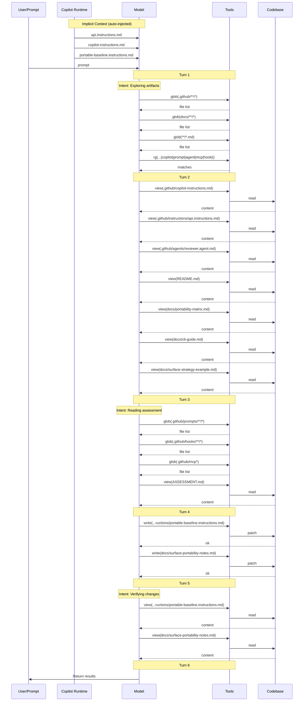

## 7 · Context Validation

> When and how was non-system (private) context accessed during the session?

### Implicit Context (auto-injected)

| File | Type |
| --- | --- |
| `api.instructions.md` | scoped |
| `copilot-instructions.md` | project-level |
| `portable-baseline.instructions.md` | scoped |

### Context Access Timeline

| Turn | Action | Target |
| ---: | --- | --- |
| 1 | search | `glob(.github/**/*)` |
| 1 | search | `glob(docs/**/*)` |
| 1 | search | `glob(**/*.md)` |
| 1 | search | `rg(applyTo:\|copilot\|prompt\|agent\|mcp\|hook\|instruction)` |
| 2 | read | `.github/copilot-instructions.md` |
| 2 | read | `.github/instructions/api.instructions.md` |
| 2 | read | `.github/agents/reviewer.agent.md` |
| 2 | read | `README.md` |
| 2 | read | `docs/portability-matrix.md` |
| 2 | read | `docs/cli-guide.md` |
| 2 | read | `docs/surface-strategy-example.md` |
| 3 | search | `glob(.github/prompts/**/*)` |
| 3 | search | `glob(.github/hooks/**/*)` |
| 3 | search | `glob(.github/mcp*)` |
| 3 | read | `ASSESSMENT.md` |
| 4 | **write** | `.github/instructions/portable-baseline.instructions.md` |
| 4 | **write** | `docs/surface-portability-notes.md` |
| 5 | read | `.github/instructions/portable-baseline.instructions.md` |
| 5 | read | `docs/surface-portability-notes.md` |

### Files Written

- `.github/instructions/portable-baseline.instructions.md`
- `docs/surface-portability-notes.md`

### Context Flow Diagram

### Validation Summary

- **Implicit context:** 3 instruction file(s) injected at session start
- **Files read:** 10 unique files across 6 turns
- **Files written:** 2 codebase file(s)
- **First codebase read:** turn 2
- **First codebase write:** turn 4
- **Discovery-before-write gap:** 2 turn(s)
