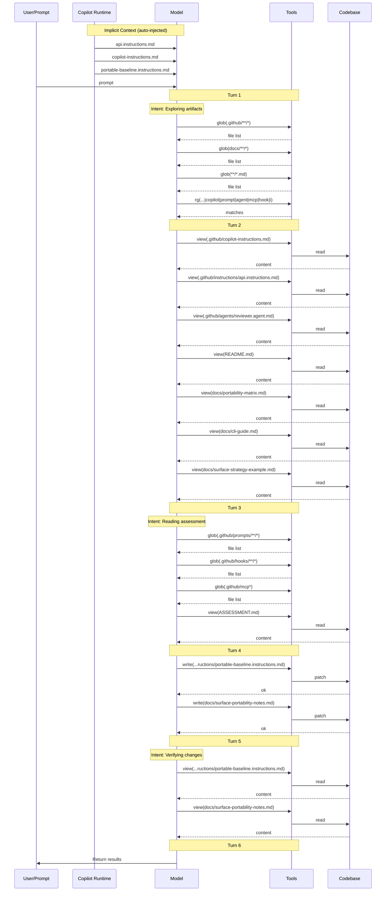

# Context Flow — 07-surface-strategy

```mermaid
sequenceDiagram
    participant U as User/Prompt
    participant S as Copilot Runtime
    participant M as Model
    participant T as Tools
    participant C as Codebase

    Note over S,M: Implicit Context (auto-injected)
    S->>M: api.instructions.md
    S->>M: copilot-instructions.md
    S->>M: portable-baseline.instructions.md

    U->>M: prompt


    Note over M,T: Turn 1
    Note over M: Intent: Exploring artifacts
    M->>T: glob(.github/**/*)
    T-->>M: file list
    M->>T: glob(docs/**/*)
    T-->>M: file list
    M->>T: glob(**/*.md)
    T-->>M: file list
    M->>T: rg(...|copilot|prompt|agent|mcp|hook|i)
    T-->>M: matches

    Note over M,T: Turn 2
    M->>T: view(.github/copilot-instructions.md)
    T->>C: read
    C-->>M: content
    M->>T: view(.github/instructions/api.instructions.md)
    T->>C: read
    C-->>M: content
    M->>T: view(.github/agents/reviewer.agent.md)
    T->>C: read
    C-->>M: content
    M->>T: view(README.md)
    T->>C: read
    C-->>M: content
    M->>T: view(docs/portability-matrix.md)
    T->>C: read
    C-->>M: content
    M->>T: view(docs/cli-guide.md)
    T->>C: read
    C-->>M: content
    M->>T: view(docs/surface-strategy-example.md)
    T->>C: read
    C-->>M: content

    Note over M,T: Turn 3
    Note over M: Intent: Reading assessment
    M->>T: glob(.github/prompts/**/*)
    T-->>M: file list
    M->>T: glob(.github/hooks/**/*)
    T-->>M: file list
    M->>T: glob(.github/mcp*)
    T-->>M: file list
    M->>T: view(ASSESSMENT.md)
    T->>C: read
    C-->>M: content

    Note over M,T: Turn 4
    M->>T: write(...ructions/portable-baseline.instructions.md)
    T->>C: patch
    C-->>M: ok
    M->>T: write(docs/surface-portability-notes.md)
    T->>C: patch
    C-->>M: ok

    Note over M,T: Turn 5
    Note over M: Intent: Verifying changes
    M->>T: view(...ructions/portable-baseline.instructions.md)
    T->>C: read
    C-->>M: content
    M->>T: view(docs/surface-portability-notes.md)
    T->>C: read
    C-->>M: content

    Note over M,T: Turn 6

    M->>U: Return results
```
