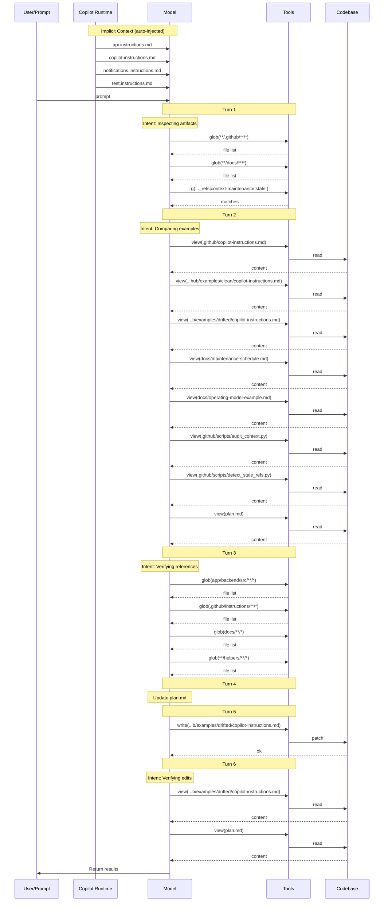

## 7 · Context Validation

> When and how was non-system (private) context accessed during the session?

### Implicit Context (auto-injected)

| File | Type |
| --- | --- |
| `api.instructions.md` | scoped |
| `copilot-instructions.md` | project-level |
| `notifications.instructions.md` | scoped |
| `test.instructions.md` | scoped |

### Context Access Timeline

| Turn | Action | Target |
| ---: | --- | --- |
| 1 | search | `glob(**/.github/**/*)` |
| 1 | search | `glob(**/docs/**/*)` |
| 1 | search | `rg(audit_context\|detect_stale_refs\|context-maintenance\|stale refs\|drift)` |
| 2 | read | `.github/copilot-instructions.md` |
| 2 | read | `.github/examples/clean/copilot-instructions.md` |
| 2 | read | `.github/examples/drifted/copilot-instructions.md` |
| 2 | read | `docs/maintenance-schedule.md` |
| 2 | read | `docs/operating-model-example.md` |
| 2 | read | `.github/scripts/audit_context.py` |
| 2 | read | `.github/scripts/detect_stale_refs.py` |
| 2 | read | `plan.md` |
| 3 | search | `glob(app/backend/src/**/*)` |
| 3 | search | `glob(.github/instructions/**/*)` |
| 3 | search | `glob(docs/**/*)` |
| 3 | search | `glob(**/helpers/**/*)` |
| 5 | **write** | `.github/examples/drifted/copilot-instructions.md` |
| 6 | read | `.github/examples/drifted/copilot-instructions.md` |
| 6 | read | `plan.md` |

### Files Written

- `.github/examples/drifted/copilot-instructions.md`

### Context Flow Diagram

### Validation Summary

- **Implicit context:** 4 instruction file(s) injected at session start
- **Files read:** 8 unique files across 7 turns
- **Files written:** 1 codebase file(s)
- **First codebase read:** turn 2
- **First codebase write:** turn 5
- **Discovery-before-write gap:** 3 turn(s)
