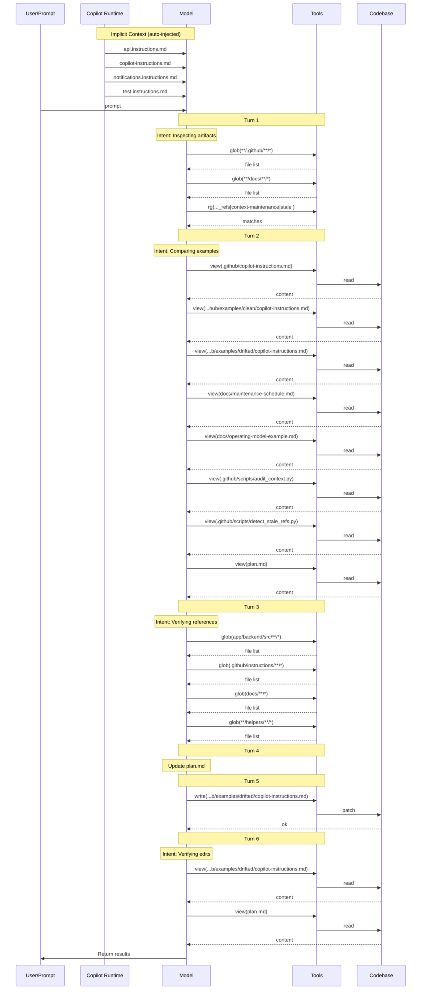

# Context Flow — 08-operating-model

```mermaid
sequenceDiagram
    participant U as User/Prompt
    participant S as Copilot Runtime
    participant M as Model
    participant T as Tools
    participant C as Codebase

    Note over S,M: Implicit Context (auto-injected)
    S->>M: api.instructions.md
    S->>M: copilot-instructions.md
    S->>M: notifications.instructions.md
    S->>M: test.instructions.md

    U->>M: prompt


    Note over M,T: Turn 1
    Note over M: Intent: Inspecting artifacts
    M->>T: glob(**/.github/**/*)
    T-->>M: file list
    M->>T: glob(**/docs/**/*)
    T-->>M: file list
    M->>T: rg(..._refs|context-maintenance|stale )
    T-->>M: matches

    Note over M,T: Turn 2
    Note over M: Intent: Comparing examples
    M->>T: view(.github/copilot-instructions.md)
    T->>C: read
    C-->>M: content
    M->>T: view(...hub/examples/clean/copilot-instructions.md)
    T->>C: read
    C-->>M: content
    M->>T: view(...b/examples/drifted/copilot-instructions.md)
    T->>C: read
    C-->>M: content
    M->>T: view(docs/maintenance-schedule.md)
    T->>C: read
    C-->>M: content
    M->>T: view(docs/operating-model-example.md)
    T->>C: read
    C-->>M: content
    M->>T: view(.github/scripts/audit_context.py)
    T->>C: read
    C-->>M: content
    M->>T: view(.github/scripts/detect_stale_refs.py)
    T->>C: read
    C-->>M: content
    M->>T: view(plan.md)
    T->>C: read
    C-->>M: content

    Note over M,T: Turn 3
    Note over M: Intent: Verifying references
    M->>T: glob(app/backend/src/**/*)
    T-->>M: file list
    M->>T: glob(.github/instructions/**/*)
    T-->>M: file list
    M->>T: glob(docs/**/*)
    T-->>M: file list
    M->>T: glob(**/helpers/**/*)
    T-->>M: file list

    Note over M,T: Turn 4
    Note over M: Update plan.md

    Note over M,T: Turn 5
    M->>T: write(...b/examples/drifted/copilot-instructions.md)
    T->>C: patch
    C-->>M: ok

    Note over M,T: Turn 6
    Note over M: Intent: Verifying edits
    M->>T: view(...b/examples/drifted/copilot-instructions.md)
    T->>C: read
    C-->>M: content
    M->>T: view(plan.md)
    T->>C: read
    C-->>M: content

    M->>U: Return results
```
