## 7 · Context Validation

> When and how was non-system (private) context accessed during the session?

### Implicit Context (auto-injected)

| File | Type |
| --- | --- |
| `api.instructions.md` | scoped |
| `copilot-instructions.md` | project-level |
| `frontend.instructions.md` | scoped |

### Context Access Timeline

| Turn | Action | Target |
| ---: | --- | --- |
| 1 | search | `glob(**/*architecture*.md)` |
| 1 | search | `glob(**/.github/**/*.md)` |
| 1 | search | `rg(notification\|preference\|preferences\|LEGAL-218\|mandatory)` |
| 1 | read | `(lesson root)` |
| 2 | read | `.github/copilot-instructions.md` |
| 2 | read | `.github/instructions/api.instructions.md` |
| 2 | read | `.github/instructions/frontend.instructions.md` |
| 2 | read | `docs/architecture.md` |
| 2 | read | `src` |
| 3 | search | `glob(src/backend/src/**/*notifications*.ts)` |
| 3 | search | `glob(src/backend/src/**/*preference*.ts)` |
| 3 | search | `glob(src/backend/tests/unit/**/*.test.ts)` |
| 3 | search | `glob(src/frontend/src/**/*notification*.ts)` |
| 3 | search | `glob(src/frontend/src/**/*preference*.ts)` |
| 3 | search | `rg(LEGAL-218\|mandatory event\|mandatory\|canDisableChannel\|notification.*preference\|preferences)` |
| 4 | search | `glob(src/backend/**/*.ts)` |
| 4 | search | `glob(src/frontend/**/*.ts)` |
| 4 | read | `src/backend` |
| 4 | read | `src/frontend` |
| 5 | search | `glob(**/*.ts)` |
| 5 | search | `glob(**/*.ts)` |
| 5 | search | `glob(**/*.ts)` |
| 5 | search | `rg(notification\|preference\|preferences\|LEGAL-218\|mandatory)` |
| 5 | search | `rg(notification\|preference\|preferences)` |
| 7 | read | `src/backend/src/routes/notifications.ts` |
| 7 | read | `src/backend/src/rules/mandatory-events.ts` |
| 7 | read | `src/backend/src/rules/business-rules.ts` |
| 7 | read | `src/backend/src/models/types.ts` |
| 7 | read | `src/backend/src/models/preference-repository.ts` |
| 7 | read | `src/backend/tests/unit/notification-service.test.ts` |
| 7 | read | `src/frontend/src/pages/preferences.ts` |
| 7 | read | `src/frontend/src/components/notification-toggle.ts` |
| 7 | read | `src/frontend/src/api/client.ts` |
| 7 | read | `src/frontend/src/api/types.ts` |
| 8 | search | `rg(LEGAL-218\|canDisableChannel\|California\|loanState\|decline\|sms\|mandatory events\|mandatory)` |
| 8 | read | `src/backend/src/services/notification-service.ts` |
| 8 | read | `src/backend/src/db/seed.ts` |
| 8 | read | `src/backend/tests/unit/business-rules.test.ts` |
| 8 | read | `src/backend/src/middleware/error-handler.ts` |
| 8 | read | `src/backend/src/middleware/request-validator.ts` |
| 9 | search | `rg(LEGAL-218\|decline\|SMS\|preferences\|preference\|notification)` |
| 9 | read | `ASSESSMENT.md` |
| 9 | read | `docs/capstone-example.md` |
| 10 | read | `src/backend/src/config/feature-flags.ts` |
| 10 | read | `src/backend/src/services/loan-service.ts` |
| 10 | read | `src/backend/src/middleware/auth.ts` |
| 10 | read | `src/backend/src/rules/role-permissions.ts` |
| 11 | read | `src/backend/src/rules/state-machine.ts` |
| 11 | read | `src/backend/tests/unit/state-machine.test.ts` |
| 12 | **write** | `src/backend/src/rules/preference-event-channel-validator.ts` |
| 12 | **write** | `src/backend/src/routes/notifications.ts` |
| 12 | **write** | `src/backend/tests/unit/preference-event-channel-validator.test.ts` |
| 13 | read | `src/backend/src/rules/preference-event-channel-validator.ts` |
| 13 | read | `src/backend/src/routes/notifications.ts` |
| 13 | read | `src/backend/tests/unit/preference-event-channel-validator.test.ts` |
| 14 | **write** | `src/backend/src/rules/preference-event-channel-validator.ts` |
| 15 | read | `src/backend/src/rules/preference-event-channel-validator.ts` |
| 15 | read | `src/backend/src/routes/notifications.ts` |
| 16 | **write** | `src/backend/src/rules/preference-event-channel-validator.ts` |
| 17 | **write** | `src/backend/src/rules/preference-event-channel-validator.ts` |

### Files Written

- `src/backend/src/routes/notifications.ts`
- `src/backend/src/rules/preference-event-channel-validator.ts`
- `src/backend/tests/unit/preference-event-channel-validator.test.ts`

### Context Flow Diagram

```mermaid
sequenceDiagram
    participant U as User/Prompt
    participant S as Copilot Runtime
    participant M as Model
    participant T as Tools
    participant C as Codebase

    Note over S,M: Implicit Context (auto-injected)
    S->>M: api.instructions.md
    S->>M: copilot-instructions.md
    S->>M: frontend.instructions.md

    U->>M: prompt


    Note over M,T: Turn 1
    Note over M: Intent: Exploring codebase
    M->>T: view((lesson root))
    T->>C: read
    C-->>M: content
    M->>T: glob(**/*architecture*.md)
    T-->>M: file list
    M->>T: glob(**/.github/**/*.md)
    T-->>M: file list
    M->>T: rg(...preference|preferences|LEGAL-218)
    T-->>M: matches

    Note over M,T: Turn 2
    Note over M: Intent: Reading instructions
    M->>T: view(.github/copilot-instructions.md)
    T->>C: read
    C-->>M: content
    M->>T: view(.github/instructions/api.instructions.md)
    T->>C: read
    C-->>M: content
    M->>T: view(.github/instructions/frontend.instructions.md)
    T->>C: read
    C-->>M: content
    M->>T: view(docs/architecture.md)
    T->>C: read
    C-->>M: content
    M->>T: view(src)
    T->>C: read
    C-->>M: content

    Note over M,T: Turn 3
    Note over M: Intent: Tracing preference flow
    M->>T: glob(src/backend/src/**/*notifications*.ts)
    T-->>M: file list
    M->>T: glob(src/backend/src/**/*preference*.ts)
    T-->>M: file list
    M->>T: glob(src/backend/tests/unit/**/*.test.ts)
    T-->>M: file list
    M->>T: glob(src/frontend/src/**/*notification*.ts)
    T-->>M: file list
    M->>T: glob(src/frontend/src/**/*preference*.ts)
    T-->>M: file list
    M->>T: rg(...annel|notification.*preference|p)
    T-->>M: matches

    Note over M,T: Turn 4
    Note over M: Intent: Mapping source tree
    M->>T: view(src/backend)
    T->>C: read
    C-->>M: content
    M->>T: view(src/frontend)
    T->>C: read
    C-->>M: content
    M->>T: glob(src/backend/**/*.ts)
    T-->>M: file list
    M->>T: glob(src/frontend/**/*.ts)
    T-->>M: file list

    Note over M,T: Turn 5
    Note over M: Intent: Locating source files
    M->>T: glob(**/*.ts)
    T-->>M: file list
    M->>T: glob(**/*.ts)
    T-->>M: file list
    M->>T: glob(**/*.ts)
    T-->>M: file list
    M->>T: rg(...preference|preferences|LEGAL-218)
    T-->>M: matches
    M->>T: rg(notification|preference|preferences)
    T-->>M: matches

    Note over M,T: Turn 6
    Note over M: Update plan.md

    Note over M,T: Turn 7
    Note over M: Intent: Reading preference code
    M->>T: view(src/backend/src/routes/notifications.ts)
    T->>C: read
    C-->>M: content
    M->>T: view(src/backend/src/rules/mandatory-events.ts)
    T->>C: read
    C-->>M: content
    M->>T: view(src/backend/src/rules/business-rules.ts)
    T->>C: read
    C-->>M: content
    M->>T: view(src/backend/src/models/types.ts)
    T->>C: read
    C-->>M: content
    M->>T: view(...ackend/src/models/preference-repository.ts)
    T->>C: read
    C-->>M: content
    M->>T: view(...nd/tests/unit/notification-service.test.ts)
    T->>C: read
    C-->>M: content
    M->>T: view(src/frontend/src/pages/preferences.ts)
    T->>C: read
    C-->>M: content
    M->>T: view(...tend/src/components/notification-toggle.ts)
    T->>C: read
    C-->>M: content
    M->>T: view(src/frontend/src/api/client.ts)
    T->>C: read
    C-->>M: content
    M->>T: view(src/frontend/src/api/types.ts)
    T->>C: read
    C-->>M: content

    Note over M,T: Turn 8
    Note over M: Intent: Reusing existing rules
    M->>T: rg(...ate|decline|sms|mandatory events)
    T-->>M: matches
    M->>T: view(...ckend/src/services/notification-service.ts)
    T->>C: read
    C-->>M: content
    M->>T: view(src/backend/src/db/seed.ts)
    T->>C: read
    C-->>M: content
    M->>T: view(src/backend/tests/unit/business-rules.test.ts)
    T->>C: read
    C-->>M: content
    M->>T: view(src/backend/src/middleware/error-handler.ts)
    T->>C: read
    C-->>M: content
    M->>T: view(...ackend/src/middleware/request-validator.ts)
    T->>C: read
    C-->>M: content

    Note over M,T: Turn 9
    Note over M: Intent: Checking lesson docs
    M->>T: view(ASSESSMENT.md)
    T->>C: read
    C-->>M: content
    M->>T: view(docs/capstone-example.md)
    T->>C: read
    C-->>M: content
    M->>T: rg(...ne|SMS|preferences|preference|no)
    T-->>M: matches

    Note over M,T: Turn 10
    Note over M: Intent: Anchoring validator types
    M->>T: view(src/backend/src/config/feature-flags.ts)
    T->>C: read
    C-->>M: content
    M->>T: view(src/backend/src/services/loan-service.ts)
    T->>C: read
    C-->>M: content
    M->>T: view(src/backend/src/middleware/auth.ts)
    T->>C: read
    C-->>M: content
    M->>T: view(src/backend/src/rules/role-permissions.ts)
    T->>C: read
    C-->>M: content

    Note over M,T: Turn 11
    Note over M: Intent: Matching rule style
    M->>T: view(src/backend/src/rules/state-machine.ts)
    T->>C: read
    C-->>M: content
    M->>T: view(src/backend/tests/unit/state-machine.test.ts)
    T->>C: read
    C-->>M: content

    Note over M,T: Turn 12
    M->>T: write(...ules/preference-event-channel-validator.ts)
    T->>C: patch
    C-->>M: ok
    M->>T: write(src/backend/src/routes/notifications.ts)
    T->>C: patch
    C-->>M: ok
    M->>T: write(...preference-event-channel-validator.test.ts)
    T->>C: patch
    C-->>M: ok

    Note over M,T: Turn 13
    Note over M: Intent: Reviewing changes
    M->>T: view(...ules/preference-event-channel-validator.ts)
    T->>C: read
    C-->>M: content
    M->>T: view(src/backend/src/routes/notifications.ts)
    T->>C: read
    C-->>M: content
    M->>T: view(...preference-event-channel-validator.test.ts)
    T->>C: read
    C-->>M: content

    Note over M,T: Turn 14
    M->>T: write(...ules/preference-event-channel-validator.ts)
    T->>C: patch
    C-->>M: ok

    Note over M,T: Turn 15
    Note over M: Intent: Final review
    M->>T: view(...ules/preference-event-channel-validator.ts)
    T->>C: read
    C-->>M: content
    M->>T: view(src/backend/src/routes/notifications.ts)
    T->>C: read
    C-->>M: content

    Note over M,T: Turn 16
    M->>T: write(...ules/preference-event-channel-validator.ts)
    T->>C: patch
    C-->>M: ok

    Note over M,T: Turn 17
    M->>T: write(...ules/preference-event-channel-validator.ts)
    T->>C: patch
    C-->>M: ok

    Note over M,T: Turn 18

    M->>U: Return results
```

### Validation Summary

- **Implicit context:** 3 instruction file(s) injected at session start
- **Files read:** 33 unique files across 18 turns
- **Files written:** 3 codebase file(s)
- **First codebase read:** turn 1
- **First codebase write:** turn 12
- **Discovery-before-write gap:** 11 turn(s)
