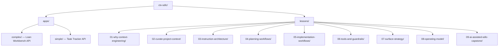

# Context Engineering for GitHub Copilot — Examples

Runnable example assets for the Context Engineering course. Each lesson copies a
template app into its `src/` subdirectory (gitignored) and provides checked-in
context files (`.github/`, `docs/`, `specs/`, etc.).

## Quick Start

```bash
# 1. Create the Python venv (one-time)
uv venv && uv pip install -e ".[dev]"

# 2. Set up a lesson workspace
cd lessons/04-planning-workflows
python default.py --clean
cd src && npm install

# 3. Run validation scenarios
cd ..
python validate.py --all
```

## Template Apps

| App                | Path            | Stack                      | Domain                               |
| ------------------ | --------------- | -------------------------- | ------------------------------------ |
| **Loan Workbench** | `apps/complex/` | Node.js / Express / SQLite | Loan workflow, queue, business rules |
| **Task Tracker**   | `apps/simple/`  | Python / Flask / SQLite    | Simple task CRUD                     |

### Loan Workbench (Complex)

Multi-tier financial services platform:

- **Backend API** (`backend/src/`): Express + better-sqlite3
- **Embedded queue** (`backend/src/queue/`): Typed message contracts, broker
- **Database** (`backend/src/db/`): SQLite schema + seed data
- **Business rules** (`backend/src/rules/`): California SMS restriction, mandatory events, role defaults
- **Frontend** (`frontend/`): Vanilla HTML/JS dashboard
- **State machine**: submitted → under_review → approved/denied → funded/closed
- **Role-based access**: underwriter, analyst-manager, compliance-reviewer

### Task Tracker (Simple)

Python Flask API with SQLite:

- State machine: todo → in-progress → review → done
- Token-based auth middleware
- Service layer + route layer separation

## Lesson Structure

Every lesson follows a unified structure:

```
NN-lesson-slug/
  .github/          ← Context files (checked in)
  docs/             ← Architecture, conventions (checked in)
  specs/            ← Product specs, NFRs (checked in, some lessons)
  output/           ← Copilot CLI output (checked in for comparison)
  src/              ← Copied from apps/ by default.py (gitignored)
  default.py        ← Copies template → src/
  validate.py       ← Runs Copilot CLI scenarios
  README.md         ← Lesson overview
  SETUP.md          ← Setup + validation instructions
```

## Lesson Map

| Folder                          | Template | Topic                                       | Key Context                                   | Video                                                |
| ------------------------------- | -------- | ------------------------------------------- | --------------------------------------------- | ---------------------------------------------------- |
| `01-why-context-engineering/`   | complex  | With vs. without context                    | `.github/`, `docs/`                           | [Watch](https://www.youtube.com/watch?v=YBXo_hxr9k4) |
| `02-curate-project-context/`    | complex  | Behavior + knowledge curation               | `.github/`, `docs/`                           | [Watch](https://www.youtube.com/watch?v=1B90MkDnmhs) |
| `03-instruction-architecture/`  | complex  | Layered instructions with `applyTo`         | `.github/instructions/`, `docs/`              | [Watch](https://www.youtube.com/watch?v=BS2NbFnyYJY) |
| `04-planning-workflows/`        | complex  | Specs, NFRs, planning prompts               | `specs/`, `docs/`, feature/bug templates      | [Watch](https://www.youtube.com/watch?v=KuLgT8Wck_E) |
| `05-implementation-workflows/`  | complex  | Role-separated agents, TDD                  | `.github/agents/`, `specs/`, `docs/`          | [Watch](https://www.youtube.com/watch?v=ZvclU2Jyx5o) |
| `06-tools-and-guardrails/`      | complex  | MCP servers, hooks, file protection         | `.github/mcp.json`, `scripts/`, `docs/`       | [Watch](https://www.youtube.com/watch?v=MBHvkVrEgRk) |
| `07-surface-strategy/`          | complex  | Polyglot context for Copilot, Claude, Codex | `AGENTS.md`, `CLAUDE.md`, `.github/`, `docs/` | [Watch](https://www.youtube.com/watch?v=XvUSBlrXZoA) |
| `08-operating-model/`           | complex  | Maintenance, measurement, anti-patterns     | `scripts/`, `checklists/`, `examples/`        | [Watch](https://www.youtube.com/watch?v=7XBVtDGi87I) |
| `09-ai-assisted-sdlc-capstone/` | complex  | Progressive context (5 stages)              | `stages/` (cumulative overlays)               | _Coming soon_                                        |

## Progressive Context Stack

Each lesson adds a new layer of context. The stack is cumulative:

```
Lesson 01  │ No context vs. structured context
           │
Lesson 02  │ + copilot-instructions.md (behavior) + docs/ (knowledge) + ADRs
           │
Lesson 03  │ + .instructions.md with applyTo scoping
           │
Lesson 04  │ + Prompts + specs + NFRs + planner agent
           │
Lesson 05  │ + Role-separated agents + TDD skills + playbook
           │
Lesson 06  │ + MCP servers + hooks + file protection + trust boundaries
           │
Lesson 07  │ → Surface strategy: polyglot context across Copilot, Claude, Codex
           │
Lesson 08  │ → Operating model: maintenance scripts, audit, anti-pattern detection
           │
Lesson 09  │ → Capstone: 5-stage progressive arc (Day 1 → Mature) on a new project
```

By lesson 06, the full context surface is: instructions + prompts + specs +
agents + skills + MCP config + hooks + trust documentation.

Lessons 07-08 teach how to maintain and port that stack across surfaces and time.
Lesson 09 synthesizes everything on a fresh project (TaskFlow) with five
progressive stages demonstrating cumulative context improvement.

## Using `#file:` Attachments

Every lesson README includes specific prompts showing how to attach context
files in Copilot Chat. The `#file:` syntax is the primary mechanism for
bringing project context into AI conversations.

**Pattern**: `#file:relative/path/to/file`

**Examples from each lesson**:

| Lesson | Attachment Example                                     | Why                                        |
| ------ | ------------------------------------------------------ | ------------------------------------------ |
| 01     | `#file:with-context/app/config/rules.py`               | Compare rules-aware vs. rules-blind output |
| 02     | `#file:docs/architecture.md`                           | Attach knowledge context for full-picture  |
| 02     | `#file:docs/adr/ADR-001-express-over-fastify.md`       | Prevent AI from re-litigating decisions    |
| 03     | `#file:.github/instructions/security.instructions.md`  | Show instruction content to the AI         |
| 04     | `#file:specs/product-spec-notification-preferences.md` | Bring requirements into planning prompts   |
| 04     | `#file:bug-report.md`                                  | Cross-reference bugs against specs         |
| 05     | `#file:.github/skills/tdd-workflow/SKILL.md`           | Invoke reusable workflow skills            |
| 05     | `#file:docs/implementation-playbook.md`                | Reference role boundaries                  |
| 06     | `#file:docs/tool-trust-boundaries.md`                  | Show trust classification to agents        |
| 06     | `#file:.github/hooks/file-protection.json`             | Explain why edits are blocked              |
| 07     | `#file:.github/instructions/api.instructions.md`       | Test path-scoped instruction portability   |
| 08     | `#file:examples/drifted/copilot-instructions.md`       | Compare drifted vs. clean context          |

## Key Scenarios Across Lessons

Each lesson README contains 6-8 numbered scenarios. Here are the highlights:

| Lesson | Scenario                        | What It Shows                                 |
| ------ | ------------------------------- | --------------------------------------------- |
| 01     | Zero context vs. rich context   | Same prompt, dramatically different output    |
| 02     | Behavior only vs. both halves   | Style correct but architecture wrong          |
| 02     | ADR prevents bad suggestion     | AI doesn't re-litigate rejected decisions     |
| 02     | GitHub CLI parity               | Instructions are the most portable artifact   |
| 03     | Removing instructions           | Quality degrades when context is removed      |
| 04     | Shallow vs. deep planning       | 4 generic tasks vs. 15+ spec-traced tasks     |
| 04     | Bug cross-reference             | Four independent rules intersect in one bug   |
| 04     | False positive detection        | Correct behavior misreported as bug           |
| 05     | TDD handoff (3 agents)          | Test → implement → review cycle               |
| 05     | Role boundary violation         | Reviewer refuses to write code                |
| 06     | File protection (feature flags) | Even "correct" changes need governance        |
| 06     | Trust boundary violation        | Agent × tool matrix prevents capability leaks |
| 06     | Adding new MCP server           | 5-step process with trust classification      |
| 07     | Shared base plus bridges        | One repo story, three tool-native entrypoints |
| 07     | Scoped parity                   | Copilot and Claude keep the same route rules  |
| 07     | Foundation-first strategy       | Start with shared intent, then bridge outward |
| 08     | Audit script run                | Automated detection of context drift          |
| 08     | Before/after cleanup            | 5 anti-patterns fixed in one diff             |
| 08     | Stale technology problem        | Wrong library = wrong code (winston vs. pino) |
| 09     | Same prompt, five stages        | Progressive context improves output           |
| 09     | Full delivery loop              | Curate → Plan → Build → Validate → Ship       |
| 09     | Four-iteration arc in TaskFlow  | Error compounding applies to any project      |

### Advanced: 4-Iteration Arc (Spans Lessons 04 → 05 → 06)

The most advanced scenario is a **cross-lesson iterative arc** that traces a
single feature through four rounds of change requests and NFR updates. It shows
how context-rich development maintains zero bugs while context-poor development
accumulates 19 hidden bugs that compound across iterations.

| Iteration | Lesson | Change                           | Without Context      | With Context                      |
| --------- | ------ | -------------------------------- | -------------------- | --------------------------------- |
| 1         | 04     | Initial notification preferences | 7 missed constraints | 16-task spec-traced plan          |
| 2         | 05     | Portfolio aggregation CR         | +3 data leakage bugs | Role-scoped, team-only            |
| 3         | 05     | Audit retention + GDPR export    | +4 export/scope bugs | User-scoped, rate-limited         |
| 4         | 06     | Bulk compliance update           | +5 legal violations  | Per-user rules + hook enforcement |
| **Total** |        |                                  | **19 hidden bugs**   | **0 bugs**                        |

Start at Lesson 04's "Advanced: Iterative Planning" section and follow the
arc through Lesson 05's "Advanced: Iterative Implementation" to Lesson 06's
"Advanced: Iterative Guardrails."

## Assessment Framework

Every lesson contains an `ASSESSMENT.md` that evaluates the Copilot CLI session
output against a **six-dimension rubric**:

| Dim | Name                  | What It Measures                                          |
| --- | --------------------- | --------------------------------------------------------- |
| CU  | Context Utilization   | Did Copilot reference the provided context files?         |
| SE  | Session Efficiency    | Duration, tool-call count, and model selection            |
| PA  | Prompt Alignment      | Did the prompt match the lesson's scenario intent?        |
| CC  | Change Correctness    | Do changed files and diff patterns match expectations?    |
| OC  | Objective Completion  | Are the lesson's learning objectives demonstrated?        |
| BC  | Behavioral Compliance | Did Copilot follow behavioral constraints (style, scope)? |

Each dimension is rated **✅ PASS**, **⚠️ PARTIAL**, or **❌ FAIL**.
A composite verdict summarizes the lesson: all-pass → ✅ PASS; any partial with
no fail → ⚠️ PASS WITH CAVEATS; any fail → ❌ FAIL.

### Current Verdicts

| Lesson | Verdict | Notes                                                |
| ------ | ------- | ---------------------------------------------------- |
| 01     | ✅ PASS | Comparative format (with-context vs without-context) |
| 02     | ✅ PASS | Behavior + knowledge curation demonstrated           |
| 03     | ✅ PASS | Instruction layering with applyTo scoping            |
| 04     | ✅ PASS | Spec-traced planning, NFR cross-referencing          |
| 05     | ✅ PASS | TDD-first workflow, all tool boundaries respected    |
| 06     | ✅ PASS | MCP, hooks, file protection all exercised            |
| 07     | ✅ PASS | CLI portability verified in 38 s                     |
| 08     | ✅ PASS | Audit + anti-pattern detection in 30 s               |
| 09     | ✅ PASS | Full capstone arc across 5 stages                    |

Full framework details: [`docs/ASSESSMENT_GUIDE.md`](../../docs/ASSESSMENT_GUIDE.md)

## Folder Structure



---

## Videos

| #   | Thumbnail                                                                                                             | Title                                                                     | Link                                                 |
| --- | --------------------------------------------------------------------------------------------------------------------- | ------------------------------------------------------------------------- | ---------------------------------------------------- |
| 01  | [](https://www.youtube.com/watch?v=YBXo_hxr9k4) | Context Engineering for GitHub Copilot [Course Intro] \| Lesson 01        | [Watch](https://www.youtube.com/watch?v=YBXo_hxr9k4) |
| 02  | [](https://www.youtube.com/watch?v=1B90MkDnmhs) | GitHub Copilot: Mastering .github/ and /docs/ \| Lesson 02 of 09          | [Watch](https://www.youtube.com/watch?v=1B90MkDnmhs) |
| 03  | [](https://www.youtube.com/watch?v=BS2NbFnyYJY) | The 3-Axis Model: Precision Context for GitHub Copilot \| Lesson 03 of 09 | [Watch](https://www.youtube.com/watch?v=BS2NbFnyYJY) |
| 04  | [](https://www.youtube.com/watch?v=KuLgT8Wck_E) | Mastering GitHub Copilot Plan Mode                                        | [Watch](https://www.youtube.com/watch?v=KuLgT8Wck_E) |
| 05  | [](https://www.youtube.com/watch?v=ZvclU2Jyx5o) | How to Build an AI "Dev Team" in GitHub Copilot \| Lesson 05 of 09        | [Watch](https://www.youtube.com/watch?v=ZvclU2Jyx5o) |
| 06  | [](https://www.youtube.com/watch?v=MBHvkVrEgRk) | Stop AI Mistakes with GitHub Copilot Hooks & Guardrails                   | [Watch](https://www.youtube.com/watch?v=MBHvkVrEgRk) |
| 07  | [](https://www.youtube.com/watch?v=XvUSBlrXZoA) | Context Engineering the Multi-Agent Era: Copilot, Claude, and Codex       | [Watch](https://www.youtube.com/watch?v=XvUSBlrXZoA) |
| 08  | [](https://www.youtube.com/watch?v=7XBVtDGi87I) | Beyond Vibe Coding: Context Operating Model                               | [Watch](https://www.youtube.com/watch?v=7XBVtDGi87I) |

Full Course: <https://tuts.localm.dev/ctx-sdlc>
