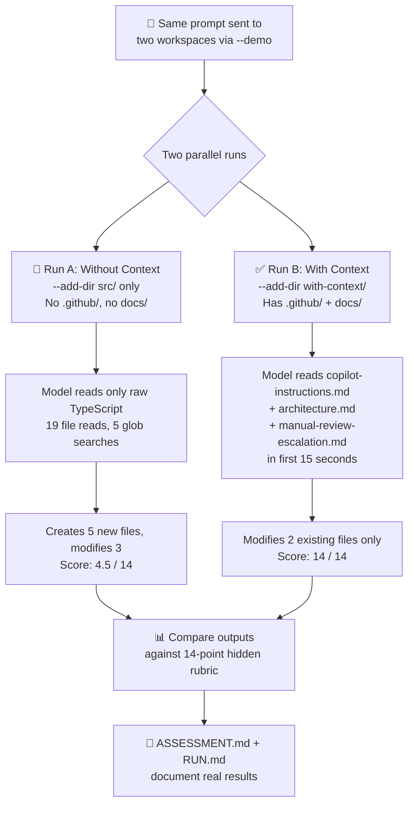

# Lesson 01 — Why Context Engineering — Run Analysis

> **Format:** Comparative (with-context vs without-context)
> **Model:** claude-haiku-4.5 · **CLI:** GitHub Copilot CLI 1.0.5
> **Date:** 2025-03-15 · **Artifacts:** `with-context/.output/`, `without-context/.output/`

---

## 1. Lesson Design — Flow Diagram



---

## 2. Experiment Structure

### Prompt (identical for both runs)

```text
Implement the manual review escalation workflow for this repository.
Follow existing repo conventions and architecture.
Return the exact files you would change and the code for each change.
Apply the change directly in code instead of only describing it.
Do not run npm install, npm test, or any shell commands. Inspect and edit files only.
```

### Without-Context Workspace (`--add-dir src/`)

| Component                          | Present? | Notes                      |
| ---------------------------------- | -------- | -------------------------- |
| `src/` (app code)                  | ✅       | Raw TypeScript Express app |
| `.github/copilot-instructions.md`  | ❌       | No behavioral guidance     |
| `docs/architecture.md`             | ❌       | No architecture knowledge  |
| `docs/manual-review-escalation.md` | ❌       | No hidden spec             |

### With-Context Workspace (`--add-dir with-context/`)

| Component                          | Present? | Notes                                             |
| ---------------------------------- | -------- | ------------------------------------------------- |
| `src/` (app code)                  | ✅       | Same raw TypeScript Express app                   |
| `.github/copilot-instructions.md`  | ✅       | Project conventions, error handling, lesson canon |
| `docs/architecture.md`             | ✅       | System shape, constraints, key rules              |
| `docs/manual-review-escalation.md` | ✅       | 14-point hidden spec (source of truth)            |
| `docs/experiment.md`               | ✅       | Scoring rubric for evaluation                     |

---

## 3. With-Context Run — Session Trace

### Session Metadata

| Key | Value |
|---|---|
| Session ID | `c162f7a2-27ae-4690-875d-470238c01d31` |
| Duration | 1m 24s |
| Tool calls | 25 (23 ✅, 2 ❌ permission-denied) |
| Edits | 3 (`edit` tool calls across 2 files) |
| Session export | ✅ `session.md` (55 KB) |

### Tool Call Timeline

| Phase | Time | Tool | Target | Purpose |
|---|---|---|---|---|
| Discovery | 10s | ❌ view | `Y:\` | Tried to list root — permission denied |
| Discovery | 10s | ❌ view | `ctx-sdlc/` | Tried parent dir — permission denied |
| Discovery | 11s | ✅ view | `with-context/` | Listed workspace root — found `.github/`, `docs/`, `src/` |
| Context | 13s | ✅ view | `docs/` | Found 3 docs |
| Context | 13s | ✅ view | `src/` | Found app structure |
| **Context** | **15s** | **✅ view** | **`docs/manual-review-escalation.md`** | **Read hidden spec — all 14 requirements** |
| Context | 15s | ✅ view | `docs/architecture.md` | Read system shape + constraints |
| Convention | 18–22s | ✅ view×4 | `src/backend/src/{models,routes,services,...}` | Explored code structure |
| Convention | 22–60s | ✅ view×12 | Key source files | Read types, routes, services, queue, audit, rules |
| Planning | 60s | 💬 | — | Output 14-point implementation plan matching spec exactly |
| **Edit** | 62s | **✅ edit** | **`routes/applications.ts`** | Added `POST /:id/manual-review` endpoint |
| Edit | 65s | ✅ view | `services/loan-service.ts` | Re-read service to plan insertion point |
| **Edit** | 70s | **✅ edit** | **`services/loan-service.ts`** | Added imports (`auditAction`, `featureFlags`) |
| **Edit** | 76s | **✅ edit** | **`services/loan-service.ts`** | Added `manualReviewEscalation()` function |
| Verify | 80s | ✅ view | Modified files | Verified edits |
| Summary | 84s | 💬 | — | Self-checked all 14 requirements ✅ |

### Key Decision Points

1. **T+15s — Context discovery:** Model read `manual-review-escalation.md` and immediately listed all 14 requirements in its plan. This was the decisive moment.
2. **T+60s — Planning complete:** After reading 20 files, the model produced a plan that mapped 1:1 to the hidden spec, including California high-risk prefix.
3. **T+70s — Surgical edits:** Only modified 2 files (`routes/applications.ts`, `services/loan-service.ts`). No new files, no schema changes, no new queue contracts.

### Changed Files

```json
{
  "added": [],
  "modified": [
    "backend/src/routes/applications.ts",
    "backend/src/services/loan-service.ts"
  ],
  "deleted": []
}
```

Patch size: **3.1 KB** (27 lines route + 65 lines service)

---

## 4. Without-Context Run — Session Trace

### Session Metadata

| Key | Value |
|---|---|
| Duration | >3m 00s (killed at 180s timeout) |
| Tool calls | ~40 (19 read, 4 list, 5 glob, 6 edit, 6 create) |
| Edits + Creates | 11 (6 edits + 5 new files) |
| Session export | ❌ Process killed before export |

### Tool Call Timeline

| Phase | Time | Tool | Target | Purpose |
|---|---|---|---|---|
| Discovery | 0–20s | list×4 | `src/backend/src/{routes,models,services,rules,...}` | Explored app structure |
| Discovery | 20s | glob×5 | `**/*.ts` patterns | Searched for TypeScript files |
| Reading | 20–80s | read×19 | Schema, types, routes, services, queue, handlers, tests | Read all major source files |
| Planning | 80s | 💬 | — | Proposed 5-point "enhancement plan" (wrong framing) |
| **Create** | 90s | **create** | **`models/escalation-repository.ts`** | New 171-line repository (wrong — should use existing) |
| **Create** | 100s | **create** | **`services/escalation-service.ts`** | New 187-line service (wrong — should use loan-service) |
| Edit | 110s | edit | `models/types.ts` | Added escalation types (+13 lines) |
| Edit | 115s | edit | `db/schema.sql` | Added escalations table (+18 lines) |
| Edit | 120s | edit | `queue/contracts.ts` | Added escalation contracts (+15 lines) |
| **Create** | 130s | **create** | **`queue/handlers/escalation-handler.ts`** | New handler (wrong — should reuse notification) |
| **Create** | 140s | **create** | **`routes/escalations.ts`** | New 110-line route file (wrong — should be in applications.ts) |
| Edit | 150s | edit×2 | `app.ts` | Registered new routes + handler |
| Create | 160s | create | `db/migrations/002_escalation_table.sql` | New migration (wrong — no schema change needed) |
| Edit | 170s | edit | `db/seed.ts` | Added escalation seed data |
| **Create** | 175s | **create** | **`tests/integration/escalations.test.ts`** | New 241-line test file |
| **Create** | 180s | **create** | **`ESCALATION_WORKFLOW.md`** | New 294-line design doc |
| ⏱️ | >180s | — | — | Process killed at timeout deadline |

### Key Decision Points

1. **No context to discover:** The model spent 20s exploring but found only raw code — no instructions, no spec, no architecture docs. It had to infer everything from existing patterns.
2. **Wrong framing at T+80s:** The model framed the task as building a new "escalation enhancement" subsystem rather than adding a side workflow to existing modules.
3. **Created 5 new files:** Instead of modifying 2 existing files, the model built an entire new subsystem with repository, service, route, handler, and migration — a classic "overengineered plausible guess."
4. **Got some things right from code reading:** Delegated-session checks, `notification.requested` event, `manual-review-escalation` event name, and `auditAction()` calls were found by reading existing code patterns. These 4 correct items came from code conventions, not project context.

### Changed Files

```json
{
  "added": [
    "backend/ESCALATION_WORKFLOW.md",
    "backend/src/models/escalation-repository.ts",
    "backend/src/routes/escalations.ts",
    "backend/src/services/escalation-service.ts",
    "backend/tests/integration/escalations.test.ts"
  ],
  "modified": [
    "backend/src/app.ts",
    "backend/src/db/seed.ts",
    "backend/src/models/types.ts"
  ],
  "deleted": []
}
```

Patch size: **34.8 KB** (10× larger than with-context)

---

## 5. Comparative Rubric Scoring

| # | Requirement | With Context | Without Context | Notes |
|---|---|---|---|---|
| 1 | `POST /api/applications/:id/manual-review` | ✅ | ❌ | Without: `POST /api/escalations` |
| 2 | Route in `routes/applications.ts` | ✅ | ❌ | Without: created `routes/escalations.ts` |
| 3 | Orchestration in `services/loan-service.ts` | ✅ | ❌ | Without: new `escalation-service.ts` |
| 4 | Thin route, logic in service | ✅ | ❌ | Without: has service layer but wrong module |
| 5 | Role gate: `analyst-manager` | ✅ | ⚠️ | Without: also expanded to `compliance-reviewer` |
| 6 | Delegated sessions blocked | ✅ | ✅ | Both discovered from existing code |
| 7 | No loan status transition | ✅ | ❌ | Without: pending/approved/rejected/completed |
| 8 | Reuses `notification.requested` | ✅ | ✅ | Both reused existing event |
| 9 | Event: `manual-review-escalation` | ✅ | ✅ | Both used correct name |
| 10 | No new queue contract | ✅ | ❌ | Without: new escalation contracts + schema |
| 11 | Audit the operation | ✅ | ✅ | Both called `auditAction()` |
| 12 | Action: `loan.manual-review-requested` | ✅ | ❌ | Without: different action name |
| 13 | `[CA-HighRisk]` subject prefix | ✅ | ❌ | Without: no California rule |
| 14 | Response: `{ ok, applicationId, notificationEventId }` | ✅ | ❌ | Without: different shape |

**With context: 14/14 · Without context: 4.5/14**

---

## 6. What This Lesson Proves

1. **Context, not intelligence, is the bottleneck** — the same model produces 14/14 vs 4.5/14 depending solely on available context
2. **Hidden specs are discoverable** — with-context run found and used `manual-review-escalation.md` as source of truth within 15 seconds
3. **Behavioral guidance drives convention adherence** — `.github/copilot-instructions.md` shaped error handling, audit patterns, and delegation blocking
4. **Knowledge docs provide architectural awareness** — `architecture.md` informed queue reuse, service placement, and state machine respect
5. **Without context, code-reading still helps partially** — the 4.5 points the baseline scored all came from discovering patterns in existing code (delegation checks, audit calls, event names)

---

## 7. Session Metadata

| Key | Value |
|---|---|
| Lesson Type | Comparative (with-context vs without-context) |
| CLI | GitHub Copilot CLI 1.0.5 |
| Model | claude-haiku-4.5 |
| With-context session | `with-context/.output/logs/session.md` (55 KB) |
| With-context patch | `with-context/.output/change/demo.patch` (3.1 KB) |
| Without-context log | `without-context/.output/logs/copilot.log` (263 KB) |
| Without-context patch | `without-context/.output/change/demo.patch` (34.8 KB) |
| Context files | 3 (`copilot-instructions.md`, `architecture.md`, `manual-review-escalation.md`) |
| Expected outcome | With-context: 10–14 · Without-context: 0–4 |
| Actual outcome | **With-context: 14/14 · Without-context: 4.5/14** |
