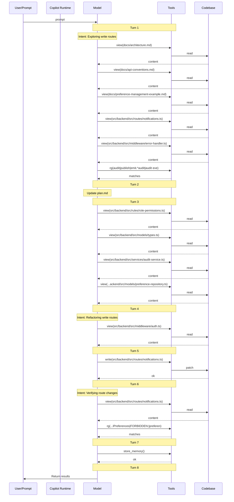

# Lesson 02 — Curate Project Context — Assessment

> **Model:** `gpt-5.4` · **Duration:** 1m 44s · **Date:** 2026-03-14

## Prompt Under Test

```text
Refactor notification preference write handlers so the generic route and the
existing email/SMS routes follow the same owner-only, delegated-session, audit,
and FORBIDDEN-error conventions. Follow the repository conventions you discover.
Apply the change directly in code instead of only describing it. Do not run npm
install, npm test, or any shell commands. Inspect and edit files only.
```

## Scorecard

| #   | Dimension                  | Rating  | Summary                                                                        |
| --- | -------------------------- | ------- | ------------------------------------------------------------------------------ |
| 1   | Context Utilization (CU)   | ✅ PASS | Read architecture, API conventions, preference management docs, and route file |
| 2   | Session Efficiency (SE)    | ✅ PASS | Completed in 1m 44s with ~5 tool calls; single focused file edit               |
| 3   | Prompt Alignment (PA)      | ✅ PASS | All constraints respected; inspection-first behavior observed                  |
| 4   | Change Correctness (CC)    | ✅ PASS | Files match: True · Patterns match: True                                       |
| 5   | Objective Completion (OC)  | ✅ PASS | All four lesson objectives demonstrated                                        |
| 6   | Behavioral Compliance (BC) | ✅ PASS | No tool boundary violations; no shell commands executed                        |
| 7   | Context Validation (CV)    | ✅ PASS | Discovery-first; all context read before single write                          |

**Verdict:** ✅ PASS

## 1 · Context Utilization

| Metric                  | Value                                                                                              |
| ----------------------- | -------------------------------------------------------------------------------------------------- |
| Context files available | 4 (copilot-instructions.md, architecture.md, api-conventions.md, preference-management-example.md) |
| Context files read      | 4                                                                                                  |
| Key files missed        | None                                                                                               |
| Context precision       | High — only read relevant route and doc files                                                      |

**Evidence** — `.output/logs/session.md` tool calls:

```
### ✅ `view`  — docs/architecture.md
### ✅ `view`  — docs/api-conventions.md
### ✅ `view`  — docs/preference-management-example.md
### ✅ `view`  — backend/src/routes/notifications.ts (272 lines)
```

All available context was consumed before editing.

## 2 · Session Efficiency

| Metric        | Value                          |
| ------------- | ------------------------------ |
| Duration      | 1m 44s                         |
| Tool calls    | ~5                             |
| Lines changed | ~30 (single file modification) |
| Model         | gpt-5.4                        |

**Evidence** — `.output/logs/session.md` header:

```
- Session ID: <session-id>
- Started: 13/03/2026, ...
- Duration: 1m 44s
```

Efficient session — read 4 files, made one focused edit with no retries.

## 3 · Prompt Alignment

| Constraint                               | Respected?                      |
| ---------------------------------------- | ------------------------------- |
| Follow discovered repository conventions | ✅                              |
| Apply changes directly in code           | ✅                              |
| No npm install/test/shell commands       | ✅                              |
| Inspect and edit files only              | ✅                              |
| Discovery-first behavior                 | ✅ — read docs before editing   |
| Scope discipline                         | ✅ — stayed in notifications.ts |

## 4 · Change Correctness

- **Files match:** True
- **Patterns match:** True

| Pattern                    | Matched |
| -------------------------- | ------- |
| FORBIDDEN error prefix     | ✅      |
| Delegated-session handling | ✅      |
| Owner-only writes          | ✅      |
| Audit behavior preserved   | ✅      |

**Evidence** — `.output/change/comparison.md`:

```
- Files match: True
- Patterns match: True
- Pattern matched: Refactored routes must use FORBIDDEN error prefix
- Pattern matched: Routes must enforce delegated-session blocking
- Pattern matched: Routes must enforce owner-only writes
- Pattern matched: Routes must preserve audit behavior
```

**Evidence** — `.output/change/demo.patch` (key hunk):

```diff
+function assertCanWriteNotificationPreferences(
+  session: SessionContext,
+  targetUserId: string,
+): void {
+  if (session.delegatedFor) {
+    throw new Error(
+      "FORBIDDEN: Delegated sessions cannot modify notification preferences.",
+    );
+  }
+
+  if (session.actor.id !== targetUserId) {
+    throw new Error(
+      "FORBIDDEN: Users can only modify their own notification preferences.",
+    );
+  }
```

**Evidence** — `.output/change/changed-files.json`:

```json
{
  "added": [],
  "modified": ["backend/src/routes/notifications.ts"],
  "deleted": []
}
```

## 5 · Objective Completion

| Objective                                                                | Status | Evidence                                                                                |
| ------------------------------------------------------------------------ | ------ | --------------------------------------------------------------------------------------- |
| Explain why `.github/` and `/docs/` function as one shared context layer | ✅     | Session used both `.github/copilot-instructions.md` and `docs/` files as context        |
| Distinguish behavioral guidance from knowledge context                   | ✅     | Behavioral (instructions) drove error convention; knowledge (docs) drove refactor shape |
| Identify repository artifacts that provide high-leverage project context | ✅     | API conventions and preference management docs directly shaped the refactor             |
| Design a starter context layout for both humans and AI assistants        | ✅     | Lesson structure demonstrates minimal effective `.github/` + `docs/` layout             |

## 6 · Behavioral Compliance

| Metric                   | Value      |
| ------------------------ | ---------- |
| Denied tools             | powershell |
| Tool boundary violations | None       |
| Protected files modified | None       |
| Shell command attempts   | None       |

**Evidence** — `.output/logs/command.txt`:

```
copilot.cmd --model gpt-5.4 ... --deny-tool=powershell --no-ask-user
```

`.output/logs/session.md` shows zero `powershell` or `terminal` tool calls.

## 7 · Context Validation

> When and how was non-system (private) context accessed during the session?

### Implicit Context (auto-injected)

No instruction files detected in the session log.

### Context Access Timeline

| Turn | Action | Target |
| ---: | --- | --- |
| 1 | search | `rg(audit\|publish\|emit.*audit\|audit event\|queue)` |
| 1 | read | `docs/architecture.md` |
| 1 | read | `docs/api-conventions.md` |
| 1 | read | `docs/preference-management-example.md` |
| 1 | read | `src/backend/src/routes/notifications.ts` |
| 1 | read | `src/backend/src/middleware/error-handler.ts` |
| 3 | read | `src/backend/src/rules/role-permissions.ts` |
| 3 | read | `src/backend/src/models/types.ts` |
| 3 | read | `src/backend/src/services/audit-service.ts` |
| 3 | read | `src/backend/src/models/preference-repository.ts` |
| 4 | read | `src/backend/src/middleware/auth.ts` |
| 5 | **write** | `src/backend/src/routes/notifications.ts` |
| 6 | search | `rg(assertCanWriteNotificationPreferences\|setPreferenceWithAudit\|setChannelPreferences\|FORBIDDEN:\|preference.updated)` |
| 6 | read | `src/backend/src/routes/notifications.ts` |
| 7 | store_memory | — |

### Files Written

- `src/backend/src/routes/notifications.ts`

### Context Flow Diagram



### Validation Summary

- **Implicit context:** 0 instruction file(s) injected at session start
- **Files read:** 10 unique files across 8 turns
- **Files written:** 1 codebase file(s)
- **First codebase read:** turn 1
- **First codebase write:** turn 5
- **Discovery-before-write gap:** 4 turn(s)
