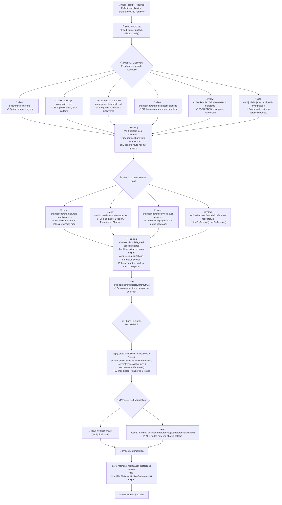

# Lesson 02 — Curate Project Context — Run Analysis

> **Session ID:** `f7b0578c-da1b-41a2-b2ef-41ff6af49bce`
> **Model:** GPT-5.4 (reasoning effort: medium)
> **Duration:** 1m 44s
> **Started:** 2026-03-14 17:35:47 · **Ended:** 2026-03-14 17:37:31

---

## 1. Thinking Trajectory — Flow Diagram

---

## 2. Context at Each Stage

### Stage 1 — Discovery: Read Docs + Route Surface (0s–17s)

| Action                  | Tool   | Target                                            | Key Discovery                                                               |
| ----------------------- | ------ | ------------------------------------------------- | --------------------------------------------------------------------------- |
| Seed work plan          | `sql`  | INSERT 3 todos                                    | 3 tracking rows                                                             |
| Read architecture       | `view` | docs/architecture.md                              | System layers, queue broker, audit pipeline                                 |
| Read API conventions    | `view` | docs/api-conventions.md                           | FORBIDDEN error prefix, route structure, audit contract                     |
| Read preference example | `view` | docs/preference-management-example.md             | 4 constraints: owner-only, delegated-session block, audit, FORBIDDEN errors |
| Read route file         | `view` | src/backend/src/routes/notifications.ts           | 272 lines — generic route has guards, email/SMS routes missing guards       |
| Read error handler      | `view` | src/backend/src/middleware/error-handler.ts       | Error prefix parsing, centralized error formatting                          |
| Search audit patterns   | `rg`   | `audit\|publish\|emit.*audit\|audit event\|queue` | Audit service integration points across codebase                            |

> **8 parallel tool calls in first response.** All available context consumed before any code edit.

### Stage 2 — Deep Source Read (25s–42s)

| Action                | Tool   | Target                          | Key Discovery                                               |
| --------------------- | ------ | ------------------------------- | ----------------------------------------------------------- |
| Read role permissions | `view` | rules/role-permissions.ts       | Permission type, role→permission mapping                    |
| Read domain types     | `view` | models/types.ts                 | SessionContext, NotificationPreference, NotificationChannel |
| Read audit service    | `view` | services/audit-service.ts       | `auditAction()` signature + queue integration               |
| Read preference repo  | `view` | models/preference-repository.ts | `findPreference()`, `setPreference()` CRUD                  |

### Stage 3 — Final Pre-Write Read (50s)

| Action               | Tool   | Target             | Key Discovery                                            |
| -------------------- | ------ | ------------------ | -------------------------------------------------------- |
| Read auth middleware | `view` | middleware/auth.ts | Delegated session detection via `x-delegated-for` header |

### Stage 4 — Code Generation (1m 0s)

| Action          | Tool          | Output                                                                               |
| --------------- | ------------- | ------------------------------------------------------------------------------------ |
| Refactor routes | `apply_patch` | Modified `notifications.ts`: extracted 3 shared helpers + rewired all 3 write routes |

### Stage 5 — Verification (1m 20s–1m 44s)

| Action               | Tool           | Output                                                                                                                                   |
| -------------------- | -------------- | ---------------------------------------------------------------------------------------------------------------------------------------- |
| Verify final file    | `view`         | notifications.ts — confirmed all 3 routes use shared helpers                                                                             |
| Search for helpers   | `rg`           | `assertCanWriteNotificationPreferences\|setPreferenceWithAudit\|setChannelPreferences\|FORBIDDEN:\|preference.updated` — confirmed usage |
| Store durable memory | `store_memory` | Saved facts about notification preference route conventions                                                                              |

---

## 3. Tool Calls & Queries — Complete Timeline

| Time | Tool           | Query / Description                                                  | Outcome                |
| ---- | -------------- | -------------------------------------------------------------------- | ---------------------- |
| 0:05 | `sql`          | INSERT 3 todos (inspect, refactor, verify)                           | 3 rows                 |
| 0:17 | `view`         | docs/architecture.md                                                 | ✅ System architecture |
| 0:17 | `view`         | docs/api-conventions.md                                              | ✅ API patterns        |
| 0:17 | `view`         | docs/preference-management-example.md                                | ✅ Constraints         |
| 0:17 | `view`         | src/backend/src/routes/notifications.ts                              | ✅ 272 lines           |
| 0:17 | `view`         | src/backend/src/middleware/error-handler.ts                          | ✅ Error convention    |
| 0:17 | `rg`           | `audit\|publish\|emit.*audit\|audit event\|queue`                    | ✅ Matches found       |
| 0:25 | `sql`          | UPDATE inspect → in_progress                                         | Updated                |
| 0:42 | `view`         | src/backend/src/rules/role-permissions.ts                            | ✅ Role model          |
| 0:42 | `view`         | src/backend/src/models/types.ts                                      | ✅ Domain types        |
| 0:42 | `view`         | src/backend/src/services/audit-service.ts                            | ✅ Audit API           |
| 0:42 | `view`         | src/backend/src/models/preference-repository.ts                      | ✅ Preference CRUD     |
| 0:50 | `view`         | src/backend/src/middleware/auth.ts                                   | ✅ Auth middleware     |
| 1:00 | `apply_patch`  | MODIFY notifications.ts — extract helpers + rewire                   | ✅ Applied             |
| 1:20 | `view`         | notifications.ts (verification read)                                 | ✅ Confirmed           |
| 1:25 | `rg`           | `assertCanWriteNotificationPreferences\|setPreferenceWithAudit\|...` | ✅ All usage confirmed |
| 1:30 | `sql`          | UPDATE all todos → done                                              | Updated                |
| 1:35 | `store_memory` | Durable facts about notification preference routes                   | ✅ Stored              |

**Total tool calls:** ~18 (8 parallel in first batch, rest sequential)

---

## 4. Assumptions & Decisions — Validation

| #   | Decision                                                          | Basis                                                                     | Constraint?                                                    | Validated?                                  |
| --- | ----------------------------------------------------------------- | ------------------------------------------------------------------------- | -------------------------------------------------------------- | ------------------------------------------- |
| 1   | Extract shared `assertCanWriteNotificationPreferences()` helper   | Observed generic route has guards that email/SMS routes lack              | preference-management-example.md: "same conventions"           | ✅ Correct — DRY refactor aligns all routes |
| 2   | Use FORBIDDEN error prefix in thrown errors                       | Discovered in error-handler.ts and api-conventions.md                     | api-conventions.md: "centralized FORBIDDEN prefix"             | ✅ Correct                                  |
| 3   | Block delegated sessions from writing                             | Found `session.delegatedFor` check in generic route                       | preference-management-example.md: "delegated-session blocking" | ✅ Correct                                  |
| 4   | Enforce owner-only writes via `session.actor.id !== targetUserId` | Discovered in existing generic route guard                                | preference-management-example.md: "owner-only writes"          | ✅ Correct                                  |
| 5   | Add `setPreferenceWithAudit()` wrapper for audit logging          | Discovered `auditAction()` from audit-service.ts                          | preference-management-example.md: "audit logging"              | ✅ Correct                                  |
| 6   | Keep change inside single file (notifications.ts)                 | README.md: "keep the change inside `backend/src/routes/notifications.ts`" | Scope constraint                                               | ✅ Correct — minimal footprint              |
| 7   | Add role permission check using `hasPermission()`                 | Discovered in role-permissions.ts                                         | Inferred from architecture — not explicitly required           | ⚠️ Valid addition but not mandated          |
| 8   | Create `setChannelPreferences()` for bulk channel operations      | Observed email/SMS routes do per-event iteration                          | Inferred for DRY                                               | ⚠️ Nice-to-have, not explicitly required    |
| 9   | Preserve existing route signatures and HTTP status codes          | api-conventions.md: route contracts are stable                            | Implicit constraint                                            | ✅ Correct                                  |
| 10  | Store memory about refactored patterns                            | Model's own initiative for future context reuse                           | No constraint                                                  | ✅ Harmless                                 |

**No violations detected.** Decisions 7–8 are reasonable inferences that don't contradict any constraint.

---

## 5. Constraint Compliance Matrix

| #   | Constraint                                      | Source                           | Satisfied? | Evidence                                            |
| --- | ----------------------------------------------- | -------------------------------- | ---------- | --------------------------------------------------- |
| 1   | Refactor notification preference write handlers | Prompt                           | ✅         | All 3 routes use shared helpers                     |
| 2   | Owner-only writes                               | preference-management-example.md | ✅         | `session.actor.id !== targetUserId` check           |
| 3   | Delegated-session blocking                      | preference-management-example.md | ✅         | `session.delegatedFor` guard                        |
| 4   | Audit logging preserved                         | preference-management-example.md | ✅         | `setPreferenceWithAudit()` calls `auditAction()`    |
| 5   | FORBIDDEN error prefix                          | api-conventions.md               | ✅         | All thrown errors use `"FORBIDDEN: ..."` prefix     |
| 6   | No shell commands                               | Prompt                           | ✅         | Zero powershell/terminal calls                      |
| 7   | Inspect first, edit second                      | Prompt                           | ✅         | 10 files read before single write                   |
| 8   | Apply change directly in code                   | Prompt                           | ✅         | Used `apply_patch` tool                             |
| 9   | Follow discovered conventions                   | Prompt                           | ✅         | Convention discovery confirmed in 4 doc files       |
| 10  | Keep change within notifications.ts             | README.md                        | ✅         | Only `backend/src/routes/notifications.ts` modified |

---

## 6. Files Created / Modified

| Action   | File                                  | Lines | Description                                                                                                                                                |
| -------- | ------------------------------------- | ----- | ---------------------------------------------------------------------------------------------------------------------------------------------------------- |
| Modified | `backend/src/routes/notifications.ts` | ~+60  | Extracted `assertCanWriteNotificationPreferences()`, `setPreferenceWithAudit()`, `setChannelPreferences()` helpers; rewired generic, email, and SMS routes |

---

## 7. Session Metadata

| Key                        | Value                                  |
| -------------------------- | -------------------------------------- |
| Session ID                 | `f7b0578c-da1b-41a2-b2ef-41ff6af49bce` |
| Copilot CLI Version        | 1.0.5                                  |
| Node.js Version            | v24.11.1                               |
| Model                      | gpt-5.4                                |
| Duration                   | 1m 44s                                 |
| Denied Tools               | powershell                             |
| Total Tool Calls           | ~18                                    |
| Files Read                 | 10 unique                              |
| Files Written              | 1                                      |
| Discovery-before-write gap | 4 turns                                |
| Assessment Verdict         | ✅ PASS (7/7 dimensions)               |

---

## 8. What This Lesson Proves

1. **Two-layer context discovery works** — `.github/copilot-instructions.md` provided behavioral guidance (auto-loaded) while `docs/` files required active reading
2. **Discovery-first behavior emerges naturally** — the model read 10 files across 4 turns before making its single edit
3. **Small, focused refactors are possible** — the model extracted shared helpers without over-engineering or expanding scope
4. **Audit and authorization conventions survive refactoring** — the model preserved `auditAction()`, `FORBIDDEN` prefix, and delegated-session blocking through the refactor
