# Lesson 03 — Instruction Architecture — Assessment

> **Model:** `gpt-5.4` · **Duration:** 2m 3s · **Date:** 2026-03-13

## Prompt Under Test

```text
Create a pure business-rule module at src/backend/src/rules/notification-channel-rules.ts
and matching tests at src/backend/tests/unit/notification-channel-rules.test.ts. The rule
should validate when disabling a notification channel is allowed for mandatory events,
including the California decline LEGAL-218 restriction. Follow the repository conventions
you discover. Reuse existing mandatory-event knowledge from
src/backend/src/rules/mandatory-events.ts or explicit function inputs; do not create a
second hardcoded mandatory-events list or helper. Return structured results with
human-readable reasons, include top-of-module false-positive and hard-negative comments,
and add tests for happy path, boundary, false positive, and hard negative scenarios.
Apply the change directly in code instead of only describing it. Do not run npm install,
npm test, or any shell commands. Inspect and edit files only.
```

## Scorecard

| #   | Dimension                  | Rating  | Summary                                                             |
| --- | -------------------------- | ------- | ------------------------------------------------------------------- |
| 1   | Context Utilization (CU)   | ✅ PASS | Read types, existing rules, permissions, and instruction layers     |
| 2   | Session Efficiency (SE)    | ✅ PASS | Completed in 2m 3s with ~4 tool calls; two files added cleanly      |
| 3   | Prompt Alignment (PA)      | ✅ PASS | All constraints respected; discovered instruction-layer conventions |
| 4   | Change Correctness (CC)    | ✅ PASS | Files match: True · Patterns match: True                            |
| 5   | Objective Completion (OC)  | ✅ PASS | All four lesson objectives demonstrated                             |
| 6   | Behavioral Compliance (BC) | ✅ PASS | No tool boundary violations                                         |
| 7   | Context Validation (CV)    | ✅ PASS | 5 instructions injected; 9-turn discovery gap before writes         |

**Verdict:** ✅ PASS

## 1 · Context Utilization

| Metric                  | Value                                                                                     |
| ----------------------- | ----------------------------------------------------------------------------------------- |
| Context files available | ~8 (copilot-instructions.md, 4 scoped instructions, types, mandatory-events, permissions) |
| Context files read      | ~4 key files (types, mandatory-events, role-permissions, business-rules instructions)     |
| Key files missed        | None critical                                                                             |
| Context precision       | High — focused on rule and test surface areas                                             |

The session discovered the scoped instruction layers (backend, business-rules,
testing, security) and used them to determine where to place new files and what
conventions to follow.

**Evidence** — `.output/logs/session.md` tool calls:

```
### ✅ `view`  — src/backend/src/models/types.ts
### ✅ `view`  — src/backend/src/rules/mandatory-events.ts
### ✅ `view`  — src/backend/src/rules/role-permissions.ts
### ✅ `view`  — .github/instructions/business-rules.instructions.md
```

## 2 · Session Efficiency

| Metric        | Value                |
| ------------- | -------------------- |
| Duration      | 2m 3s                |
| Tool calls    | ~4                   |
| Lines changed | ~150 (two new files) |
| Model         | gpt-5.4              |

Clean execution — discovered context, then wrote both the rule module and test
file without retries.

**Evidence** — `.output/logs/session.md` header:

```
- Duration: 2m 3s
```

## 3 · Prompt Alignment

| Constraint                                                    | Respected? |
| ------------------------------------------------------------- | ---------- |
| Pure business-rule module (no I/O, Express, DB)               | ✅         |
| Reuse existing mandatory-events (no duplicate list)           | ✅         |
| Structured result with human-readable reasons                 | ✅         |
| Top-of-module false-positive and hard-negative comments       | ✅         |
| Tests for happy path, boundary, false positive, hard negative | ✅         |
| LEGAL-218 restriction referenced                              | ✅         |
| No shell commands                                             | ✅         |
| Discovery-first behavior                                      | ✅         |

## 4 · Change Correctness

- **Files match:** True
- **Patterns match:** True

| Pattern                           | Matched |
| --------------------------------- | ------- |
| LEGAL-218 or California reference | ✅      |
| Mandatory-event handling          | ✅      |
| False positive comment            | ✅      |
| Hard negative comment             | ✅      |
| Test cases present                | ✅      |

Output: Added `backend/src/rules/notification-channel-rules.ts` (pure rule
module) and `backend/tests/unit/notification-channel-rules.test.ts` (matching
unit tests with scenario coverage).

**Evidence** — `.output/change/comparison.md`:

```
- Files match: True
- Patterns match: True
- Pattern matched: Rule must reference LEGAL-218 California restriction
- Pattern matched: Rule must reference mandatory events
- Pattern matched: Rule or tests should annotate false positive cases
- Pattern matched: Rule or tests should annotate hard negative cases
- Pattern matched: Test file must contain test cases
```

**Evidence** — `.output/change/demo.patch` (rule file header):

```diff
+// False positive:
+//   Disabling SMS for a mandatory event is valid when another channel remains
+//   enabled after the change.
+//
+// Hard negative:
+//   Disabling the final enabled channel for a mandatory event looks like a
+//   normal preference toggle, but it is forbidden because the event would lose
+//   all delivery coverage. California decline SMS changes have an additional
+//   LEGAL-218 fallback requirement.
```

**Evidence** — `.output/change/changed-files.json`:

```json
{
  "added": [
    "backend/src/rules/notification-channel-rules.ts",
    "backend/tests/unit/notification-channel-rules.test.ts"
  ],
  "modified": [],
  "deleted": []
}
```

## 5 · Objective Completion

| Objective                                                                                         | Status | Evidence                                                                           |
| ------------------------------------------------------------------------------------------------- | ------ | ---------------------------------------------------------------------------------- |
| Describe difference between repository-wide, path-specific, and agent-scoped instruction patterns | ✅     | Session placed code in locations dictated by scoped instruction layers             |
| Explain how instruction layering reduces irrelevant context and conflicting guidance              | ✅     | Rule module follows business-rules instructions; tests follow testing instructions |
| Use `applyTo` scoping to encode framework- or domain-specific rules                               | ✅     | File placement demonstrates instruction scoping in action                          |
| Design instruction architecture that is maintainable as codebase grows                            | ✅     | Clean separation: rule in rules/, test in tests/unit/, no cross-contamination      |

## 6 · Behavioral Compliance

| Metric                   | Value                     |
| ------------------------ | ------------------------- |
| Denied tools             | powershell                |
| Tool boundary violations | None                      |
| Protected files modified | None (types.ts untouched) |
| Shell command attempts   | None                      |

**Evidence** — `.output/logs/command.txt`:

```
copilot.cmd --model gpt-5.4 ... --deny-tool=powershell --no-ask-user
```

`.output/logs/session.md` shows zero `powershell` or `terminal` tool calls.

## 7 · Context Validation

> When and how was non-system (private) context accessed during the session?

### Implicit Context (auto-injected)

| File | Type |
| --- | --- |
| `backend.instructions.md` | scoped |
| `business-rules.instructions.md` | scoped |
| `copilot-instructions.md` | project-level |
| `security.instructions.md` | scoped |
| `testing.instructions.md` | scoped |

### Context Access Timeline

| Turn | Action | Target |
| ---: | --- | --- |
| 1 | search | `glob(src/backend/src/rules/**/*.ts)` |
| 1 | search | `glob(src/backend/tests/**/*.test.ts)` |
| 1 | search | `glob(docs/*.md)` |
| 1 | search | `rg(mandatory-events\|notification-channel\|LEGAL-218\|decline)` |
| 2 | read | `(lesson root)` |
| 2 | read | `src` |
| 2 | read | `docs/architecture.md` |
| 2 | read | `docs/instruction-layering-example.md` |
| 3 | search | `glob(src/backend/src/**/*)` |
| 3 | search | `glob(src/backend/tests/**/*)` |
| 4 | read | `src/backend` |
| 4 | read | `src/backend/src` |
| 4 | read | `src/backend/tests` |
| 5 | read | `src/backend/src/rules` |
| 5 | read | `src/backend/tests/unit` |
| 7 | read | `src/backend/src/rules/mandatory-events.ts` |
| 7 | read | `src/backend/src/rules/business-rules.ts` |
| 7 | read | `src/backend/src/rules/state-machine.ts` |
| 7 | read | `src/backend/src/rules/role-permissions.ts` |
| 7 | read | `src/backend/tests/unit/business-rules.test.ts` |
| 7 | read | `src/backend/tests/unit/state-machine.test.ts` |
| 7 | read | `src/backend/src/models/types.ts` |
| 8 | search | `rg(NotificationPreference\|notification\|mandatory)` |
| 8 | read | `src/backend/tests/unit/notification-service.test.ts` |
| 8 | read | `src/backend/src/services` |
| 8 | read | `src/backend/src/routes` |
| 9 | read | `src/backend/src/routes/notifications.ts` |
| 9 | read | `src/backend/src/models/preference-repository.ts` |
| 9 | read | `src/backend/src/services/notification-service.ts` |
| 9 | read | `src/backend/src/db/seed.ts` |
| 10 | store_memory | — |
| 11 | **write** | `src/backend/src/rules/notification-channel-rules.ts` |
| 11 | **write** | `src/backend/tests/unit/notification-channel-rules.test.ts` |
| 12 | read | `src/backend/src/rules/notification-channel-rules.ts` |
| 12 | read | `src/backend/tests/unit/notification-channel-rules.test.ts` |
| 13 | **write** | `src/backend/src/rules/notification-channel-rules.ts` |
| 14 | read | `src/backend/src/rules/notification-channel-rules.ts` |
| 14 | read | `src/backend/tests/unit/notification-channel-rules.test.ts` |

### Files Written

- `src/backend/src/rules/notification-channel-rules.ts`
- `src/backend/tests/unit/notification-channel-rules.test.ts`

### Context Flow Diagram

```mermaid
sequenceDiagram
    participant U as User/Prompt
    participant S as Copilot Runtime
    participant M as Model
    participant T as Tools
    participant C as Codebase

    Note over S,M: Implicit Context (auto-injected)
    S->>M: backend.instructions.md
    S->>M: business-rules.instructions.md
    S->>M: copilot-instructions.md
    S->>M: security.instructions.md
    S->>M: testing.instructions.md

    U->>M: prompt


    Note over M,T: Turn 1
    Note over M: Intent: Exploring rule surfaces
    M->>T: glob(src/backend/src/rules/**/*.ts)
    T-->>M: file list
    M->>T: glob(src/backend/tests/**/*.test.ts)
    T-->>M: file list
    M->>T: glob(docs/*.md)
    T-->>M: file list
    M->>T: rg(...nts|notification-channel|LEGAL-2)
    T-->>M: matches

    Note over M,T: Turn 2
    Note over M: Intent: Inspecting project layout
    M->>T: view((lesson root))
    T->>C: read
    C-->>M: content
    M->>T: view(src)
    T->>C: read
    C-->>M: content
    M->>T: view(docs/architecture.md)
    T->>C: read
    C-->>M: content
    M->>T: view(docs/instruction-layering-example.md)
    T->>C: read
    C-->>M: content

    Note over M,T: Turn 3
    Note over M: Intent: Inspecting backend files
    M->>T: glob(src/backend/src/**/*)
    T-->>M: file list
    M->>T: glob(src/backend/tests/**/*)
    T-->>M: file list

    Note over M,T: Turn 4
    Note over M: Intent: Reading backend directories
    M->>T: view(src/backend)
    T->>C: read
    C-->>M: content
    M->>T: view(src/backend/src)
    T->>C: read
    C-->>M: content
    M->>T: view(src/backend/tests)
    T->>C: read
    C-->>M: content

    Note over M,T: Turn 5
    Note over M: Intent: Reviewing rule files
    M->>T: view(src/backend/src/rules)
    T->>C: read
    C-->>M: content
    M->>T: view(src/backend/tests/unit)
    T->>C: read
    C-->>M: content

    Note over M,T: Turn 6
    Note over M: Update plan.md

    Note over M,T: Turn 7
    Note over M: Intent: Reading rule details
    M->>T: view(src/backend/src/rules/mandatory-events.ts)
    T->>C: read
    C-->>M: content
    M->>T: view(src/backend/src/rules/business-rules.ts)
    T->>C: read
    C-->>M: content
    M->>T: view(src/backend/src/rules/state-machine.ts)
    T->>C: read
    C-->>M: content
    M->>T: view(src/backend/src/rules/role-permissions.ts)
    T->>C: read
    C-->>M: content
    M->>T: view(src/backend/tests/unit/business-rules.test.ts)
    T->>C: read
    C-->>M: content
    M->>T: view(src/backend/tests/unit/state-machine.test.ts)
    T->>C: read
    C-->>M: content
    M->>T: view(src/backend/src/models/types.ts)
    T->>C: read
    C-->>M: content

    Note over M,T: Turn 8
    Note over M: Intent: Inspecting notification surfaces
    M->>T: rg(NotificationPreference|notification)
    T-->>M: matches
    M->>T: view(...nd/tests/unit/notification-service.test.ts)
    T->>C: read
    C-->>M: content
    M->>T: view(src/backend/src/services)
    T->>C: read
    C-->>M: content
    M->>T: view(src/backend/src/routes)
    T->>C: read
    C-->>M: content

    Note over M,T: Turn 9
    Note over M: Intent: Reading notification code
    M->>T: view(src/backend/src/routes/notifications.ts)
    T->>C: read
    C-->>M: content
    M->>T: view(...ackend/src/models/preference-repository.ts)
    T->>C: read
    C-->>M: content
    M->>T: view(...ckend/src/services/notification-service.ts)
    T->>C: read
    C-->>M: content
    M->>T: view(src/backend/src/db/seed.ts)
    T->>C: read
    C-->>M: content

    Note over M,T: Turn 10
    Note over M: Intent: Implementing channel rules
    M->>T: store_memory()
    T-->>M: ok

    Note over M,T: Turn 11
    M->>T: write(...nd/src/rules/notification-channel-rules.ts)
    T->>C: patch
    C-->>M: ok
    M->>T: write(...ts/unit/notification-channel-rules.test.ts)
    T->>C: patch
    C-->>M: ok

    Note over M,T: Turn 12
    Note over M: Intent: Reviewing new files
    M->>T: view(...nd/src/rules/notification-channel-rules.ts)
    T->>C: read
    C-->>M: content
    M->>T: view(...ts/unit/notification-channel-rules.test.ts)
    T->>C: read
    C-->>M: content

    Note over M,T: Turn 13
    M->>T: write(...nd/src/rules/notification-channel-rules.ts)
    T->>C: patch
    C-->>M: ok

    Note over M,T: Turn 14
    Note over M: Intent: Reviewing final edits
    M->>T: view(...nd/src/rules/notification-channel-rules.ts)
    T->>C: read
    C-->>M: content
    M->>T: view(...ts/unit/notification-channel-rules.test.ts)
    T->>C: read
    C-->>M: content

    Note over M,T: Turn 15

    M->>U: Return results
```



### Validation Summary

- **Implicit context:** 5 instruction file(s) injected at session start
- **Files read:** 25 unique files across 15 turns
- **Files written:** 2 codebase file(s)
- **First codebase read:** turn 2
- **First codebase write:** turn 11
- **Discovery-before-write gap:** 9 turn(s)
