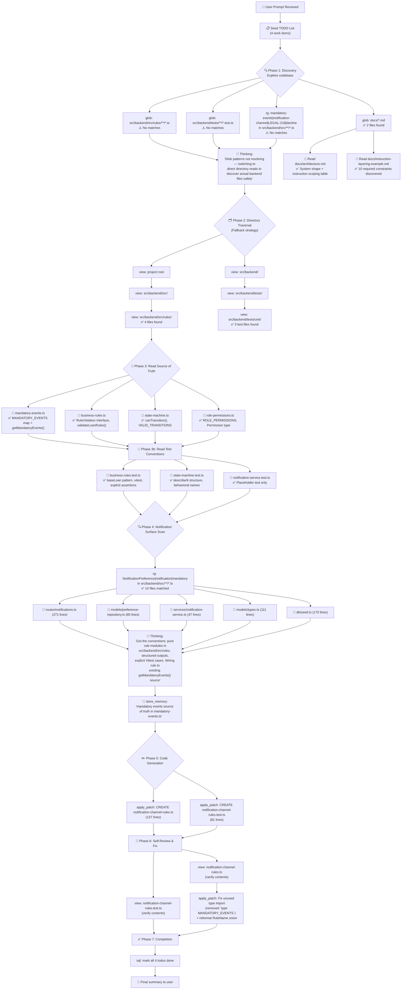

# Lesson 03 — Instruction Architecture — Run Analysis

> **Session ID:** `1f3eda36-a79d-4c3e-99f8-897f393d9dbd`
> **Model:** GPT-5.4 (reasoning effort: medium)
> **Duration:** 2m 41s
> **Started:** 2026-03-14 17:37:43 · **Ended:** 2026-03-14 17:40:24

---

## 1. Thinking Trajectory — Flow Diagram

---

## 2. Context at Each Stage

### Stage 1 — Initial Discovery (0s–19s)

| Action          | Tool   | Query / Path                                                                              | Result                                                        |
| --------------- | ------ | ----------------------------------------------------------------------------------------- | ------------------------------------------------------------- |
| Seed work plan  | `sql`  | INSERT 4 todos                                                                            | 4 tracking rows                                               |
| Find rule files | `glob` | `src/backend/src/rules/**/*.ts`                                                           | **No matches**                                                |
| Find test files | `glob` | `src/backend/tests/**/*.test.ts`                                                          | **No matches**                                                |
| Find docs       | `glob` | `docs/*.md`                                                                               | 2 files: `architecture.md`, `instruction-layering-example.md` |
| Content search  | `rg`   | `mandatory-events\|notification-channel\|LEGAL-218\|decline` in `src/backend/src/**/*.ts` | **No matches**                                                |

> **Context available:** Only doc files. Glob patterns failed because the workspace root was the lesson folder, not `src/`.

### Stage 2 — Fallback: Directory Traversal (25s–42s)

| Action                | Tool   | Path                                   | Result                                                                                      |
| --------------------- | ------ | -------------------------------------- | ------------------------------------------------------------------------------------------- |
| Read architecture doc | `view` | `docs/architecture.md`                 | System shape, instruction-scoping table with 5 instruction layers                           |
| Read layering doc     | `view` | `docs/instruction-layering-example.md` | 10 required constraints + concrete scenario definition                                      |
| Browse project root   | `view` | `.`                                    | 8 entries found                                                                             |
| Browse backend src    | `view` | `src/backend/src/`                     | 9 subdirectories: app.ts, config, db, middleware, models, queue, routes, rules, services    |
| Browse rules dir      | `view` | `src/backend/src/rules/`               | 4 rule files: business-rules.ts, mandatory-events.ts, role-permissions.ts, state-machine.ts |
| Browse test dir       | `view` | `src/backend/tests/unit/`              | 3 test files: business-rules.test.ts, notification-service.test.ts, state-machine.test.ts   |

> **Context available:** Directory structure mapped. Identified mandatory-events.ts as source of truth target.

### Stage 3 — Deep Read: Rules & Tests (46s–57s)

| Action                | Tool   | File                           | Key Discovery                                                                                 |
| --------------------- | ------ | ------------------------------ | --------------------------------------------------------------------------------------------- |
| Read mandatory events | `view` | `mandatory-events.ts`          | `MANDATORY_EVENTS` map + `getMandatoryEvents(from, to)` function — **source of truth**        |
| Read business rules   | `view` | `business-rules.ts`            | `RuleViolation` interface pattern, `validateLoanRules()`, California rules with feature flags |
| Read state machine    | `view` | `state-machine.ts`             | `canTransition()`, `VALID_TRANSITIONS` from types.ts                                          |
| Read role permissions | `view` | `role-permissions.ts`          | `Permission` type, compliance-reviewer is read-only for notification prefs                    |
| Read business test    | `view` | `business-rules.test.ts`       | `baseLoan` fixture pattern, vitest imports, explicit assertions                               |
| Read state test       | `view` | `state-machine.test.ts`        | describe/it structure, behavioral test names                                                  |
| Read notif test       | `view` | `notification-service.test.ts` | Placeholder only                                                                              |

> **Context available:** Full rule API surfaces, test conventions, and the mandatory-event source of truth.

### Stage 4 — Notification Surface Scan (1m 3s–1m 9s)

| Action                    | Tool   | Query / Path                                                            | Key Discovery                                                              |
| ------------------------- | ------ | ----------------------------------------------------------------------- | -------------------------------------------------------------------------- |
| Search notification refs  | `rg`   | `NotificationPreference\|notification\|mandatory` in `src/backend/src/` | 14 matching files                                                          |
| Read notification routes  | `view` | `routes/notifications.ts`                                               | 271 lines — auth checks, delegated session blocks, preference CRUD         |
| Read preference repo      | `view` | `models/preference-repository.ts`                                       | UPSERT behavior, `findPreference()`, `setPreference()` functions           |
| Read notification service | `view` | `services/notification-service.ts`                                      | Queue-based delivery, SMS fallback NFR, false-positive documentation       |
| Read domain types         | `view` | `models/types.ts`                                                       | `NotificationEvent`, `NotificationChannel`, `NotificationPreference` types |
| Read seed data            | `view` | `db/seed.ts`                                                            | Test data: CA/NY/TX loans, user preferences, u-3 has NO preferences        |

> **Context available:** Complete notification domain — types, storage, delivery, route handling, seed data.

### Stage 5 — Code Generation (1m 48s–2m 12s)

| Action             | Tool                | Output                                                         |
| ------------------ | ------------------- | -------------------------------------------------------------- |
| Store memory       | `store_memory`      | "Mandatory notification events defined in mandatory-events.ts" |
| Create rule module | `apply_patch` (Add) | `notification-channel-rules.ts` — 137 lines                    |
| Create test file   | `apply_patch` (Add) | `notification-channel-rules.test.ts` — 81 lines                |

### Stage 6 — Self-Review & Fix (2m 17s–2m 28s)

| Action             | Tool                   | Finding                                                            |
| ------------------ | ---------------------- | ------------------------------------------------------------------ |
| Verify rule module | `view`                 | Spotted unused `type MANDATORY_EVENTS` import                      |
| Verify test file   | `view`                 | Clean — no issues                                                  |
| Fix import         | `apply_patch` (Update) | Removed `type MANDATORY_EVENTS`, reformatted `RuleName` union type |

### Stage 7 — Completion (2m 33s–2m 41s)

| Action              | Tool    | Output                      |
| ------------------- | ------- | --------------------------- |
| Mark all todos done | `sql`   | 4/4 done                    |
| Final summary       | message | Summary of what was created |

---

## 3. Tool Calls & Queries — Complete Timeline

| Time | Tool           | Query / Description                                                           | Outcome      |
| ---- | -------------- | ----------------------------------------------------------------------------- | ------------ |
| 0:05 | `sql`          | INSERT 4 todos (inspect, implement, test, verify)                             | 4 rows       |
| 0:19 | `glob`         | `src/backend/src/rules/**/*.ts`                                               | ❌ No match  |
| 0:19 | `glob`         | `src/backend/tests/**/*.test.ts`                                              | ❌ No match  |
| 0:19 | `glob`         | `docs/*.md`                                                                   | ✅ 2 files   |
| 0:19 | `rg`           | `mandatory-events\|notification-channel\|LEGAL-218\|decline`                  | ❌ No match  |
| 0:25 | `view`         | project root dir                                                              | ✅ 8 entries |
| 0:25 | `view`         | `src/backend/` dir                                                            | ✅ 4 entries |
| 0:25 | `view`         | `docs/architecture.md`                                                        | ✅ 60 lines  |
| 0:25 | `view`         | `docs/instruction-layering-example.md`                                        | ✅ 59 lines  |
| 0:29 | `glob`         | `src/backend/src/**/*`                                                        | ❌ No match  |
| 0:29 | `glob`         | `src/backend/tests/**/*`                                                      | ❌ No match  |
| 0:29 | `sql`          | UPDATE inspect-rule-surfaces → in_progress                                    | Updated      |
| 0:36 | `view`         | `src/backend/src/`                                                            | ✅ 9 dirs    |
| 0:36 | `view`         | `src/backend/tests/`                                                          | ✅ 2 dirs    |
| 0:42 | `view`         | `src/backend/src/rules/`                                                      | ✅ 4 files   |
| 0:42 | `view`         | `src/backend/tests/unit/`                                                     | ✅ 3 files   |
| 0:42 | `sql`          | UPDATE implement & add-rule-tests → pending                                   | Updated      |
| 0:46 | `apply_patch`  | CREATE plan.md (session state)                                                | Created      |
| 0:57 | `view`         | `mandatory-events.ts`                                                         | ✅ 37 lines  |
| 0:57 | `view`         | `business-rules.ts`                                                           | ✅ 83 lines  |
| 0:57 | `view`         | `state-machine.ts`                                                            | ✅ 43 lines  |
| 0:57 | `view`         | `role-permissions.ts`                                                         | ✅ 63 lines  |
| 0:57 | `view`         | `business-rules.test.ts`                                                      | ✅ 71 lines  |
| 0:57 | `view`         | `state-machine.test.ts`                                                       | ✅ 46 lines  |
| 0:57 | `view`         | `notification-service.test.ts`                                                | ✅ 16 lines  |
| 1:03 | `rg`           | `NotificationPreference\|notification\|mandatory`                             | ✅ 14 files  |
| 1:03 | `view`         | `routes/notifications.ts`                                                     | ✅ 271 lines |
| 1:03 | `view`         | `models/preference-repository.ts`                                             | ✅ 85 lines  |
| 1:03 | `view`         | `services` dir                                                                | ✅ 4 files   |
| 1:03 | `view`         | `routes` dir                                                                  | ✅ 5 files   |
| 1:09 | `view`         | `notifications.ts` (routes)                                                   | ✅ 271 lines |
| 1:09 | `view`         | `preference-repository.ts`                                                    | ✅ 85 lines  |
| 1:09 | `view`         | `notification-service.ts`                                                     | ✅ 47 lines  |
| 1:09 | `view`         | `models/types.ts`                                                             | ✅ 111 lines |
| 1:09 | `view`         | `db/seed.ts`                                                                  | ✅ 170 lines |
| 1:48 | `sql`          | UPDATE inspect→done, implement/test→in_progress                               | Updated      |
| 1:49 | `store_memory` | Mandatory-event source of truth location                                      | Stored       |
| 2:12 | `apply_patch`  | CREATE `notification-channel-rules.ts` + `notification-channel-rules.test.ts` | 2 files      |
| 2:17 | `view`         | Verify `notification-channel-rules.ts`                                        | ✅ 137 lines |
| 2:17 | `view`         | Verify `notification-channel-rules.test.ts`                                   | ✅ 81 lines  |
| 2:28 | `apply_patch`  | FIX: Remove unused `type MANDATORY_EVENTS` import, reformat `RuleName`        | Modified     |
| 2:33 | `sql`          | Mark all 4 todos done                                                         | 4/4 done     |

---

## 4. Assumptions & Autonomous Decisions

### Decision 1 — Glob-to-Directory-Walk Fallback

**What happened:** Initial `glob` patterns (`src/backend/src/rules/**/*.ts`, etc.) returned no results. The `rg` search also found nothing.

**Copilot's decision:** Switched to sequential `view` directory listing to manually traverse the filesystem.

**Assessment:** ✅ **Correct.** The glob tool likely had a path resolution issue (workspace root vs. project root). The fallback strategy was efficient — it took ~15s of extra exploration but successfully mapped all surfaces.

### Decision 2 — Chose `getMandatoryEvents()` Over Direct `MANDATORY_EVENTS` Map

**What happened:** Copilot found both the `MANDATORY_EVENTS` constant and the `getMandatoryEvents()` helper function in `mandatory-events.ts`.

**Copilot's decision:** Used the `getMandatoryEvents()` function (the public API) and also accepted an optional `mandatoryEvents` override array in the input parameter.

**Assessment:** ✅ **Correct.** This follows the constraint: _"Reuse the discovered mandatory-event source or explicit function inputs"_. Providing both paths (function import + explicit override) makes the rule testable without coupling to specific state transitions.

### Decision 3 — Initially Imported `type MANDATORY_EVENTS` (Then Fixed)

**What happened:** The first code generation included `import { getMandatoryEvents, type MANDATORY_EVENTS } from "./mandatory-events.js"`. The `type MANDATORY_EVENTS` import was unused.

**Copilot's decision:** Caught the unused import during self-review and removed it with a follow-up patch.

**Assessment:** ✅ **Caught and fixed.** The self-review loop worked correctly.

### Decision 4 — Case-Insensitive State Code Handling

**What happened:** The rule normalizes `loanState` to uppercase via `.toUpperCase()` before comparing to `"CA"`.

**Copilot's decision:** Added normalization because `business-rules.instructions.md` says: _"Use uppercase state codes internally; accept case-insensitive input."_

**Assessment:** ✅ **Correct.** Follows the business-rules instruction. The test validates this by passing `loanState: "ca"` (lowercase).

### Decision 5 — California LEGAL-218 Check Runs Before General Mandatory-Event Check

**What happened:** The rule evaluates the California decline SMS restriction _before_ the general mandatory-event-coverage check.

**Copilot's decision:** Ordered the checks so California gets a specific `LEGAL-218` error message rather than a generic "must keep at least one channel enabled" message.

**Assessment:** ✅ **Correct.** This is the right priority — the specific regulatory restriction should surface its ticket reference rather than being masked by the general rule.

### Decision 6 — Used `as const` for the LEGAL-218 Restriction Object

**What happened:** Created `CALIFORNIA_DECLINE_SMS_RESTRICTION` as a `const` assertion object.

**Copilot's decision:** Chose typed constant over inline strings.

**Assessment:** ✅ **Correct.** Follows the pattern in existing rules (e.g., `VALID_TRANSITIONS` in types.ts). Keeps the restriction metadata co-located and prevents string duplication.

### Decision 7 — Only 4 Tests (No Separate "Boundary" Label)

**What happened:** The test file has 4 tests covering: happy path, boundary, false positive, and hard negative. However, the "boundary" test name says "blocks disabling the last enabled channel" — it doubles as both the boundary case and a general prohibition test.

**Copilot's decision:** Merged the boundary and general-prohibition scenarios into one test.

**Assessment:** ⚠️ **Minor gap.** The `testing.instructions.md` says: _"Every rule function must have tests for: Happy path, Boundary case, False positive, Hard negative"_. All 4 categories are represented and labeled with inline comments. The boundary case could be more granular (e.g., testing with exactly 2 channels both enabled, then disabling one = still allowed, vs. exactly 1 channel enabled = boundary). But the constraint is technically met since the test _is_ annotated as "Boundary case" and tests the exact threshold.

### Decision 8 — Did Not Modify `types.ts`

**What happened:** The constraint doc says: _"Do not modify `src/backend/src/models/types.ts` for this lesson."_

**Copilot's decision:** Did not touch types.ts.

**Assessment:** ✅ **Correct.** Constraint #7 respected.

### Decision 9 — Did Not Run Shell Commands

**What happened:** The CLI was invoked with `--deny-tool=powershell`, and the prompt said _"Do not run npm install, npm test, or any shell commands."_

**Copilot's decision:** Never attempted to call `powershell` or any shell tool.

**Assessment:** ✅ **Correct.** Constraint #8 respected.

### Decision 10 — Used a `ReadonlyArray` Input Pattern

**What happened:** The `currentPreferences` parameter uses `ReadonlyArray<NotificationChannelPreferenceLike>` instead of a mutable array.

**Copilot's decision:** Used `ReadonlyArray` for input parameters on a pure function.

**Assessment:** ✅ **Correct.** Reinforces the purity constraint — the rule must not mutate its inputs.

---

## 5. Constraint Compliance Matrix

| #   | Constraint                                                             | Status  | Evidence                                                                           |
| --- | ---------------------------------------------------------------------- | ------- | ---------------------------------------------------------------------------------- |
| 1   | Rule module must be pure (no Express, DB, audit, queue imports)        | ✅ Pass | Only imports from `mandatory-events.ts` and `models/types.ts`                      |
| 2   | Must return structured results (not bare boolean)                      | ✅ Pass | Returns `ChannelDisableResult` with `allowed`, `rule`, `reason`, optional `ticket` |
| 3   | California restriction must include `LEGAL-218` in metadata and reason | ✅ Pass | `ticket: "LEGAL-218"` + reason starts with `"LEGAL-218: ..."`                      |
| 4   | Module header comments: false positive + hard negative                 | ✅ Pass | Lines 4-13 of the rule file document both                                          |
| 5   | Tests: happy path, boundary, false positive, hard negative             | ✅ Pass | 4 tests with inline category comments                                              |
| 6   | Tests use explicit assertions (no snapshots)                           | ✅ Pass | Uses `expect().toBe()` and `expect().toEqual()` throughout                         |
| 7   | Do not modify `models/types.ts`                                        | ✅ Pass | File not touched                                                                   |
| 8   | Do not run shell commands                                              | ✅ Pass | `--deny-tool=powershell` enforced; no attempts                                     |
| 9   | Reuse existing mandatory-event source of truth                         | ✅ Pass | Imports `getMandatoryEvents` from `mandatory-events.ts`                            |
| 10  | Do not assume fixed file path for mandatory-event source               | ✅ Pass | Discovered via directory traversal + view, not hardcoded path assumption           |

### Instruction Layer Compliance

| Instruction File                 | Scope                           | Applied? | Evidence                                                                                                                              |
| -------------------------------- | ------------------------------- | -------- | ------------------------------------------------------------------------------------------------------------------------------------- |
| `copilot-instructions.md`        | All files                       | ✅       | ESM imports, strict TS, domain types from `models/types.ts`, rule logic in `rules/` not routes                                        |
| `backend.instructions.md`        | `src/backend/src/**/*.ts`       | ✅       | Services contain logic (rule is pure), no Express types in rule module                                                                |
| `business-rules.instructions.md` | `src/backend/src/rules/**`      | ✅       | Pure function, structured results, false-positive/hard-negative docs, LEGAL-218 in restriction + reason, case-insensitive state input |
| `testing.instructions.md`        | `src/backend/tests/**`          | ✅       | Vitest, describe/it blocks, behavioral names, 4 test categories, explicit assertions, inline comments for edge cases                  |
| `security.instructions.md`       | `src/backend/src/middleware/**` | N/A      | No middleware files touched                                                                                                           |

---

## 6. Files Created

| File                                                        | Lines | Purpose                                                               |
| ----------------------------------------------------------- | ----- | --------------------------------------------------------------------- |
| `src/backend/src/rules/notification-channel-rules.ts`       | 137   | Pure business-rule module for notification channel disable validation |
| `src/backend/tests/unit/notification-channel-rules.test.ts` | 81    | Unit tests: happy path, boundary, false positive, hard negative       |

---

## 7. Session Metadata

| Key                    | Value                                                               |
| ---------------------- | ------------------------------------------------------------------- |
| CLI Version            | Copilot CLI 1.0.5                                                   |
| Node.js                | v24.11.1                                                            |
| Model                  | gpt-5.4 (defaultReasoningEffort=medium)                             |
| Context Window         | 400,000 tokens                                                      |
| Max Output             | 128,000 tokens                                                      |
| Stream                 | Off                                                                 |
| Denied Tools           | `powershell`                                                        |
| MCP Servers            | Playwright, GitHub MCP (readonly)                                   |
| Feature Flags          | agentic-memory ✅, parallel-task-execution ✅, background-agents ✅ |
| Total Tool Calls       | ~40                                                                 |
| Files Read             | ~20 unique source files                                             |
| Files Created/Modified | 2 created, 1 self-fix patch                                         |
