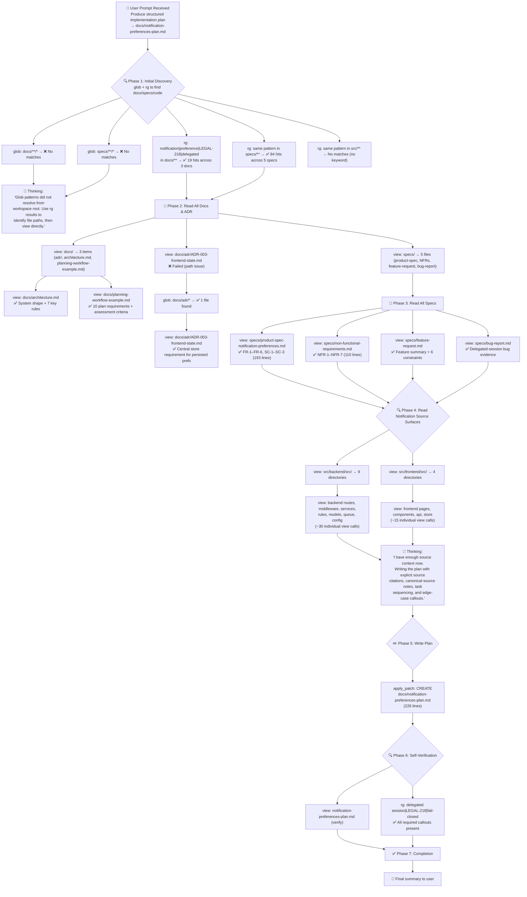

# Lesson 04 — Planning Workflows — Run Analysis

> **Session ID:** `0b1cb144-3c12-4347-909a-85fc85baa317`
> **Model:** GPT-5.4 (reasoning effort: medium)
> **Duration:** 3m 57s
> **Started:** 2026-03-14 17:17:58 · **Ended:** 2026-03-14 17:21:56

---

## 1. Thinking Trajectory — Flow Diagram

---

## 2. Context at Each Stage

### Stage 1 — Initial Discovery (0s–18s)

| Action        | Tool   | Query / Path                                                  | Result                          |
| ------------- | ------ | ------------------------------------------------------------- | ------------------------------- |
| Find docs     | `glob` | `docs/**/*`                                                   | ❌ No matches (glob path issue) |
| Find specs    | `glob` | `specs/**/*`                                                  | ❌ No matches (glob path issue) |
| Search docs   | `rg`   | `notification\|preference\|LEGAL-218\|delegated` in docs/\*\* | ✅ 19 hits in 3 files           |
| Search specs  | `rg`   | same pattern in specs/\*\*                                    | ✅ 84 hits in 5 files           |
| Search source | `rg`   | same pattern in src/\*\*                                      | No matches                      |

> **Context:** rg successfully identified file locations where glob failed. Model pivoted to direct view calls.

### Stage 2 — Read All Documentation (25s–46s)

| Action                | Tool   | Target                                         | Key Discovery                                                     |
| --------------------- | ------ | ---------------------------------------------- | ----------------------------------------------------------------- |
| List docs dir         | `view` | docs/                                          | 3 items: adr/, architecture.md, planning-workflow-example.md      |
| Read architecture     | `view` | docs/architecture.md                           | System shape, route→rule→service split, 7 key rules               |
| Read planning example | `view` | docs/planning-workflow-example.md              | 10 required plan sections + assessment criteria                   |
| Read ADR-003          | `view` | docs/adr/ADR-003-frontend-state.md             | Central store for persisted preferences, no component-local state |
| Read product spec     | `view` | specs/product-spec-notification-preferences.md | FR-1–FR-6, SC-1–SC-3 (193 lines of requirements)                  |
| Read NFRs             | `view` | specs/non-functional-requirements.md           | NFR-1–NFR-7 with false positive / hard negative annotations       |
| Read feature request  | `view` | specs/feature-request.md                       | Summary + 6 edge-case constraints                                 |
| Read bug report       | `view` | specs/bug-report.md                            | Delegated-session bug evidence + root cause hypotheses            |

### Stage 3 — Read All Source Surfaces (46s–3m 41s)

The model read **~50 source files** across backend and frontend to map exact file paths and current behavior:

| Area                | Files Read                                                                    | Key Discoveries                                                |
| ------------------- | ----------------------------------------------------------------------------- | -------------------------------------------------------------- |
| Backend routes      | notifications.ts, audit.ts, applications.ts                                   | Write paths, auth checks, existing bulk endpoints              |
| Backend middleware  | auth.ts, error-handler.ts, rate-limiter.ts, audit-logger.ts                   | Delegated session detection, error prefix convention           |
| Backend rules       | role-permissions.ts, mandatory-events.ts, business-rules.ts, state-machine.ts | Rule-layer pattern, `getMandatoryEvents()`                     |
| Backend services    | audit-service.ts, notification-service.ts, loan-service.ts                    | Queued audit, degraded-mode fallback, mandatory event delivery |
| Backend models      | types.ts, preference-repository.ts                                            | Domain types, CRUD operations                                  |
| Backend queue       | handlers/notification-handler.ts, handlers/audit-handler.ts                   | Delivery pipeline, audit durability gap                        |
| Backend config      | feature-flags.ts                                                              | Existing flag pattern, no preferences flag yet                 |
| Frontend pages      | preferences.ts, application-detail.ts                                         | Direct toggle rendering, no central store                      |
| Frontend components | notification-toggle.ts, app-shell.ts                                          | Component-local state, no delegated mode                       |
| Frontend api        | client.ts                                                                     | Direct API calls from components                               |
| Frontend store      | index.ts                                                                      | Store exists but preferences not managed                       |

### Stage 4 — Plan Generation (3m 41s)

| Action     | Tool          | Output                                                      |
| ---------- | ------------- | ----------------------------------------------------------- |
| Write plan | `apply_patch` | Created `docs/notification-preferences-plan.md` (226 lines) |

### Stage 5 — Verification (3m 47s–3m 57s)

| Action          | Tool   | Output                                                                          |
| --------------- | ------ | ------------------------------------------------------------------------------- |
| Read plan back  | `view` | Confirmed all required sections present                                         |
| Search callouts | `rg`   | Verified delegated sessions, LEGAL-218, fail-closed, mandatory events all cited |

---

## 3. Tool Calls & Queries — Complete Timeline

| Phase        | Tool Count | Tools Used                          | Description                               |
| ------------ | ---------- | ----------------------------------- | ----------------------------------------- |
| Discovery    | 5          | 2× `glob`, 3× `rg`                  | Initial file discovery + keyword search   |
| Doc reads    | 8          | 7× `view`, 1× `glob` (ADR recovery) | All docs, ADR, specs                      |
| Source reads | ~65        | ~60× `view`, 5× `rg`, 2× `glob`     | Exhaustive backend + frontend surface map |
| Plan write   | 1          | `apply_patch`                       | Single file creation                      |
| Verification | ~8         | 5× `view`, 3× `rg`                  | Self-verification pass                    |

**Total tool calls: ~87** (the largest session across all lessons)

Notable patterns:

- 2 `❌` failed views (glob path issues), both recovered via direct directory listing
- Exhaustive source reading before any write (3m 41s of reading → single write)
- Heavy use of `view` on individual source files to map exact change surfaces

---

## 4. Assumptions & Decisions — Validation

| #   | Decision                                                                 | Basis                                                                 | Constraint?                                                | Validated?         |
| --- | ------------------------------------------------------------------------ | --------------------------------------------------------------------- | ---------------------------------------------------------- | ------------------ |
| 1   | Product spec is canonical for FR/SC requirements, not feature-request.md | Feature request is a summary; product spec has normalized identifiers | planning-workflow-example.md: "cite FR/SC/ADR/NFR sources" | ✅ Correct         |
| 2   | Current `src/` paths override spec paths (`apps/web/`, `services/api/`)  | Spec uses placeholder paths that don't match lesson repo              | Inferred from actual repo structure                        | ✅ Correct         |
| 3   | Separate confirmed requirements from inferred choices                    | Prompt requires explicit separation                                   | Prompt constraint                                          | ✅ Correct         |
| 4   | Call out canonical source identification                                 | Prompt: "identify the canonical source and explain why"               | Prompt constraint                                          | ✅ Correct         |
| 5   | Include 3 false positives and 5 hard negatives                           | Prompt: "at least one false positive and at least one hard negative"  | Prompt constraint                                          | ✅ Exceeds minimum |
| 6   | Map exact source file:line references in task acceptance criteria        | planning-workflow-example.md: "source references"                     | Assessment criteria                                        | ✅ Correct         |
| 7   | Recommend pilot flag addition (inferred, not confirmed)                  | No pilot flag exists in feature-flags.ts for preferences              | Correctly flagged as inferred                              | ✅ Correct         |
| 8   | Highlight fail-closed audit gap as largest risk                          | Current queued audit doesn't satisfy NFR-2 for preference writes      | Source analysis matches NFR-2                              | ✅ Correct         |

**No violations detected.** All decisions properly grounded in source material.

---

## 5. Constraint Compliance Matrix

| #   | Constraint                                                   | Source | Satisfied? | Evidence                                                |
| --- | ------------------------------------------------------------ | ------ | ---------- | ------------------------------------------------------- |
| 1   | Source-backed confirmed requirements with FR/SC/ADR/NFR refs | Prompt | ✅         | 22 confirmed requirements with identifiers              |
| 2   | Open questions with file references                          | Prompt | ✅         | 5 open questions with file:line refs                    |
| 3   | Inferred choices separated from confirmed requirements       | Prompt | ✅         | Dedicated "Inferred implementation choices" section     |
| 4   | Constraints and special conditions                           | Prompt | ✅         | 9 constraints with source citations                     |
| 5   | Numbered tasks with acceptance criteria                      | Prompt | ✅         | 10 tasks with multi-point acceptance criteria           |
| 6   | Validation steps                                             | Prompt | ✅         | 7 validation categories                                 |
| 7   | Risks and dependencies                                       | Prompt | ✅         | 5 risks + 4 dependencies                                |
| 8   | Call out delegated sessions                                  | Prompt | ✅         | SC-2 fully cited in requirements, constraints, tasks    |
| 9   | Call out LEGAL-218                                           | Prompt | ✅         | FR-4 California SMS restriction throughout              |
| 10  | Call out mandatory-event delivery                            | Prompt | ✅         | FR-2 mandatory escalation in requirements + tasks       |
| 11  | Call out fail-closed audit                                   | Prompt | ✅         | NFR-2 in requirements + task 5 + risk 1                 |
| 12  | Call out degraded-mode fallback                              | Prompt | ✅         | FR-5 in requirements + task 6                           |
| 13  | At least one false positive                                  | Prompt | ✅         | 3 false positives identified                            |
| 14  | At least one hard negative                                   | Prompt | ✅         | 5 hard negatives identified                             |
| 15  | Canonical source identification                              | Prompt | ✅         | Dedicated section explaining canonical vs input sources |
| 16  | No shell commands                                            | Prompt | ✅         | Zero powershell/terminal calls                          |
| 17  | No SQL                                                       | Prompt | ✅         | --deny-tool=sql in command                              |
| 18  | Write plan to docs/notification-preferences-plan.md          | Prompt | ✅         | File created at correct path                            |

---

## 6. Files Created / Modified

| Action | File                                    | Lines | Description                                                                                                                                                                                                        |
| ------ | --------------------------------------- | ----- | ------------------------------------------------------------------------------------------------------------------------------------------------------------------------------------------------------------------ |
| Added  | `docs/notification-preferences-plan.md` | 226   | Structured implementation plan with 10 sections: summary, canonical sources, 22 confirmed requirements, 5 open questions, 7 inferred choices, 9 constraints, 10 tasks, 7 validation steps, 5 risks, 4 dependencies |

---

## 7. Session Metadata

| Key                        | Value                                    |
| -------------------------- | ---------------------------------------- |
| Session ID                 | `0b1cb144-3c12-4347-909a-85fc85baa317`   |
| Copilot CLI Version        | 1.0.5                                    |
| Node.js Version            | v24.11.1                                 |
| Model                      | gpt-5.4                                  |
| Duration                   | 3m 57s                                   |
| Denied Tools               | powershell, sql                          |
| Total Tool Calls           | ~87                                      |
| Files Read                 | ~50 unique                               |
| Files Written              | 1                                        |
| Discovery-before-write gap | ~3m 41s (entire session except last 16s) |
| Failed Tool Calls          | 2 (glob path resolution)                 |
| Assessment Verdict         | ✅ PASS                                  |

---

## 8. What This Lesson Proves

1. **Planning requires exhaustive context** — the model read ~50 source files across 6 architectural layers before producing a single line of plan
2. **Read-only workflows can produce deep analysis** — with no code edits, the plan identified 5 risks, 5 open questions, and an audit-architecture mismatch
3. **Source citation is achievable** — every requirement traced to a specific file:line range, not generic descriptions
4. **Canonical source identification prevents shallow planning** — the model distinguished normative specs from summary inputs and bug evidence
5. **False positive/hard negative framing is valuable** — the plan explicitly names 3 false positives and 5 hard negatives that would otherwise be missed in a feature spec
