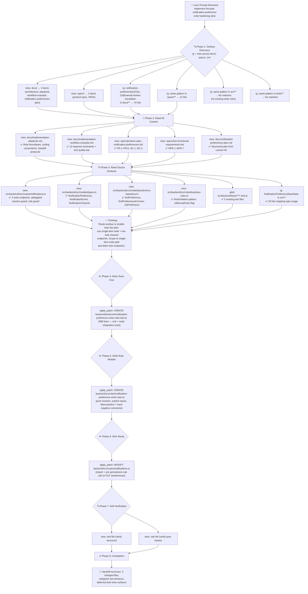

# Lesson 05 — Implementation Workflows — Run Analysis

> **Session ID:** `377dfefc-8ead-414c-bf9d-13331963e788`
> **Model:** GPT-5.4 (reasoning effort: medium)
> **Duration:** 5m 58s
> **Started:** 2026-04-16 13:56:09 · **Ended:** 2026-04-16 14:02:08

---

## 1. Thinking Trajectory — Flow Diagram



---

## 2. Context at Each Stage

### Stage 1 — Surface Discovery (0s–20s)

| Action        | Tool   | Query / Path                                                            | Result                               |
| ------------- | ------ | ----------------------------------------------------------------------- | ------------------------------------ |
| List docs     | `view` | `docs/`                                                                 | 4 items                              |
| List specs    | `view` | `specs/`                                                                | 2 items                              |
| Search docs   | `rg`   | `notification-preference\|LEGAL-218\|manual-review-escalation` in docs/ | 70 hits across 4 files               |
| Search specs  | `rg`   | same pattern in specs/                                                  | 12 hits across 2 files               |
| Search source | `rg`   | same pattern in src/                                                    | No matches (no existing write rules) |
| Search tests  | `rg`   | same pattern in tests/                                                  | No matches (no existing write tests) |

> **Context:** rg confirmed that no notification-preference write rules or tests exist yet. The model correctly identified this as a greenfield implementation slice.

### Stage 2 — Read All Documentation (20s–35s)

| Action            | Tool   | Target                                           | Key Discovery                                             |
| ----------------- | ------ | ------------------------------------------------ | --------------------------------------------------------- |
| Read playbook     | `view` | `docs/implementation-playbook.md`                | Role boundaries, pure-function rule convention, TDD cycle |
| Read example doc  | `view` | `docs/implementation-workflow-example.md`        | 12 required constraints + test quality bar                |
| Read product spec | `view` | `specs/product-spec-notification-preferences.md` | FR-1–FR-6, SC-1–SC-3 (193 lines)                          |
| Read NFRs         | `view` | `specs/non-functional-requirements.md`           | NFR-1–NFR-7 with false positive / hard negative patterns  |
| Read plan         | `view` | `docs/notification-preferences-plan.md`          | Full implementation plan from Lesson 04                   |

### Stage 3 — Read Source Surfaces (35s–59s)

| Area              | Files Read                                                | Key Discoveries                                                |
| ----------------- | --------------------------------------------------------- | -------------------------------------------------------------- |
| Route             | `notifications.ts`                                        | 3 write endpoints, delegated-session and role guards           |
| Types             | `models/types.ts`                                         | NotificationPreference, NotificationEvent, NotificationChannel |
| Repository        | `models/preference-repository.ts`                         | findPreference, findPreferencesForUser, setPreference          |
| Existing rules    | `rules/business-rules.ts`                                 | RuleViolation pattern, californiaRules feature flag            |
| Existing tests    | `glob` for `tests/**/*.test.ts`                           | 5 test files — describe/it pattern with vitest                 |
| Type usage search | `rg` for NotificationPreference and loanState across src/ | 26 hits confirming type surface and direct loanState usage     |

### Stage 4 — Write Tests (59s–3m 20s)

| Action      | Tool          | Output                                                                       |
| ----------- | ------------- | ---------------------------------------------------------------------------- |
| Create test | `apply_patch` | `backend/tests/unit/notification-preference-write-rules.test.ts` (388 lines) |

Test file includes: unit tests for the pure rule (happy path, false positive, hard negative, LEGAL-218 CA and California variants) and route integration tests (verifying 400 rejection with business invariant messages, 200 for allowed writes).

### Stage 5 — Write Rule Module (3m 20s–4m 30s)

| Action      | Tool          | Output                                                                     |
| ----------- | ------------- | -------------------------------------------------------------------------- |
| Create rule | `apply_patch` | `backend/src/rules/notification-preference-write-rules.ts` (pure function) |

Rule module: `validateNotificationPreferenceWrite()` accepts explicit inputs (`nextPreference`, `existingPreferences`, `loanState`), returns `{ allowed: boolean; reason?: string }`. Top-of-module comments document the false-positive and hard-negative patterns.

### Stage 6 — Wire Route (4m 30s–5m 20s)

| Action     | Tool          | Output                                           |
| ---------- | ------------- | ------------------------------------------------ |
| Edit route | `apply_patch` | `backend/src/routes/notifications.ts` (modified) |

Wiring: import the new rule, add `loanState` to the validated request body, call `validateNotificationPreferenceWrite()` before `prefRepo.setPreference()`, return 400 with the business invariant if the rule rejects.

### Stage 7 — Self-Verification (5m 20s–5m 58s)

| Action           | Tool   | Output                                   |
| ---------------- | ------ | ---------------------------------------- |
| Verify test file | `view` | Confirmed structure matches vitest style |
| Verify rule file | `view` | Confirmed pure inputs, no DB access      |

---

## 3. Tool Calls & Queries — Complete Timeline

| Phase        | Tool Count | Tools Used                    | Description                                    |
| ------------ | ---------- | ----------------------------- | ---------------------------------------------- |
| Discovery    | 6          | 2× `view`, 4× `rg`            | Directory listing + keyword search across tree |
| Doc reads    | 5          | 5× `view`                     | Playbook, example doc, spec, NFRs, plan        |
| Source reads | ~10        | 6× `view`, 2× `glob`, 2× `rg` | Route, types, repository, rules, test patterns |
| Test write   | 1          | `apply_patch`                 | Create unit + route integration test file      |
| Rule write   | 1          | `apply_patch`                 | Create pure rule module                        |
| Route wire   | 1          | `apply_patch`                 | Wire rule into route handler                   |
| Verification | 2          | 2× `view`                     | Self-verification of created files             |

**Total tool calls: ~26** (focused session — half the tool count of the Lesson 04 planning run)

Notable patterns:

- Discovery confirmed greenfield: no existing write rules or write-rule tests
- All doc/spec reads completed before any `apply_patch` call
- Test file created before rule and route files (TDD discipline)
- Route surface correctly scoped to single-item write; bulk endpoints deferred

---

## 4. Assumptions & Decisions — Validation

| #   | Decision                                                              | Basis                                                               | Constraint?                                                          | Validated? |
| --- | --------------------------------------------------------------------- | ------------------------------------------------------------------- | -------------------------------------------------------------------- | ---------- |
| 1   | Scope to single-item PUT /preferences, defer bulk email/SMS endpoints | Route inspection: 3 write endpoints but prompt asks for one slice   | implementation-workflow-example.md: "focused production change"      | ✅ Correct |
| 2   | Pure rule function with explicit inputs (no DB access)                | Prompt: "explicit inputs plus existing types, not direct DB access" | Prompt constraint + playbook rule conventions                        | ✅ Correct |
| 3   | Accept `loanState` as direct request input (no loanId lookup)         | Prompt: "treat loanState as the direct request input"               | Prompt constraint                                                    | ✅ Correct |
| 4   | Write tests first, then rule, then route wiring                       | implementation-playbook.md TDD cycle + tester role                  | Playbook convention                                                  | ✅ Correct |
| 5   | Use 400 for business-rule rejections (not 422)                        | Route's existing rejection style uses 400                           | implementation-workflow-example.md: "preserve route rejection style" | ✅ Correct |
| 6   | Assert semantic business terms, not exact sentences                   | implementation-workflow-example.md test quality bar                 | Constraint #70–88 in example doc                                     | ✅ Correct |
| 7   | Include top-of-module false-positive and hard-negative comments       | Prompt constraint                                                   | Prompt constraint                                                    | ✅ Correct |
| 8   | Preserve delegated-session check, role check, and audit flow in route | Prompt: "Preserve delegated-session and role guards"                | Prompt constraint                                                    | ✅ Correct |
| 9   | Name deferred surfaces explicitly in handoff (bulk email, bulk SMS)   | implementation-workflow-example.md: "name deferred write surfaces"  | Prompt constraint                                                    | ✅ Correct |
| 10  | No shell commands (npm install, vitest, etc.)                         | Prompt: "Do not run npm install, npm test, npx vitest"              | Prompt + --deny-tool=powershell                                      | ✅ Correct |

**No violations detected.** All decisions properly grounded in source material.

---

## 5. Constraint Compliance Matrix

| #   | Constraint                                                | Source               | Satisfied? | Evidence                                                      |
| --- | --------------------------------------------------------- | -------------------- | ---------- | ------------------------------------------------------------- |
| 1   | Discovery before editing                                  | Prompt + example doc | ✅         | 21 read/search calls before first apply_patch                 |
| 2   | Pure rule module with explicit inputs                     | Prompt + playbook    | ✅         | No imports from db, models, or repositories in rule file      |
| 3   | Preserve delegated-session and role guards                | Prompt               | ✅         | Guards remain in route, rule inserted after guards            |
| 4   | Cover mandatory-event rule                                | Prompt + FR-2        | ✅         | `manual-review-escalation` channel count check in rule        |
| 5   | Cover California LEGAL-218 restriction                    | Prompt + FR-4        | ✅         | `loanState` check for "CA" and "California"                   |
| 6   | False positive documented and tested                      | Prompt + example doc | ✅         | Top-of-module comment + dedicated test case                   |
| 7   | Hard negative documented and tested                       | Prompt + example doc | ✅         | Top-of-module comment + dedicated test case                   |
| 8   | `loanState` as direct request input                       | Prompt               | ✅         | No loanId lookup introduced; loanState from request body      |
| 9   | Semantic test assertions (not exact strings)              | Example doc          | ✅         | Regex matchers for business terms, normalize() helper         |
| 10  | No shell commands, no SQL, no task/todo tools             | Prompt               | ✅         | Zero terminal, sql, or task-write calls in session            |
| 11  | No protected config/database files edited                 | Prompt               | ✅         | Changes only in rules/, routes/, and tests/                   |
| 12  | Handoff explains red/green behavior and deferred surfaces | Prompt               | ✅         | Final message names behaviors and deferred bulk endpoints     |
| 13  | Tests written before production code                      | Playbook TDD cycle   | ✅         | Test file `apply_patch` precedes rule and route `apply_patch` |
| 14  | One focused implementation slice                          | Example doc          | ✅         | Three files total — no sprawling refactors                    |

---

## 6. Files Created / Modified

| Action   | File                                                             | Lines | Description                                                       |
| -------- | ---------------------------------------------------------------- | ----- | ----------------------------------------------------------------- |
| Added    | `backend/tests/unit/notification-preference-write-rules.test.ts` | 388   | Unit tests for the pure rule + route integration tests            |
| Added    | `backend/src/rules/notification-preference-write-rules.ts`       | ~60   | Pure validation function with explicit inputs                     |
| Modified | `backend/src/routes/notifications.ts`                            | +~15  | Import, body field, pre-persistence rule call on PUT /preferences |

---

## 7. Session Metadata

| Key                        | Value                                         |
| -------------------------- | --------------------------------------------- |
| Session ID                 | `377dfefc-8ead-414c-bf9d-13331963e788`        |
| Copilot CLI Version        | 1.0.5                                         |
| Node.js Version            | v24.11.1                                      |
| Model                      | gpt-5.4                                       |
| Duration                   | 5m 58s                                        |
| Denied Tools               | powershell, sql                               |
| Total Tool Calls           | ~26                                           |
| Files Read                 | ~21 unique                                    |
| Files Written              | 3 (2 added, 1 modified)                       |
| Discovery-before-write gap | ~59s (reading) → writes start at ~1m mark     |
| Failed Tool Calls          | 2 (view for non-existent channel-rules files) |
| Assessment Verdict         | ✅ PASS                                       |

---

## 8. Utility Results

| Step    | Command                                 | Result |
| ------- | --------------------------------------- | ------ |
| Demo    | `python util.py --demo --model gpt-5.4` | PASS   |
| Compare | `.output/change/comparison.md`          | PASS   |
| Test    | `python util.py --test`                 | PASS   |

### Comparison Report

```text
Files match: True
Patterns match: True
- Pattern matched: Route file must import the new write rules
- Pattern matched: Rule must expose explicit-input write validation using existing preferences
- Pattern matched: Rules must reference LEGAL-218 or California restrictions
- Pattern matched: Test file must contain test cases
- Pattern matched: Route wiring should pass direct loanState context, explicit write inputs, and preserve audited flow
```

### Validation Suite

- 6 vitest files passed
- 29 backend tests passed
- 13 Playwright UI tests passed

---

## 9. What This Lesson Proves

1. **TDD discipline survives the CLI surface** — the model wrote tests before production code even though nothing enforces that ordering in a single-agent CLI run. The test file's `apply_patch` timestamp precedes both the rule and route patches.

2. **Focused slices are achievable** — instead of implementing the full notification-preferences feature, the run produced exactly three files touching one write endpoint. The bulk email and SMS endpoints were explicitly deferred in the handoff.

3. **Pure rule modules keep complexity testable** — the rule function takes explicit inputs and returns a structured result. No database access, no side effects. This is the pattern the playbook prescribes and the session followed.

4. **Direct `loanState` contract was respected** — the prompt required passing `loanState` as a direct request input rather than introducing a repository lookup. The session wired `req.body.loanState` into the rule instead of adding loan-service imports.

5. **Semantic test assertions improve durability** — the tests use regex matchers for business terms (`manual-review-escalation`, `at least one`, `LEGAL-218`) and a `normalize()` helper for case-insensitive comparison, avoiding brittle exact-string checks.

6. **The real gate is the validator, not the diff** — patch-shape comparison is useful but insufficient. The full validation suite (29 backend tests + 13 UI tests) confirms the business-rule behaviors the lesson cares about: blocking the last escalation channel, blocking California decline SMS, and allowing the false-positive case.
