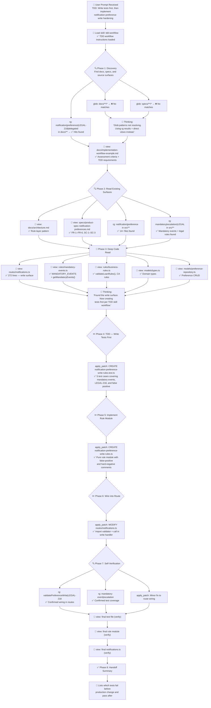

# Lesson 05 — Implementation Workflows — Run Analysis

> **Session ID:** `75425311-a9e8-4f75-b5b5-33ca70c55d25`
> **Model:** GPT-5.4 (reasoning effort: medium)
> **Duration:** 2m 30s
> **Started:** 2026-03-14 20:28:50 · **Ended:** 2026-03-14 20:31:21

---

## 1. Thinking Trajectory — Flow Diagram

---

## 2. Context at Each Stage

### Stage 1 — Skill Load + Doc Discovery (0s–20s)

| Action           | Tool    | Target                                                        | Result                              |
| ---------------- | ------- | ------------------------------------------------------------- | ----------------------------------- |
| Load TDD skill   | `skill` | tdd-workflow                                                  | ✅ TDD workflow instructions loaded |
| Find docs        | `glob`  | docs/\*_/_                                                    | ❌ No matches                       |
| Find specs       | `glob`  | specs/\*_/_                                                   | ❌ No matches                       |
| Search docs      | `rg`    | `notification\|preference\|LEGAL-218\|delegated` in docs/\*\* | ✅ Hits found                       |
| Read example doc | `view`  | docs/implementation-workflow-example.md                       | ❌ First attempt failed (path)      |
| Read example doc | `view`  | docs/implementation-workflow-example.md                       | ✅ Assessment criteria discovered   |

> **Notable:** The model loaded the `tdd-workflow` skill before any other action, indicating it recognized the TDD requirement from the prompt.

### Stage 2 — Architecture + Specs (25s–45s)

| Action            | Tool   | Target                                         | Key Discovery                             |
| ----------------- | ------ | ---------------------------------------------- | ----------------------------------------- |
| Read architecture | `view` | docs/architecture.md                           | Rule-layer pattern, rules in `src/rules/` |
| Read product spec | `view` | specs/product-spec-notification-preferences.md | FR-2 (mandatory events), FR-4 (LEGAL-218) |
| Search code       | `rg`   | `notification\|preference` in src/\*\*         | 14+ matching files                        |
| Search code       | `rg`   | `mandatory\|escalation\|LEGAL` in src/\*\*     | Rule and service hits                     |

### Stage 3 — Deep Code Read (50s–1m 10s)

| Action                    | Tool   | Target                            | Key Discovery                                |
| ------------------------- | ------ | --------------------------------- | -------------------------------------------- |
| Read routes               | `view` | routes/notifications.ts           | 272 lines — all write endpoints              |
| Read mandatory events     | `view` | rules/mandatory-events.ts         | MANDATORY_EVENTS map, `getMandatoryEvents()` |
| Read business rules       | `view` | rules/business-rules.ts           | `validateLoanRules()`, CA rules pattern      |
| Read types                | `view` | models/types.ts                   | Domain type definitions                      |
| Read preference repo      | `view` | models/preference-repository.ts   | findPreference(), setPreference()            |
| Read test conventions     | `view` | tests/unit/business-rules.test.ts | Vitest patterns, baseLoan fixtures           |
| Read notification service | `view` | services/notification-service.ts  | Delivery pipeline, fallback                  |
| Read audit service        | `view` | services/audit-service.ts         | auditAction() signature                      |
| Read role permissions     | `view` | rules/role-permissions.ts         | Permission model                             |

### Stage 4 — TDD: Tests First (1m 15s)

| Action           | Tool          | Output                                                       |
| ---------------- | ------------- | ------------------------------------------------------------ |
| Create test file | `apply_patch` | `notification-preference-write-rules.test.ts` — 5 test cases |

### Stage 5 — Implement Rule Module (1m 30s)

| Action           | Tool          | Output                                                                                                |
| ---------------- | ------------- | ----------------------------------------------------------------------------------------------------- |
| Create rule file | `apply_patch` | `notification-preference-write-rules.ts` — pure validation with false-positive/hard-negative comments |

### Stage 6 — Wire into Route (1m 45s)

| Action       | Tool          | Output                                                 |
| ------------ | ------------- | ------------------------------------------------------ |
| Modify route | `apply_patch` | Import `validatePreferenceWrite` + call in PUT handler |

### Stage 7 — Self-Verification (2m 0s–2m 30s)

| Action             | Tool          | Output                                                  |
| ------------------ | ------------- | ------------------------------------------------------- |
| Search wiring      | `rg`          | Confirmed import in notifications.ts                    |
| Search test        | `rg`          | Confirmed test coverage                                 |
| Fix route wiring   | `apply_patch` | Minor adjustment to validator call site                 |
| Verify test file   | `view`        | Clean — all 5 tests present                             |
| Verify rule module | `view`        | Correct — false-positive/hard-negative comments present |
| Verify route       | `view`        | Correct — validator integrated                          |

---

## 3. Tool Calls Summary

| Category            | Count   | Tools                                                                  |
| ------------------- | ------- | ---------------------------------------------------------------------- |
| Skill load          | 1       | `skill` (tdd-workflow)                                                 |
| Discovery (glob/rg) | 7       | 2× `glob`, 5× `rg`                                                     |
| Source reads        | 15      | `view`                                                                 |
| Code writes         | 4       | `apply_patch` (1 create test + 1 create rule + 1 modify route + 1 fix) |
| Verification        | 8       | 2× `rg`, 3× `view`                                                     |
| **Total**           | **~38** |                                                                        |

Failed tool calls: 2 (glob path issues, both recovered)

---

## 4. Assumptions & Decisions — Validation

| #   | Decision                                      | Basis                                                               | Constraint?                        | Validated?               |
| --- | --------------------------------------------- | ------------------------------------------------------------------- | ---------------------------------- | ------------------------ |
| 1   | Load TDD skill before discovery               | Prompt says "write tests first"                                     | Skill available in .github/skills/ | ✅ Correct use           |
| 2   | Write tests at prescribed path                | Prompt specifies exact file path                                    | Direct prompt constraint           | ✅ Correct               |
| 3   | Create pure rule module (no DB access)        | Prompt: "explicit inputs plus existing types, not direct DB access" | Prompt constraint                  | ✅ Correct               |
| 4   | Rule file at prescribed path                  | Prompt specifies exact file path                                    | Direct prompt constraint           | ✅ Correct               |
| 5   | Include false-positive/hard-negative comments | Prompt: "top-of-module false-positive and hard-negative comments"   | Prompt constraint                  | ✅ Correct               |
| 6   | Wire into notifications.ts only               | Prompt: "wire the minimal production changes"                       | Scope constraint                   | ✅ Correct               |
| 7   | Defer bulk email/SMS surfaces                 | Prompt: "name any intentionally deferred write surfaces"            | Scope constraint                   | ✅ Documented in handoff |
| 8   | Enforce: escalation must keep ≥1 channel      | Prompt: "manual-review-escalation must keep at least one channel"   | Direct prompt constraint           | ✅ Tested                |
| 9   | Enforce: decline SMS blocked for CA           | Prompt: "decline SMS cannot be enabled when loanState is CA"        | LEGAL-218, direct prompt           | ✅ Tested                |
| 10  | Allow: escalation SMS off + email on          | Prompt: "the false positive... must remain allowed"                 | Direct prompt constraint           | ✅ Tested                |

**No violations detected.** TDD workflow followed correctly (tests created before implementation).

---

## 5. Constraint Compliance Matrix

| #   | Constraint                           | Source | Satisfied? | Evidence                                                             |
| --- | ------------------------------------ | ------ | ---------- | -------------------------------------------------------------------- |
| 1   | Write tests first                    | Prompt | ✅         | Test file created before rule module                                 |
| 2   | Test file at prescribed path         | Prompt | ✅         | `src/backend/tests/unit/notification-preference-write-rules.test.ts` |
| 3   | Rule module at prescribed path       | Prompt | ✅         | `src/backend/src/rules/notification-preference-write-rules.ts`       |
| 4   | Wire into notifications.ts           | Prompt | ✅         | Import + call in write handler                                       |
| 5   | Pure rule (no DB access)             | Prompt | ✅         | Rule takes explicit inputs only                                      |
| 6   | False-positive comments in rule file | Prompt | ✅         | Top-of-module comments present                                       |
| 7   | Hard-negative comments in rule file  | Prompt | ✅         | Top-of-module comments present                                       |
| 8   | Mandatory event enforcement          | Prompt | ✅         | Test covers ≥1 channel rule                                          |
| 9   | LEGAL-218 CA restriction             | Prompt | ✅         | Test covers CA decline SMS block                                     |
| 10  | False positive allowed               | Prompt | ✅         | Escalation SMS off + email on passes                                 |
| 11  | Handoff: state which tests fail/pass | Prompt | ✅         | Final message lists both                                             |
| 12  | Handoff: name deferred surfaces      | Prompt | ✅         | Bulk email/SMS endpoints named                                       |
| 13  | No shell commands                    | Prompt | ✅         | Zero powershell/terminal calls                                       |
| 14  | No SQL/task tools                    | Prompt | ✅         | --deny-tool=sql in command                                           |
| 15  | Don't edit protected config/database | Prompt | ✅         | Only test, rule, route files touched                                 |

---

## 6. Files Created / Modified

| Action   | File                                                                 | Description                                                                  |
| -------- | -------------------------------------------------------------------- | ---------------------------------------------------------------------------- |
| Added    | `src/backend/tests/unit/notification-preference-write-rules.test.ts` | 5 test cases: mandatory event enforcement, LEGAL-218, false positive         |
| Added    | `src/backend/src/rules/notification-preference-write-rules.ts`       | Pure validation rule with explicit inputs, false-positive/hard-negative docs |
| Modified | `src/backend/src/routes/notifications.ts`                            | Import + call to `validatePreferenceWrite` in PUT handler                    |

---

## 7. Session Metadata

| Key                 | Value                                  |
| ------------------- | -------------------------------------- |
| Session ID          | `75425311-a9e8-4f75-b5b5-33ca70c55d25` |
| Copilot CLI Version | 1.0.5                                  |
| Node.js Version     | v24.11.1                               |
| Model               | gpt-5.4                                |
| Duration            | 2m 30s                                 |
| Denied Tools        | powershell, sql                        |
| Total Tool Calls    | ~38                                    |
| Files Read          | ~15 unique                             |
| Files Written       | 3 (2 created, 1 modified)              |
| Skill Used          | tdd-workflow                           |
| Assessment Verdict  | ✅ PASS                                |

---

## 8. What This Lesson Proves

1. **TDD workflow is achievable with agents** — the model loaded a TDD skill, wrote tests first, then implemented the production code
2. **Skill integration shapes behavior** — the `tdd-workflow` skill was loaded as the first action, before any file discovery
3. **Agent prompt files + agent definitions compose** — `.github/agents/implementer.agent.md` + `.github/prompts/implement-feature.prompt.md` provided structural guidance for the TDD workflow
4. **Scope discipline held under pressure** — deferred bulk email/SMS surfaces were explicitly named rather than silently expanded
5. **False positive / hard negative testing requires explicit prompt constraints** — the model correctly tested the false positive (escalation SMS off + email on is valid) only because the prompt specified it
