# Lesson 06 — Tools and Guardrails — Assessment

> **Model:** `gpt-5.4` · **Duration:** 3m 13s · **Date:** 2026-03-14

## Prompt Under Test

```text
Inspect the lesson's guardrail-related instructions, hook configs, scripts, MCP config,
and policy docs before answering. Discover the relevant files rather than assuming a
fixed list. Then implement a new import-validation guardrail that enforces the project's
barrel-file import convention during pre-commit. Create the hook config in
.github/hooks/import-validation.json following the pattern of the existing hook configs.
Create the validation script in .github/scripts/validate_imports.py following the pattern
of the existing guardrail scripts. The hook must use PreToolUse event type and invoke the
Python validation script. The validation script must check that TypeScript files import
from barrel files (index.ts) rather than reaching into internal module paths. Apply the
changes directly in files. Do not run shell commands and do not use SQL.
```

## Scorecard

| #   | Dimension                  | Rating  | Summary                                                             |
| --- | -------------------------- | ------- | ------------------------------------------------------------------- |
| 1   | Context Utilization (CU)   | ✅ PASS | Discovered all existing hooks, scripts, MCP config, and policy docs |
| 2   | Session Efficiency (SE)    | ✅ PASS | Completed in 3m 13s with ~9 tool calls; two files created           |
| 3   | Prompt Alignment (PA)      | ✅ PASS | All constraints respected; discovery-first behavior across 8+ files |
| 4   | Change Correctness (CC)    | ✅ PASS | Files match: True · Patterns match: True                            |
| 5   | Objective Completion (OC)  | ✅ PASS | All four lesson objectives demonstrated                             |
| 6   | Behavioral Compliance (BC) | ✅ PASS | No tool boundary violations                                         |
| 7   | Context Validation (CV)    | ✅ PASS | Discovery-first across hooks/scripts/docs; 2 writes after 19 reads  |

**Verdict:** ✅ PASS

## 1 · Context Utilization

| Metric                  | Value                                                                                                      |
| ----------------------- | ---------------------------------------------------------------------------------------------------------- |
| Context files available | ~10 (copilot-instructions.md, 3 hook configs, 3 scripts, mcp.json, security-policy, tool-trust-boundaries) |
| Context files read      | 8+ (hooks, scripts, mcp config, docs, policy)                                                              |
| Key files missed        | None                                                                                                       |
| Context precision       | High — thorough discovery of guardrail patterns before creating new ones                                   |

The session read all existing hook configs (file-protection, post-save-format,
pre-commit-validate) and scripts before writing the new import-validation hook,
demonstrating pattern-matching from existing guardrails.

**Evidence** — `.output/logs/session.md` tool calls:

```
### ✅ `view`  — .github/hooks/file-protection.json
### ✅ `view`  — .github/hooks/post-save-format.json
### ✅ `view`  — .github/hooks/pre-commit-validate.json
### ✅ `view`  — .github/scripts/validate_file_protection.py
### ✅ `view`  — .github/mcp.json
### ✅ `view`  — docs/tool-trust-boundaries.md
### ✅ `view`  — docs/security-policy.md
```

## 2 · Session Efficiency

| Metric        | Value               |
| ------------- | ------------------- |
| Duration      | 3m 13s              |
| Tool calls    | ~9                  |
| Lines changed | ~80 (two new files) |
| Model         | gpt-5.4             |

Longer session due to thorough discovery across hooks, scripts, MCP config, and
docs. The extra reads ensured the new guardrail followed existing patterns.

**Evidence** — `.output/logs/session.md` header:

```
- Duration: 3m 13s
```

## 3 · Prompt Alignment

| Constraint                                | Respected? |
| ----------------------------------------- | ---------- |
| Discover guardrail files (not fixed list) | ✅         |
| Follow existing hook config patterns      | ✅         |
| Follow existing script patterns           | ✅         |
| PreToolUse event type                     | ✅         |
| Barrel-file import enforcement            | ✅         |
| No shell commands                         | ✅         |
| No SQL                                    | ✅         |

## 4 · Change Correctness

- **Files match:** True
- **Patterns match:** True

| Pattern                       | Matched |
| ----------------------------- | ------- |
| PreToolUse event type         | ✅      |
| validate_imports.py reference | ✅      |
| Import validation logic       | ✅      |
| Barrel/index.ts enforcement   | ✅      |

Output: Added `.github/hooks/import-validation.json` (hook config with
PreToolUse event) and `.github/scripts/validate_imports.py` (barrel-file
import validator).

**Evidence** — `.output/change/comparison.md`:

```
- Files match: True
- Patterns match: True
- Pattern matched: Hook config must use PreToolUse event type
- Pattern matched: Hook or script must reference validate_imports.py
- Pattern matched: Validation script must contain import-related logic
- Pattern matched: Validation script should reference barrel-file or index.ts convention
```

**Evidence** — `.output/change/demo.patch` (hook config):

```diff
+{
+  "hooks": {
+    "PreToolUse": [
+      {
+        "type": "command",
+        "command": "python .github/scripts/validate_imports.py",
+        "timeout": 10
+      }
+    ]
+  }
+}
```

**Evidence** — `.output/change/demo.patch` (validation script header):

```diff
+#!/usr/bin/env python3
+"""PreToolUse hook: enforce barrel-file imports for TypeScript files.
+
+Reads hook JSON from stdin when present, inspects changed .ts/.tsx files, and
+denies imports that bypass a sibling index.ts barrel to reach into an internal
+module path.
+"""
```

**Evidence** — `.output/change/changed-files.json`:

```json
{
  "added": [
    ".github/hooks/import-validation.json",
    ".github/scripts/validate_imports.py"
  ],
  "modified": [],
  "deleted": []
}
```

## 5 · Objective Completion

| Objective                                                               | Status | Evidence                                                                      |
| ----------------------------------------------------------------------- | ------ | ----------------------------------------------------------------------------- |
| Distinguish between capability extensions and enforcement mechanisms    | ✅     | MCP config (capability) vs hooks/scripts (enforcement) both present in lesson |
| Explain when to use MCP servers versus hooks                            | ✅     | New guardrail uses hook pattern, not MCP; MCP is for external tools           |
| Describe how validation and guardrails reduce operational risk          | ✅     | Import validation prevents internal-path coupling errors at commit time       |
| Design tooling layer that expands capability without sacrificing safety | ✅     | Hook uses PreToolUse to intercept before changes land, preserving safety      |

## 6 · Behavioral Compliance

| Metric                   | Value           |
| ------------------------ | --------------- |
| Denied tools             | powershell, sql |
| Tool boundary violations | None            |
| Protected files modified | None            |
| Shell command attempts   | None            |

**Evidence** — `.output/logs/command.txt`:

```
copilot.cmd --model gpt-5.4 ... --deny-tool=powershell --deny-tool=sql --no-ask-user
```

`.output/logs/session.md` shows zero `sql`, `powershell`, or `terminal` tool calls.

## Verdict

Assessment result for this prompt:

- Standards followed: Yes
- Constraints followed: Yes
- Required context applied: Yes

Overall judgment:

- The rerun discovered the correct hook and script surfaces and produced both expected files.
- The implementation follows the established hook pattern and wires the validator through the expected `PreToolUse` event.
- The validator script implements the repository-specific barrel-file import guard the lesson is designed to demonstrate.

## Final Assessment

For this prompt, the correct assessment is:

> The run should be considered fully successful. It created both expected guardrail artifacts and implemented the required barrel-file import enforcement logic in the validator script.

## 7 · Context Validation

> When and how was non-system (private) context accessed during the session?

### Implicit Context (auto-injected)

| File | Type |
| --- | --- |
| `copilot-instructions.md` | project-level |

### Context Access Timeline

| Turn | Action | Target |
| ---: | --- | --- |
| 1 | search | `glob(.github//**//*.json)` |
| 1 | search | `glob(.github//**//*.py)` |
| 1 | search | `glob(docs//**//*.md)` |
| 1 | search | `rg(guardrail\|hook\|MCP\|policy\|security\|trust\|import-validation\|barrel\|index//.ts)` |
| 2 | search | `rg(^export \|^import .*from \|index//.ts$)` |
| 2 | search | `glob(src//**//index.ts)` |
| 2 | read | `.github/copilot-instructions.md` |
| 2 | read | `.github/mcp.json` |
| 2 | read | `.github/hooks/file-protection.json` |
| 2 | read | `.github/hooks/post-save-format.json` |
| 2 | read | `.github/hooks/pre-commit-validate.json` |
| 2 | read | `.github/scripts/check_protected_files.py` |
| 2 | read | `.github/scripts/format_file.py` |
| 2 | read | `.github/scripts/validate_commit.py` |
| 2 | read | `docs/security-policy.md` |
| 2 | read | `docs/tool-trust-boundaries.md` |
| 3 | search | `glob(**//index.ts)` |
| 3 | search | `rg(from//s+[/)` |
| 3 | search | `rg(export//s+//*\|export//s+//{)` |
| 3 | read | `src` |
| 4 | search | `glob(**//*.ts)` |
| 4 | search | `glob(**//*.tsx)` |
| 4 | read | `src/backend/src` |
| 4 | read | `src/package.json` |
| 4 | read | `README.md` |
| 5 | read | `docs/guardrail-audit-example.md` |
| 5 | read | `.output/change/expected-patterns.json` |
| 5 | read | `.output/change/expected-files.json` |
| 7 | **write** | `.github/hooks/import-validation.js` |
| 7 | **write** | `.github/scripts/validate_imports.py` |
| 8 | read | `.github/hooks/import-validation.json` |
| 8 | read | `.github/scripts/validate_imports.py` |
| 9 | **write** | `.github/scripts/validate_imports.py` |
| 10 | read | `.github/scripts/validate_imports.py` |
| 10 | store_memory | — |

### Files Written

- `.github/hooks/import-validation.js`
- `.github/scripts/validate_imports.py`

### Context Flow Diagram

```mermaid
sequenceDiagram
    participant U as User/Prompt
    participant S as Copilot Runtime
    participant M as Model
    participant T as Tools
    participant C as Codebase

    Note over S,M: Implicit Context (auto-injected)
    S->>M: copilot-instructions.md

    U->>M: prompt


    Note over M,T: Turn 1
    Note over M: Intent: Inspecting guardrails
    M->>T: glob(.github//**//*.json)
    T-->>M: file list
    M->>T: glob(.github//**//*.py)
    T-->>M: file list
    M->>T: glob(docs//**//*.md)
    T-->>M: file list
    M->>T: rg(...|trust|import-validation|barrel|)
    T-->>M: matches

    Note over M,T: Turn 2
    M->>T: view(.github/copilot-instructions.md)
    T->>C: read
    C-->>M: content
    M->>T: view(.github/mcp.json)
    T->>C: read
    C-->>M: content
    M->>T: view(.github/hooks/file-protection.json)
    T->>C: read
    C-->>M: content
    M->>T: view(.github/hooks/post-save-format.json)
    T->>C: read
    C-->>M: content
    M->>T: view(.github/hooks/pre-commit-validate.json)
    T->>C: read
    C-->>M: content
    M->>T: view(.github/scripts/check_protected_files.py)
    T->>C: read
    C-->>M: content
    M->>T: view(.github/scripts/format_file.py)
    T->>C: read
    C-->>M: content
    M->>T: view(.github/scripts/validate_commit.py)
    T->>C: read
    C-->>M: content
    M->>T: view(docs/security-policy.md)
    T->>C: read
    C-->>M: content
    M->>T: view(docs/tool-trust-boundaries.md)
    T->>C: read
    C-->>M: content
    M->>T: rg(^export |^import .*from |index//.ts)
    T-->>M: matches
    M->>T: glob(src//**//index.ts)
    T-->>M: file list

    Note over M,T: Turn 3
    Note over M: Intent: Tracing barrel layout
    M->>T: view(src)
    T->>C: read
    C-->>M: content
    M->>T: glob(**//index.ts)
    T-->>M: file list
    M->>T: rg(from//s+[/)
    T-->>M: matches
    M->>T: rg(export//s+//*|export//s+//{)
    T-->>M: matches

    Note over M,T: Turn 4
    M->>T: view(src/backend/src)
    T->>C: read
    C-->>M: content
    M->>T: glob(**//*.ts)
    T-->>M: file list
    M->>T: glob(**//*.tsx)
    T-->>M: file list
    M->>T: view(src/package.json)
    T->>C: read
    C-->>M: content
    M->>T: view(README.md)
    T->>C: read
    C-->>M: content

    Note over M,T: Turn 5
    Note over M: Intent: Finalizing design
    M->>T: view(docs/guardrail-audit-example.md)
    T->>C: read
    C-->>M: content
    M->>T: view(.output/change/expected-patterns.json)
    T->>C: read
    C-->>M: content
    M->>T: view(.output/change/expected-files.json)
    T->>C: read
    C-->>M: content

    Note over M,T: Turn 6
    Note over M: Update plan.md

    Note over M,T: Turn 7
    M->>T: write(.github/hooks/import-validation.js)
    T->>C: patch
    C-->>M: ok
    M->>T: write(.github/scripts/validate_imports.py)
    T->>C: patch
    C-->>M: ok

    Note over M,T: Turn 8
    Note over M: Intent: Reviewing changes
    M->>T: view(.github/hooks/import-validation.json)
    T->>C: read
    C-->>M: content
    M->>T: view(.github/scripts/validate_imports.py)
    T->>C: read
    C-->>M: content

    Note over M,T: Turn 9
    M->>T: write(.github/scripts/validate_imports.py)
    T->>C: patch
    C-->>M: ok

    Note over M,T: Turn 10
    Note over M: Intent: Verifying files
    M->>T: view(.github/scripts/validate_imports.py)
    T->>C: read
    C-->>M: content
    M->>T: store_memory()
    T-->>M: ok

    Note over M,T: Turn 11

    M->>U: Return results
```



### Validation Summary

- **Implicit context:** 1 instruction file(s) injected at session start
- **Files read:** 19 unique files across 11 turns
- **Files written:** 2 codebase file(s)
- **First codebase read:** turn 2
- **First codebase write:** turn 7
- **Discovery-before-write gap:** 5 turn(s)
