# Lesson 06 — Tools and Guardrails — Run Analysis

> **Session ID:** `ca2dc2b2-3dc8-45bf-abad-3e17ac710e34`
> **Started:** 14/03/2026, 19:33:56 · **Duration:** 3m 21s
> **Model:** GPT-5.4 · **Reasoning:** medium

---

## 1. Thinking Trajectory

```mermaid
flowchart TD
    A[Receive prompt] --> B[Discover guardrail surface]
    B --> C{glob × 3: .github JSON, .py, docs}
    C -->|all empty| D[rg: broad pattern search across repo]
    D --> E[103 hits — maps hook configs, scripts, MCP, policy docs, README]
    E --> F[💬 Copilot: I found the surface, now reading existing configs]
    F --> G[view × 8: copilot-instructions, mcp.json, 3 hook configs, 3 scripts]
    G --> H[rg: scan existing import patterns in src/]
    H --> I[glob: check for index.ts barrels in src/]
    I -->|none found| J[rg: scan relative imports in src/]
    J --> K[glob: full *.ts listing in backend/src/]
    K --> L[view: package.json, README, guardrail-audit-example, expected-files, expected-patterns]
    L --> M[💬 Copilot: Enough context, implementing now]
    M --> N[store_memory: session plan]
    N --> O[apply_patch: create import-validation.json + validate_imports.py]
    O --> P[view × 2: verify created files]
    P --> Q[💬 Copilot: Rough edge in import suggestion builder]
    Q --> R[apply_patch: simplify format_relative_import with os.path.relpath]
    R --> S[view: verify final validate_imports.py — 255 lines]
    S --> T[store_memory: guardrail pattern fact]
    T --> U[💬 Final summary]
```

## 2. Context at Each Stage

| Phase                  | Time          | Context Loaded                                                                    | Purpose                                                                |
| ---------------------- | ------------- | --------------------------------------------------------------------------------- | ---------------------------------------------------------------------- |
| **Surface discovery**  | 0s–17s        | 3× `glob` (all empty), 1× `rg` (103 hits)                                         | Map guardrail files — globs returned nothing, ripgrep found everything |
| **Convention reading** | 17s–31s       | `copilot-instructions.md`, `mcp.json`, 3 hook JSONs, 3 Python scripts             | Learn hook JSON structure, Python script patterns, MCP server config   |
| **Import landscape**   | 31s–43s       | `rg` imports, `glob` for `index.ts`, `rg` relative imports                        | Understand TypeScript barrel usage (none found — no barrels yet)       |
| **File structure**     | 43s–50s       | `glob` 32 `.ts` files, `glob` `.tsx` (none), `view` package.json                  | Map full backend source tree                                           |
| **Requirements**       | 50s–2m 4s     | README, `guardrail-audit-example.md`, expected-files.json, expected-patterns.json | Load assessment criteria and expected output shape                     |
| **Implementation**     | 2m 4s–2m 42s  | Session plan + `apply_patch` (2 new files)                                        | Create hook config + validation script                                 |
| **Verification + fix** | 2m 42s–3m 11s | `view` both files, `apply_patch` to simplify import helper                        | Verify and refine                                                      |

## 3. Tool Calls Timeline

| #   | Tool           | Target                                     | Result                                 |
| --- | -------------- | ------------------------------------------ | -------------------------------------- |
| 1   | `glob`         | `.github/**/*.json`                        | 0 matches                              |
| 2   | `glob`         | `.github/**/*.py`                          | 0 matches                              |
| 3   | `glob`         | `docs/**/*.md`                             | 0 matches                              |
| 4   | `rg`           | guardrail/hook/MCP/barrel/import patterns  | 103 matches — full surface map         |
| 5   | `view`         | `.github/copilot-instructions.md`          | 50 lines — hook/MCP policy rules       |
| 6   | `view`         | `.github/mcp.json`                         | 33 lines — sqlite + filesystem servers |
| 7   | `view`         | `.github/hooks/file-protection.json`       | 11 lines — PreToolUse pattern          |
| 8   | `view`         | `.github/hooks/post-save-format.json`      | 11 lines — PostToolUse pattern         |
| 9   | `view`         | `.github/hooks/pre-commit-validate.json`   | 11 lines — PreToolUse pattern          |
| 10  | `view`         | `.github/scripts/check_protected_files.py` | 64 lines — deny payload pattern        |
| 11  | `view`         | `.github/scripts/format_file.py`           | 24 lines — PostSave script             |
| 12  | `view`         | `.github/scripts/validate_commit.py`       | 52 lines — pre-commit script           |
| 13  | `rg`           | import/export patterns in `src/`           | 8 matches                              |
| 14  | `glob`         | `src/**/index.ts`                          | 0 matches (no barrels exist)           |
| 15  | `rg`           | relative import paths in `src/`            | 3 matches                              |
| 16  | `rg`           | export patterns in index.ts                | 0 matches                              |
| 17  | `view`         | `src/backend/src/` directory listing       | 9 folders                              |
| 18  | `glob`         | `src/backend/src/**/*.ts`                  | 32 files                               |
| 19  | `glob`         | `src/frontend/src/**/*.tsx`                | 0 matches                              |
| 20  | `view`         | `src/package.json`                         | 34 lines                               |
| 21  | `view`         | `README.md`                                | 85 lines                               |
| 22  | `view`         | `docs/guardrail-audit-example.md`          | 46 lines                               |
| 23  | `view`         | `.output/change/expected-patterns.json`    | 19 lines                               |
| 24  | `view`         | `.output/change/expected-files.json`       | 9 lines                                |
| 25  | `store_memory` | Session plan                               | ✅                                     |
| 26  | `apply_patch`  | Create hook config + validation script     | 2 new files                            |
| 27  | `view`         | `import-validation.json`                   | 12 lines — verify                      |
| 28  | `view`         | `validate_imports.py`                      | 282 lines — verify                     |
| 29  | `apply_patch`  | Simplify `format_relative_import`          | Modified 1 file                        |
| 30  | `view`         | `validate_imports.py`                      | 255 lines — final                      |
| 31  | `store_memory` | Guardrail pattern convention               | ✅                                     |

**Total: ~31 tool calls** (4 glob, 3 rg, 16 view, 2 apply_patch, 2 store_memory)

## 4. Assumptions & Decisions

| #   | Decision                                                                           | Validation                                                                                                |
| --- | ---------------------------------------------------------------------------------- | --------------------------------------------------------------------------------------------------------- |
| 1   | Used `PreToolUse` event type for hook config                                       | ✅ Matches existing `file-protection.json` and `pre-commit-validate.json`                                 |
| 2   | Hook invokes `python .github/scripts/validate_imports.py`                          | ✅ Matches existing command patterns                                                                      |
| 3   | Set `timeout: 10` for the hook                                                     | ✅ Matches `file-protection.json` timeout                                                                 |
| 4   | Script reads hook JSON from stdin                                                  | ✅ Matches `check_protected_files.py` input pattern                                                       |
| 5   | Script emits deny payload with `hookSpecificOutput` → `permissionDecision: "deny"` | ✅ Matches existing deny pattern                                                                          |
| 6   | Created 255-line Python script (much larger than existing scripts)                 | ⚠️ Ambitious — existing scripts are 24-64 lines, but the barrel validation logic requires more complexity |
| 7   | No `index.ts` barrels exist in the project yet                                     | ✅ Confirmed via `glob` — script would be a preventive guardrail                                          |
| 8   | Simplified `format_relative_import` after first pass                               | ✅ Self-correction — replaced complex Path manipulation with `os.path.relpath`                            |
| 9   | Scoped output to `.github/hooks/` and `.github/scripts/` only                      | ✅ Matches constraint #4 from `guardrail-audit-example.md`                                                |
| 10  | Did not run shell commands or SQL                                                  | ✅ Adheres to denied tools                                                                                |

## 5. Constraint Compliance

| #   | Constraint                                        | Status | Evidence                                              |
| --- | ------------------------------------------------- | ------ | ----------------------------------------------------- |
| 1   | Discover relevant files, don't assume fixed list  | ✅     | Used `glob` × 3 + `rg` to map surface                 |
| 2   | Follow existing hook config patterns              | ✅     | Identical JSON shape to file-protection.json          |
| 3   | Hook uses `PreToolUse` event type                 | ✅     | `import-validation.json` line 3                       |
| 4   | Invoke Python validation script                   | ✅     | Command: `python .github/scripts/validate_imports.py` |
| 5   | Script reads JSON from stdin                      | ✅     | `load_hook_payload()` reads `sys.stdin`               |
| 6   | Script inspects `.ts`/`.tsx` files                | ✅     | `TS_FILE_SUFFIXES = {".ts", ".tsx"}`                  |
| 7   | Script denies barrel-bypassing imports            | ✅     | `find_barrel_violation()` checks barrel index.ts      |
| 8   | Complete Python file, not placeholder             | ✅     | 255 lines with full import resolution logic           |
| 9   | Both files exist at session end                   | ✅     | Verified via `view` after creation                    |
| 10  | Scoped to `.github/hooks/` and `.github/scripts/` | ✅     | No other locations modified                           |
| 11  | No shell commands                                 | ✅     | Denied tool `powershell`                              |
| 12  | No SQL                                            | ✅     | Denied tool `sql`                                     |

## 6. Files Created / Modified

| File                                   | Action  | Lines | Description                  |
| -------------------------------------- | ------- | ----- | ---------------------------- |
| `.github/hooks/import-validation.json` | Created | 12    | PreToolUse hook config       |
| `.github/scripts/validate_imports.py`  | Created | 255   | Barrel-file import validator |

## 7. Session Metadata

| Field            | Value                                   |
| ---------------- | --------------------------------------- |
| CLI version      | Copilot CLI v1.0.5                      |
| Node.js          | v24.11.1                                |
| Platform         | win32                                   |
| Model            | GPT-5.4                                 |
| Reasoning        | medium                                  |
| Denied tools     | `powershell`, `sql`                     |
| Discovery time   | ~2m 4s (62% of session)                 |
| Writing time     | ~1m 17s (38% of session)                |
| Self-corrections | 1 (simplified `format_relative_import`) |
| Session plan     | Stored in `.copilot/session-state/`     |
| Memory stored    | Guardrail hook pattern convention       |

## 8. What This Lesson Proves

1. **Glob fragility**: Three `glob` queries returned zero results (likely path resolution issues), but `rg` with broad patterns found all 103 relevant hits. Copilot adapted immediately rather than retrying failed globs.

2. **Convention extraction works**: By reading three existing hook configs and three existing scripts, the model produced output that exactly matched the established JSON shape and Python script patterns.

3. **Preventive guardrails are valid**: The project has no `index.ts` barrel files yet. Copilot still created a complete validator that would enforce the convention when barrels are introduced — a forward-looking guardrail.

4. **Self-correction happens**: The first implementation of `format_relative_import` was overly complex (nested `Path`/`PurePosixPath` conversions). Copilot identified the issue during verification and simplified it to a single `os.path.relpath` call.

5. **Discovery budget is dominant**: 62% of session time was reading (24 files viewed/searched, 7 discovery queries). The actual write was two `apply_patch` calls — one to create and one to refine.
