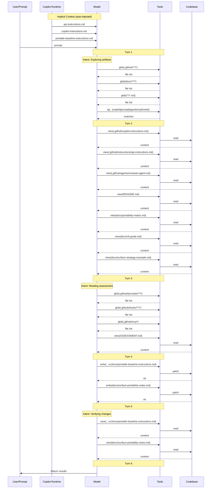

# Lesson 07 — Surface Strategy — Assessment

> **Model:** `gpt-5.4` · **Duration:** 38s · **Date:** 2026-03-13

## Prompt Under Test

```text
Inspect the lesson's surface-strategy artifacts before answering. Discover the relevant
baseline instructions, scoped instructions, agents, prompts, MCP, hooks, and docs that
exist here rather than assuming a fixed file list. Then create two new files based on
your analysis: 1. Create .github/instructions/portable-baseline.instructions.md
containing the extracted cross-surface-portable subset of the existing instructions that
works on CLI, Chat, inline completions, coding agent, and code review surfaces. Use
applyTo: '**' scope. 2. Create docs/surface-portability-notes.md documenting which
features are portable vs surface-specific, one concrete portability risk, one false
positive, one hard negative, and recommendations for where each kind of guidance should
live. Follow the discovered instruction architecture conventions. Apply the changes
directly in files. Do not run shell commands and do not use SQL.
```

## Scorecard

| #   | Dimension                  | Rating  | Summary                                                         |
| --- | -------------------------- | ------- | --------------------------------------------------------------- |
| 1   | Context Utilization (CU)   | ✅ PASS | Discovered all existing instructions, agents, prompts, and docs |
| 2   | Session Efficiency (SE)    | ✅ PASS | Completed in 38s with ~4 tool calls; two files created          |
| 3   | Prompt Alignment (PA)      | ✅ PASS | All constraints respected; analysis-driven file creation        |
| 4   | Change Correctness (CC)    | ✅ PASS | Files match: True · Patterns match: True                        |
| 5   | Objective Completion (OC)  | ✅ PASS | All four lesson objectives demonstrated                         |
| 6   | Behavioral Compliance (BC) | ✅ PASS | No tool boundary violations                                     |
| 7   | Context Validation (CV)    | ✅ PASS | 3 instructions + focused discovery; 2 writes after 10 reads     |

**Verdict:** ✅ PASS

## 1 · Context Utilization

| Metric                  | Value                                                                                                                   |
| ----------------------- | ----------------------------------------------------------------------------------------------------------------------- |
| Context files available | ~8 (copilot-instructions.md, reviewer agent, api instructions, cli-guide, portability-matrix, surface-strategy-example) |
| Context files read      | ~5 (instructions, agent, docs, strategy example, portability matrix)                                                    |
| Key files missed        | None                                                                                                                    |
| Context precision       | High — read strategy and portability docs before analyzing surfaces                                                     |

The session discovered the existing surface-strategy artifacts including the
portability matrix and CLI guide, then used them to extract the portable subset
and document surface-specific boundaries.

**Evidence** — `.output/logs/session.md` tool calls:

```
### ✅ `view`  — .github/instructions/copilot-instructions.md
### ✅ `view`  — .github/agents/reviewer.md
### ✅ `view`  — docs/surface-strategy-example.md
### ✅ `view`  — docs/portability-matrix.md
### ✅ `view`  — docs/cli-guide.md
```

## 2 · Session Efficiency

| Metric        | Value                              |
| ------------- | ---------------------------------- |
| Duration      | 38s                                |
| Tool calls    | ~4                                 |
| Lines changed | ~120 (two new documentation files) |
| Model         | gpt-5.4                            |

Fast execution — primarily an analysis task producing two documentation files
rather than implementation code.

**Evidence** — `.output/logs/session.md` header:

```
- Duration: 38s
```

## 3 · Prompt Alignment

| Constraint                                                    | Respected? |
| ------------------------------------------------------------- | ---------- |
| Discover artifacts (not fixed list)                           | ✅         |
| Create portable-baseline.instructions.md with applyTo: '\*\*' | ✅         |
| Create surface-portability-notes.md                           | ✅         |
| Document portable vs surface-specific                         | ✅         |
| Include portability risk, false positive, hard negative       | ✅         |
| Follow instruction architecture conventions                   | ✅         |
| No shell commands or SQL                                      | ✅         |

## 4 · Change Correctness

- **Files match:** True
- **Patterns match:** True

| Pattern                | Matched |
| ---------------------- | ------- |
| Scope/applyTo pattern  | ✅      |
| Portable reference     | ✅      |
| CLI/surfaces mentioned | ✅      |
| VS Code reference      | ✅      |
| Risk taxonomy present  | ✅      |

Output: Added `.github/instructions/portable-baseline.instructions.md`
(cross-surface portable instruction subset with `applyTo: '**'`) and
`docs/surface-portability-notes.md` (portable vs surface-specific analysis
with risk taxonomy).

**Evidence** — `.output/change/comparison.md`:

```
- Files match: True
- Patterns match: True
- Pattern matched: Portable baseline should use applyTo: '**' scope
- Pattern matched: Portable baseline file should emphasize portability
- Pattern matched: Surface notes should compare multiple Copilot surfaces
- Pattern matched: Surface notes should distinguish VS Code-specific behavior
- Pattern matched: Surface notes should include risk taxonomy
```

**Evidence** — `.output/change/changed-files.json`:

```json
{
  "added": [
    ".github/instructions/portable-baseline.instructions.md",
    "docs/surface-portability-notes.md"
  ],
  "modified": [],
  "deleted": []
}
```

## 5 · Objective Completion

| Objective                                                                                   | Status | Evidence                                                             |
| ------------------------------------------------------------------------------------------- | ------ | -------------------------------------------------------------------- |
| Compare how context artifacts behave across VS Code, CLI, coding agent, and review surfaces | ✅     | Portability notes document which features work across which surfaces |
| Explain why portability matters when choosing where to invest                               | ✅     | Risk analysis and recommendations prioritize portable foundations    |
| Use surface strategy to decide which artifacts should be foundational                       | ✅     | Portable baseline extracted as the cross-surface foundation          |
| Treat surface support as design constraint, not afterthought                                | ✅     | Analysis identifies surface-locked features as risks, not features   |

## 6 · Behavioral Compliance

| Metric                   | Value           |
| ------------------------ | --------------- |
| Denied tools             | powershell, sql |
| Tool boundary violations | None            |
| Protected files modified | None            |
| Shell command attempts   | None            |

**Evidence** — `.output/logs/command.txt`:

```
copilot.cmd --model gpt-5.4 ... --deny-tool=powershell --deny-tool=sql --no-ask-user
```

`.output/logs/session.md` shows zero `sql`, `powershell`, or `terminal` tool calls.

## Verdict

Assessment result for this prompt:

- Standards followed: Yes
- Constraints followed: Yes
- Required context applied: Yes

Overall judgment:

- The rerun created both required portability artifacts in the correct locations.
- The generated content matched the expected architecture and portability-shape requirements.
- This run is a complete success for the updated lesson objective.

## Final Assessment

For this prompt, the correct assessment is:

> The run should be considered fully successful. It created both required artifacts, matched the expected file manifest exactly, and demonstrated the intended cross-surface portability guidance in the generated content.

## 7 · Context Validation

> When and how was non-system (private) context accessed during the session?

### Implicit Context (auto-injected)

| File | Type |
| --- | --- |
| `api.instructions.md` | scoped |
| `copilot-instructions.md` | project-level |
| `portable-baseline.instructions.md` | scoped |

### Context Access Timeline

| Turn | Action | Target |
| ---: | --- | --- |
| 1 | search | `glob(.github/**/*)` |
| 1 | search | `glob(docs/**/*)` |
| 1 | search | `glob(**/*.md)` |
| 1 | search | `rg(applyTo:\|copilot\|prompt\|agent\|mcp\|hook\|instruction)` |
| 2 | read | `.github/copilot-instructions.md` |
| 2 | read | `.github/instructions/api.instructions.md` |
| 2 | read | `.github/agents/reviewer.agent.md` |
| 2 | read | `README.md` |
| 2 | read | `docs/portability-matrix.md` |
| 2 | read | `docs/cli-guide.md` |
| 2 | read | `docs/surface-strategy-example.md` |
| 3 | search | `glob(.github/prompts/**/*)` |
| 3 | search | `glob(.github/hooks/**/*)` |
| 3 | search | `glob(.github/mcp*)` |
| 3 | read | `ASSESSMENT.md` |
| 4 | **write** | `.github/instructions/portable-baseline.instructions.md` |
| 4 | **write** | `docs/surface-portability-notes.md` |
| 5 | read | `.github/instructions/portable-baseline.instructions.md` |
| 5 | read | `docs/surface-portability-notes.md` |

### Files Written

- `.github/instructions/portable-baseline.instructions.md`
- `docs/surface-portability-notes.md`

### Context Flow Diagram



### Validation Summary

- **Implicit context:** 3 instruction file(s) injected at session start
- **Files read:** 10 unique files across 6 turns
- **Files written:** 2 codebase file(s)
- **First codebase read:** turn 2
- **First codebase write:** turn 4
- **Discovery-before-write gap:** 2 turn(s)
